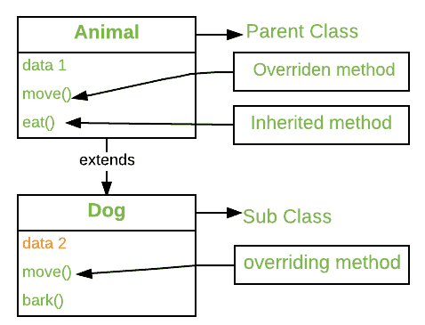

# Python 中的方法覆盖

> 原文:[https://www.geeksforgeeks.org/method-overriding-in-python/](https://www.geeksforgeeks.org/method-overriding-in-python/)

**先决条件:**[Python 中的继承](https://www.geeksforgeeks.org/inheritance-in-python/)

方法重写是任何面向对象编程语言的一种能力，它允许子类或子类提供某个方法的特定实现，而该方法已经由其超类或父类之一提供。当子类中的方法与其超类中的方法具有相同的名称、相同的参数或签名以及相同的返回类型(或子类型)时，则称子类中的方法**覆盖超类中的方法**。



执行的方法版本将由用于调用它的对象决定。如果父类的对象被用来调用方法，那么父类中的版本将被执行，但是如果子类的对象被用来调用方法，那么子类中的版本将被执行。换句话说，是被引用对象的类型(而不是引用变量的类型)决定了被重写方法的哪个版本将被执行。

**示例:**

```
# Python program to demonstrate 
# method overriding

# Defining parent class
class Parent():

    # Constructor
    def __init__(self):
        self.value = "Inside Parent"

    # Parent's show method
    def show(self):
        print(self.value)

# Defining child class
class Child(Parent):

    # Constructor
    def __init__(self):
        self.value = "Inside Child"

    # Child's show method
    def show(self):
        print(self.value)

# Driver's code
obj1 = Parent()
obj2 = Child()

obj1.show()
obj2.show()
```

**输出:**

```
Inside Parent
Inside Child

```

#### 用多重和多级继承重写方法

1.  [**Multiple Inheritance:**](https://www.geeksforgeeks.org/multiple-inheritance-in-python/) When a class is derived from more than one base class it is called [multiple Inheritance](https://www.geeksforgeeks.org/multiple-inheritance-in-python/).

    **示例:**让我们考虑一个示例，在该示例中，我们希望只重写一个父类的方法。下面是实现。

    ```
    # Python program to demonstrate
    # overriding in multiple inheritance

    # Defining parent class 1
    class Parent1():

        # Parent's show method
        def show(self):
            print("Inside Parent1")

    # Defining Parent class 2
    class Parent2():

        # Parent's show method
        def display(self):
            print("Inside Parent2")

    # Defining child class
    class Child(Parent1, Parent2):

        # Child's show method
        def show(self):
            print("Inside Child")

    # Driver's code
    obj = Child()

    obj.show()
    obj.display()
    ```

    **输出:**

    ```
    Inside Child
    Inside Parent2

    ```

2.  **Multilevel Inheritance:** When we have a child and grandchild relationship.

    **示例:**让我们考虑一个例子，在这个例子中，我们只想要覆盖它的一个父类的一个方法。下面是实现。

    ```
    # Python program to demonstrate
    # overriding in multilevel inheritance 

    # Python program to demonstrate
    # overriding in multilevel inheritance 

    class Parent(): 

        # Parent's show method
        def display(self):
            print("Inside Parent")

    # Inherited or Sub class (Note Parent in bracket) 
    class Child(Parent): 

        # Child's show method
        def show(self):
            print("Inside Child")

    # Inherited or Sub class (Note Child in bracket) 
    class GrandChild(Child): 

        # Child's show method
        def show(self):
            print("Inside GrandChild")         

    # Driver code 
    g = GrandChild()   
    g.show()
    g.display()
    ```

    **输出:**

    ```
    Inside GrandChild
    Inside Parent

    ```

#### 在被重写的方法中调用父方法

父类方法也可以在重写的方法中调用。这通常可以通过两种方式实现。

*   **Using Classname:** Parent’s class methods can be called by using the Parent `classname.method` inside the overridden method.

    **示例:**

    ```
    # Python program to demonstrate
    # calling the parent's class method
    # inside the overridden method

    class Parent():

        def show(self):
            print("Inside Parent")

    class Child(Parent):

        def show(self):

            # Calling the parent's class
            # method
            Parent.show(self)
            print("Inside Child")

    # Driver's code
    obj = Child()
    obj.show()
    ```

    **输出:**

    ```
    Inside Parent
    Inside Child

    ```

*   **Using Super():** Python `super()` function provides us the facility to refer to the parent class explicitly. It is basically useful where we have to call superclass functions. It returns the proxy object that allows us to refer parent class by ‘super’.

    **例 1:**

    ```
    # Python program to demonstrate
    # calling the parent's class method
    # inside the overridden method using
    # super()

    class Parent():

        def show(self):
            print("Inside Parent")

    class Child(Parent):

        def show(self):

            # Calling the parent's class
            # method
            super().show()
            print("Inside Child")

    # Driver's code
    obj = Child()
    obj.show()
    ```

    **输出:**

    ```
    Inside Parent
    Inside Child

    ```

    **例 2:**

    ```
    # Program to define the use of super() 
    # function in multiple inheritance 
    class GFG1: 
        def __init__(self): 
            print('HEY !!!!!! GfG I am initialised(Class GEG1)') 

        def sub_GFG(self, b): 
            print('Printing from class GFG1:', b) 

    # class GFG2 inherits the GFG1 
    class GFG2(GFG1): 
        def __init__(self): 
            print('HEY !!!!!! GfG I am initialised(Class GEG2)') 
            super().__init__() 

        def sub_GFG(self, b): 
            print('Printing from class GFG2:', b) 
            super().sub_GFG(b + 1) 

    # class GFG3 inherits the GFG1 ang GFG2 both 
    class GFG3(GFG2): 
        def __init__(self): 
            print('HEY !!!!!! GfG I am initialised(Class GEG3)') 
            super().__init__() 

        def sub_GFG(self, b): 
            print('Printing from class GFG3:', b) 
            super().sub_GFG(b + 1) 

    # main function 
    if __name__ == '__main__': 

        # created the object gfg 
        gfg = GFG3() 

        # calling the function sub_GFG3() from class GHG3 
        # which inherits both GFG1 and GFG2 classes 
        gfg.sub_GFG(10)
    ```

    **输出:**

    ```
    HEY !!!!!! GfG I am initialised(Class GEG3)
    HEY !!!!!! GfG I am initialised(Class GEG2)
    HEY !!!!!! GfG I am initialised(Class GEG1)
    Printing from class GFG3: 10
    Printing from class GFG2: 11
    Printing from class GFG1: 12

    ```