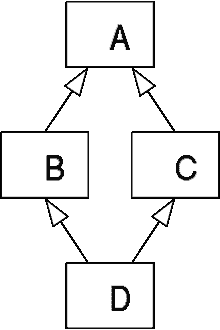

# Python 继承中的方法解析顺序

> 原文:[https://www . geesforgeks . org/method-resolution-python 中的顺序-继承/](https://www.geeksforgeeks.org/method-resolution-order-in-python-inheritance/)

**方法解析顺序:**
方法解析顺序(MRO)它表示编程语言解析方法或属性的方式。Python 支持从其他类继承的类。被继承的类称为父类或超类，而继承的类称为子类或子类。在 python 中，方法解析顺序定义了执行方法时搜索基类的顺序。首先，在类中搜索方法或属性，然后它遵循我们在继承时指定的顺序。这个顺序也被称为类的线性化，一组规则被称为 MRO(方法解析顺序)。当从另一个类继承时，解释器需要一种方法来解析通过实例调用的方法。因此，我们需要方法解析顺序。例如

```py
# Python program showing
# how MRO works

class A:
    def rk(self):
        print(" In class A")
class B(A):
    def rk(self):
        print(" In class B")

r = B()
r.rk()
```

**输出:**

```py
 In class B

```

在上面的例子中，调用的方法来自类 B，而不是类 A，这是由于方法解析顺序(MRO)。
上面代码中的顺序是- `class B - > class A`
在多个继承中，方法是根据继承类时指定的顺序执行的。对于支持单继承的语言来说，方法解析顺序并不有趣，但是支持多继承方法解析顺序的语言起着非常关键的作用。让我们看另一个例子来深入理解方法解析顺序:

```py
# Python program showing
# how MRO works

class A:
    def rk(self):
        print(" In class A")
class B(A):
    def rk(self):
        print(" In class B")
class C(A):
    def rk(self):
        print("In class C")

# classes ordering
class D(B, C):
    pass

r = D()
r.rk()
```

**输出:**

```py
 In class B

```

在上面的例子中，我们使用了多个继承，它也被称为**钻石继承**或死亡的致命钻石，它看起来如下:

Python 遵循深度优先的查找顺序，因此最终从类 A 调用方法。
`Class D -> Class B -> Class C -> Class A`
Python 遵循深度优先顺序解析方法和属性。所以在上面的例子中，它在类 b 中执行方法。

**新旧风格顺序:**
在 Python 的旧版本(2.1)中，我们必然会使用旧风格的类，但是在 Python(3 . x)&2.2 中，我们必然只会使用新的类。新样式类的第一个父类继承自 Python 根“对象”类。

```py
# Old style class
class OldStyleClass: 
    pass

# New style class
class NewStyleClass(object): 
    pass
```

方法解析顺序(MRO)在两者的声明风格上是不同的。旧样式类使用 **DLR 或深度优先从左到右算法**，而新样式类使用 **C3 线性化算法**进行方法解析，同时进行多个继承。

**DLR 算法**
在实现多个继承的过程中，Python 会构建一个类列表进行搜索，因为它需要解决当实例调用一个方法时必须调用哪个方法。顾名思义，方法解析顺序将首先搜索深度，然后从左到右。例如

```py
class A: 
    pass

class B: 
    pass

class C(A, B): 
    pass

class D(B, A): 
    pass

class E(C,D): 
    pass
```

在上面的示例中，算法首先查看被调用方法的实例类。如果不存在，那么它会查看第一个父对象，如果也不存在，那么会查看父对象的父对象。这一直持续到类的深度结束，最后，直到继承类的结束。因此，我们最后一个例子中的解析顺序将是 D，B，A，C，A。但是，A 不能出现两次。因此，顺序将是 D，B，A，C。但是该算法以不同的方式变化，并在不同的时间表现出不同的行为。于是萨缪尔·佩德罗尼首先发现了一个不一致性，并引入了 C3 线性化算法。

**C3 线性化算法:**
C3 线性化算法是一种使用新型类的算法。它用于移除由动态链接库算法创建的不一致。它们有一定的局限性:

*   孩子先于父母
*   如果一个类从多个类继承，它们将按照基类元组中指定的顺序保存。

C3 线性化算法基于三个规则:

*   继承图决定了方法解析顺序的结构。
*   只有在访问了本地类的方法之后，用户才能访问超级类。
*   单调性

**类的方法解析顺序方法(MRO):**
要获取类的方法解析顺序，我们可以使用 __mro__ 属性或`mro()`方法。通过使用这些方法，我们可以显示方法被解析的顺序。例如

```py
# Python program to show the order
# in which methods are resolved

class A:
    def rk(self):
        print(" In class A")
class B:
    def rk(self):
        print(" In class B")

# classes ordering
class C(A, B):
    def __init__(self):
        print("Constructor C")

r = C()

# it prints the lookup order 
print(C.__mro__)
print(C.mro())
```

**输出:**

```py
Constructor C
(<class '__main__.C'>, <class '__main__.A'>, <class '__main__.B'>, <class 'object'>)
[<class '__main__.C'>, <class '__main__.A'>, <class '__main__.B'>, <class 'object'>]

```