# ML |评估指标

> 原文:[https://www . geesforgeks . org/metrics-for-machine-learning-model/](https://www.geeksforgeeks.org/metrics-for-machine-learning-model/)

任何领域的评价总是好的对吧！在机器学习的情况下，这是最好的实践。在这篇文章中，我将几乎涵盖所有用于机器学习的流行和常见指标。

*   混淆矩阵
*   分类准确性。
*   对数损失。
*   曲线下的区域。
*   F1 成绩。
*   平均绝对误差。
*   均方误差。

## 混淆矩阵:

它创建一个 *N X N* 矩阵，其中 N 是要预测的类或类别的数量。这里我们有 *N = 2* ，所以我们得到 *2 X 2* 矩阵。假设我们的实践有一个问题，那就是二元分类。该分类的样品属于*是*或*否*。因此，我们构建了一个分类器来预测新输入样本的类别。之后，我们用 *165* 样本对我们的模型进行了测试，得到了以下结果。

**有 4 个术语你要记住:**

1.  **真阳性:**是我们预测是，实际输出也是。
2.  **真否定:**就是我们预测 No，实际输出也是 No 的情况
3.  **误报:**就是我们预测是但实际上不是的情况
4.  **假阴性:**就是我们预测没有，实际上是有。

矩阵的精度总是通过取 ***主对角线上的平均值来计算，即***

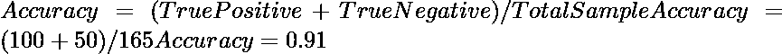

## 分类准确度:

分类精度是我们通常所说的精度，每当我们使用术语精度时。我们通过计算输入样本总数的正确预测比率来计算。

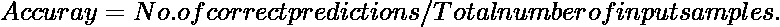

如果每个类都有相同数量的样本，这将非常有效。例如，我们的训练集中有 90%的*A 类*样本和 10%的*B 类*样本。然后，通过预测所有属于*A 类*的训练样本，我们的模型将以 90%的准确率进行预测。如果我们用 A 类 60%和 b 类 40%的测试集测试同一个模型，那么准确率会下降，我们会得到 60%的准确率。

分类精度是好的，但它给假阳性的感觉达到高精度。这个问题的出现是由于小类样本误分类的可能性非常高。

## 对数损失。

这也称为日志丢失。它的基本工作宣传是通过惩罚假(假阳性)分类。它通常可以很好地处理多类分类。使用对数丢失，分类器应该为所有样本的每一类分配一个概率。如果有 N 个样本属于 *M* 类，那么我们这样计算 Log 损失:

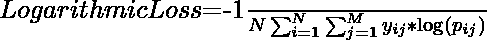

现在是条款，

*   *y_ij* 表示样品 *i* 是否属于 j 类
*   *p _ ij*–样本 *i* 的概率属于 j 类
*   日志丢失的范围是[0，？).当对数损失接近 0 时，表示精度较高，当远离 0 时，表示精度较低。
*   让我给你一个加分点，最小化日志丢失给你分类器更高的准确性。

## 曲线下面积:

它是广泛使用的度量之一，基本上用于二进制分类。分类器的 U C 被定义为分类器将随机选择的正例排名高于负例的概率。在更多地进入美国大学之前，让我用几个基本术语让你感到舒服。

**真阳性率:**也称为或称为敏感性。真阳性率被认为是正确地被认为是阳性的阳性数据点的一部分，相对于所有阳性数据点而言。

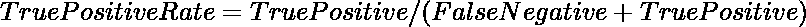

**真阴性率:**也称为或称为特异性。假阴性率被认为是被正确认为是阴性的阴性数据点的一部分，对于所有数据点，这些数据点都是阴性的。

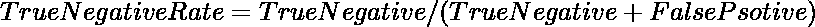

**假阳性率:**假阴性率被认为是相对于所有为阴性的数据点而言，被错误地认为是阴性的一部分阴性数据点。

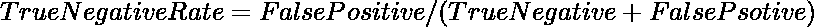

假阳性率和真阳性率的值都在[0，1]范围内。现在的问题是什么是空调？因此，A U C 是在所有不同数据点的假阳性率与真阳性率之间绘制的曲线，范围为[0，1]。AUCC 值越大，模型的性能越好。

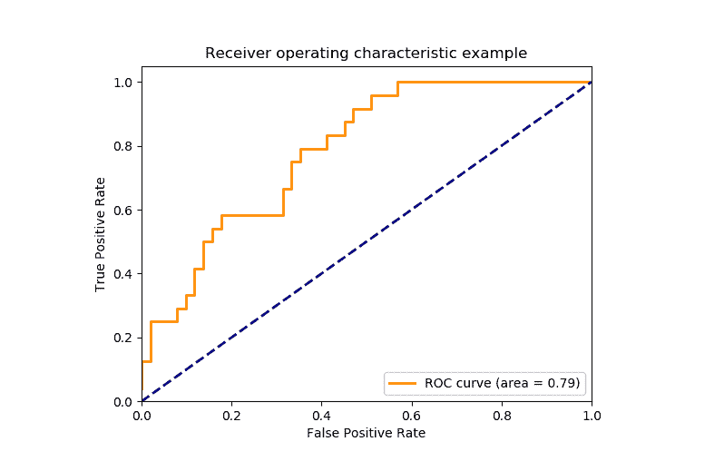

铀碳曲线

## F1 分数:

这是召回率和准确率的调和平均值。它的范围是[0，1]。这个度量通常告诉我们我们的分类器有多精确(它正确地分类了多少个实例)和健壮(没有遗漏任何大量的实例)。

> 它用于测量测试的准确性

**精度:**

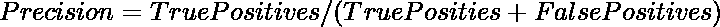

**召回:**

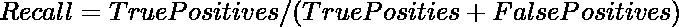

较低的召回率和较高的精度会给你带来很高的准确性，但它会遗漏大量的实例。F1 得分越多，成绩就会越好。它可以这样用数学方法表达:

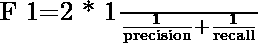

## 平均绝对误差:

它是预测值和原始值之间的平均距离。基本上它给出了我们是如何根据实际产量进行预测的。然而，有一个限制，即它没有给出任何关于误差方向的想法，即我们是低估还是高估了我们的数据。它可以用这种方式用数学表示:

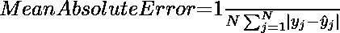

## 均方误差:

它类似于平均绝对误差，但不同之处在于它取预测值和原始值的平均值的平方。采用这种度量的主要优点是，计算梯度更容易，而在平均绝对误差的情况下，计算梯度需要复杂的编程工具。通过取误差的平方，它表明较大的误差大于较小的误差，我们可以更多地关注较大的误差。它可以这样用数学方法表达:

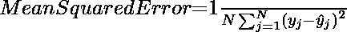
