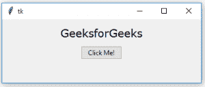

# Tkinter | Python 中的 minsize()方法

> 原文:[https://www . geesforgeks . org/minsize-method-in-tkinter-python/](https://www.geeksforgeeks.org/minsize-method-in-tkinter-python/)

在 Tkinter 中， **`minsize()`** 方法用于设置 [Tkinter](https://www.geeksforgeeks.org/python-gui-tkinter/) 窗口的最小尺寸。使用这种方法，用户可以将窗口的初始化大小设置为其最小大小，并且仍然能够最大化和缩放窗口。

**语法:**

```
master.minsize(height, width)
```

这里，高度和宽度以像素为单位。

**代码#1:** 根窗口没有最小尺寸，也就是说你可以随意缩小窗口。

```
# importing only  those functions
# which are needed
from tkinter import * 
from tkinter.ttk import *
from time import strftime

# creating tkinter window
root = Tk()

# Adding widgets to the root window
Label(root, text = 'GeeksforGeeks', 
      font =('Verdana', 15)).pack(side = TOP, pady = 10)

Button(root, text = 'Click Me !').pack(side = TOP)

mainloop()
```

**输出:**
初始根窗口大小不变


根窗向下缩小后，看到的窗是完全缩小的，因为它没有最小[几何图形](https://www.geeksforgeeks.org/python-geometry-method-in-tkinter/)。
T3】

**代码#2:** 最小尺寸的根窗口。

```
# importing only  those functions
# which are needed
from tkinter import * 
from tkinter.ttk import * 
from time import strftime

# creating tkinter window
root = Tk()

# setting the minimum size of the root window
root.minsize(150, 100)

# Adding widgets to the root window
Label(root, text = 'GeeksforGeeks', 
      font =('Verdana', 15)).pack(side = TOP, pady = 10)
Button(root, text = 'Click Me !').pack(side = TOP)

mainloop()
```

**输出:**
初始窗口


扩展窗口(我们可以任意扩展窗口，因为我们没有设置窗口的最大大小)。


窗户缩小到最小尺寸(不能再缩小了)。
