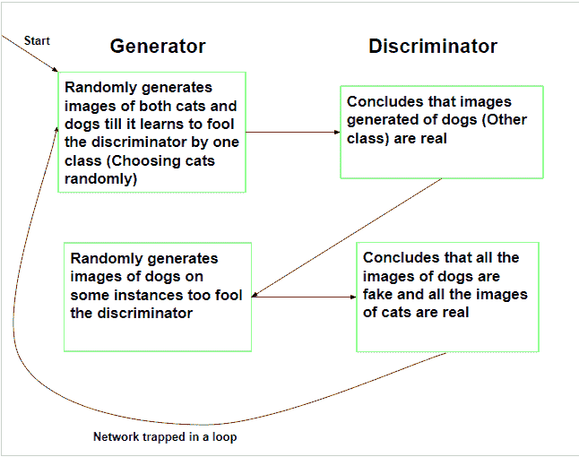

# GANs 中的模态崩溃

> 原文:[https://www.geeksforgeeks.org/modal-collapse-in-gans/](https://www.geeksforgeeks.org/modal-collapse-in-gans/)

**先决条件:** [一般对抗网络](https://www.geeksforgeeks.org/generative-adversarial-network-gan/)

尽管生成对抗网络是非常强大的神经网络，可以用来生成类似于训练数据的新数据，但它的局限性在于它只能在单模态数据(即因变量仅由一个分类条目组成的数据)上训练。

如果在多模态数据上训练生成性对抗网络，会导致**模态崩溃**。模态崩溃是指网络的发生器部分只产生有限数量的各种样本而不考虑输入的情况。这意味着，当网络直接在多模态数据上训练时，生成器学会通过只生成有限种类的数据来欺骗鉴别器。

下面的流程图示出了当在包含猫和狗的图像的数据集上训练时，生成性对抗网络的训练:

以下方法可用于解决模态崩溃

1.  **对类进行分组:**处理模态崩溃的主要方法之一是根据数据中存在的不同类对数据进行分组。这给了鉴别器鉴别子批次的能力，并确定给定批次是真的还是假的。
2.  **预测反作用:**该方法通过训练生成器**最大化**通过考虑鉴别器的反作用来欺骗鉴别器，重点消除鉴别器“追赶”生成器的情况。这种方法的缺点是训练时间增加，梯度计算复杂。
3.  **从经验中学习:**这种方法包括在生成器在固定次数的迭代中生成的旧伪样本上训练鉴别器。
4.  **多个网络:**该方法包括为每个不同的类训练多个生成网络，从而覆盖数据的所有类。缺点包括增加的训练时间和生成的数据质量的典型降低。