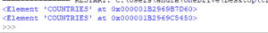
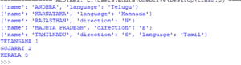
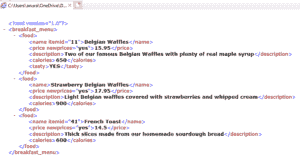

# 用 Python 修改 XML 文件

> 原文:[https://www.geeksforgeeks.org/modify-xml-files-with-python/](https://www.geeksforgeeks.org/modify-xml-files-with-python/)

Python |修改/解析 XML
可扩展标记语言 [(XML)](https://www.geeksforgeeks.org/xml-basics/) 是一种标记语言，它定义了一组规则，用于以人类可读和机器可读的格式对文档进行编码。XML 的设计目标集中在互联网上的简单性、通用性和可用性。这是一种文本数据格式，通过 Unicode 为不同的人类语言提供了强大的支持。虽然 XML 的设计侧重于文档，但是该语言被广泛用于表示任意数据结构，例如 web 服务中使用的数据结构。
XML 本来就是一种层次化的数据格式，最自然的表示方式就是用树。为了执行任何操作，比如解析、搜索、修改一个 XML 文件，我们使用一个模块**[**XML . etree . element tree**](https://docs.python.org/2/library/xml.etree.elementtree.html#functions)**。它有两个班。 ***ElementTree*** 将整个 XML 文档表示为一棵树，这有助于执行操作。 ***元素*** 代表此树中的单个节点。整个文档的读写是在*元素树*级别完成的。与单个 XML 元素及其子元素的交互是在*元素*级别完成的。**** 

******元素属性:******

<figure class="table">

| 性能 | 描述 |
| --- | --- |
| 标签 | 标识元素所代表的数据类型的字符串。
可以使用*元素名称标签*进行访问。 |
| 属性数量 | 存储为 python 字典。
可以通过*元素名称*访问。 |
| 文本字符串 | 关于元素的字符串信息。 |
| 子字符串 | 可选子元素字符串信息。 |
| 子元素 | 特定根的子元素数量。 |

</figure>

******解析:**
我们可以从字符串或 XML 文档中解析 XML 数据。将**视为 ET。
1。 **ET.parse('文件名')。getroot()**-et . parse(' fname ')-创建一棵树，然后我们通过。getroot()。
2。**et . from string(string name)**-从 XML 数据字符串创建根。
**示例 1:**
**XML 文档:******** 

## **可扩展标记语言**

```
<?xml version="1.0"?>
<!--COUNTRIES is the root element-->
<COUNTRIES>
    <country name="INDIA">
        <neighbor name="Dubai" direction="W"/>
    </country>
    <country name="Singapore">
        <neighbor name="Malaysia" direction="N"/>
    </country>
</COUNTRIES>
```

****Python 代码:**** 

## **蟒蛇 3**

```
# importing the module.
import xml.etree.ElementTree as ET
XMLexample_stored_in_a_string ='''<?xml version ="1.0"?>
<COUNTRIES>
    <country name ="INDIA">
        <neighbor name ="Dubai" direction ="W"/>
    </country>
    <country name ="Singapore">
        <neighbor name ="Malaysia" direction ="N"/>
    </country>
</COUNTRIES>
'''
# parsing directly.
tree = ET.parse('xmldocument.xml')
root = tree.getroot()
# parsing using the string.
stringroot = ET.fromstring(XMLexample_stored_in_a_string)
# printing the root.
print(root)
print(stringroot)
```

****输出:****

**

outputexample1** 

****元素方法:**
1) **元素. iter('标记')**-迭代所有子元素(子树元素)
2) **元素. findall('标记')**-仅查找带有标记的元素，这些元素是当前元素的直接子元素。
3) **元素.查找('标签')**-查找具有特定标签的第一个子元素。
4) **元素. get('标记')**-访问元素属性。
5) **元素.文本**-给出元素的文本。
6)**element . attrib**-返回所有存在的属性。
7) **元素标签**-返回元素名称。
**例 2:**** 

## **蟒蛇 3**

```
import xml.etree.ElementTree as ET
XMLexample_stored_in_a_string ='''<?xml version ="1.0"?>
<States>
    <state name ="TELANGANA">
        <rank>1</rank>
        <neighbor name ="ANDHRA" language ="Telugu"/>
        <neighbor name ="KARNATAKA" language ="Kannada"/>
    </state>
    <state name ="GUJARAT">
        <rank>2</rank>
        <neighbor name ="RAJASTHAN" direction ="N"/>
        <neighbor name ="MADHYA PRADESH" direction ="E"/>
    </state>
    <state name ="KERALA">
        <rank>3</rank>
        <neighbor name ="TAMILNADU" direction ="S" language ="Tamil"/>
    </state>
</States>
'''
# parsing from the string.
root = ET.fromstring(XMLexample_stored_in_a_string)
# printing attributes of the root tags 'neighbor'.
for neighbor in root.iter('neighbor'):
    print(neighbor.attrib)
# finding the state tag and their child attributes.
for state in root.findall('state'):
    rank = state.find('rank').text
    name = state.get('name')
    print(name, rank)
```

****输出:****

**

元素方法输出。** 

****修改:**
修改 XML 文档也可以通过 Element 方法完成。
方法:
1) **元素集(【属性】、【值】)**–修改元素属性。
2) **元素。子元素(父元素，new _ child tag)**-在父元素下创建一个新的子标签。
3)**element . write(' filename . xml ')**-将 XML 树创建到另一个文件中。
4)**element . pop()**-删除特定属性。
5)**element . remove()**-删除完整的标签。
**示例 3:**
**XML 文档:**** 

## **可扩展标记语言**

```
<?xml version="1.0"?>
<breakfast_menu>
    <food>
        <name itemid="11">Belgian Waffles</name>
        <price>5.95</price>
        <description>Two of our famous Belgian Waffles
with plenty of real maple syrup</description>
        <calories>650</calories>
    </food>
    <food>
        <name itemid="21">Strawberry Belgian Waffles</name>
        <price>7.95</price>
        <description>Light Belgian waffles covered
with strawberries and whipped cream</description>
        <calories>900</calories>
    </food>
    <food>
        <name itemid="31">Berry-Berry Belgian Waffles</name>
        <price>8.95</price>
        <description>Light Belgian waffles covered with
an assortment of fresh berries and whipped cream</description>
        <calories>900</calories>
    </food>
    <food>
        <name itemid="41">French Toast</name>
        <price>4.50</price>
        <description>Thick slices made from our
homemade sourdough bread</description>
        <calories>600</calories>
    </food>
</breakfast_menu>
```

****Python 代码:**** 

## **蟒蛇 3**

```
import xml.etree.ElementTree as ET

mytree = ET.parse('xmldocument.xml.txt')
myroot = mytree.getroot()

# iterating through the price values.
for prices in myroot.iter('price'):
    # updates the price value
    prices.text = str(float(prices.text)+10)
    # creates a new attribute
    prices.set('newprices', 'yes')

# creating a new tag under the parent.
# myroot[0] here is the first food tag.
ET.SubElement(myroot[0], 'tasty')
for temp in myroot.iter('tasty'):
    # giving the value as Yes.
    temp.text = str('YES')

# deleting attributes in the xml.
# by using pop as attrib returns dictionary.
# removes the itemid attribute in the name tag of
# the second food tag.
myroot[1][0].attrib.pop('itemid')

# Removing the tag completely we use remove function.
# completely removes the third food tag.
myroot.remove(myroot[2])

mytree.write('output.xml')
```

****输出:**** 

****