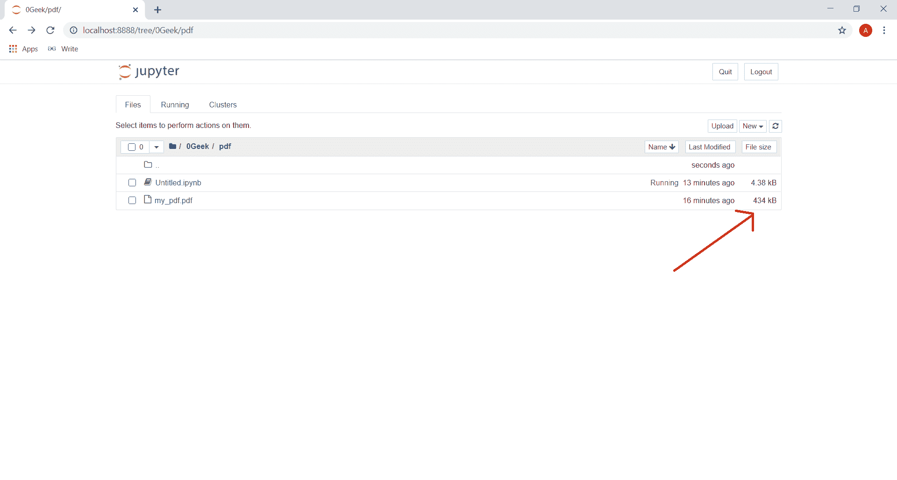
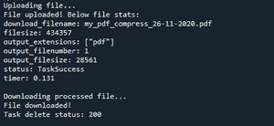
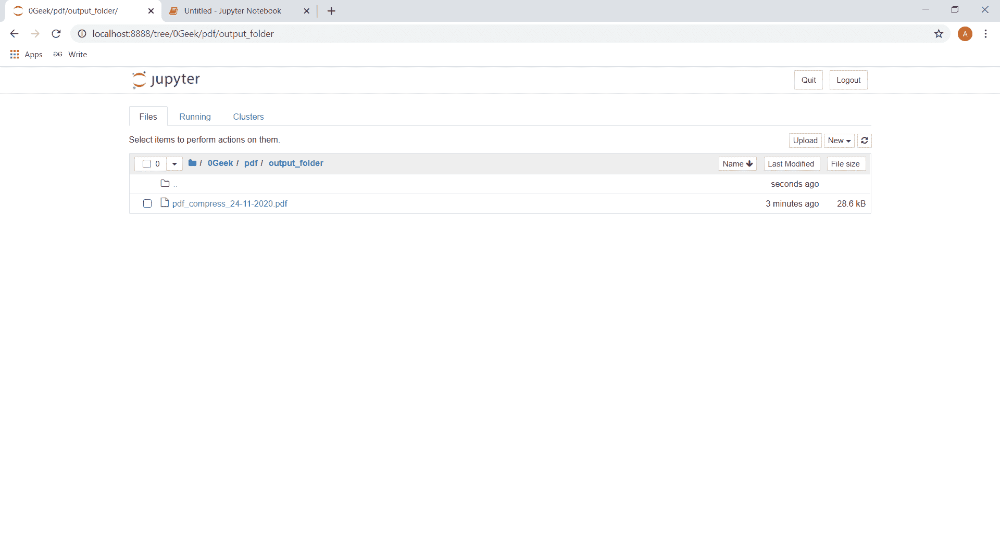
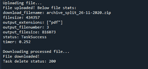

# 使用 Python 修改 PDF 文件

> 原文:[https://www . geesforgeks . org/modification-pdf-file-use-python/](https://www.geeksforgeeks.org/modifying-pdf-file-using-python/)

下面的文章描述了如何使用 python 的 pylovepdf 模块修改 PDF。可移植文档格式(PDF)是 Adobe 于 1993 年开发的一种文件格式，以独立于应用软件、硬件和操作系统的方式呈现文档，包括文本格式和图像。

可以使用 pip 命令下载 pylovepdf 模块:

```
pip install pylovepdf
```

iLovePDF 应用编程接口，即“pylovepdf”模块是围绕 REST 组织的。它们的应用编程接口是可预测的、面向资源的网址，并使用 HTTP 响应代码来指示应用编程接口错误。它们使用内置的 HTTP 功能，如 HTTP 身份验证和 HTTP 动词，这些都是现成的 HTTP 客户端可以理解的。它们支持跨来源的资源共享，允许您从客户端 web 应用程序安全地与它们的 API 交互。有了这个应用编程接口，我们可以压缩 PDF 文件，也可以添加水印，将它们转换成图像，甚至分割它们，反之亦然，还有很多其他的东西。

为了做到这一点，我们首先需要一个公钥来使用这个模块，因为登录到 https://developer.ilovepdf.com/之后，公钥将在“我的项目”部分可见。下面是公钥的截图


既然我们有了公钥，我们就可以使用这个应用编程接口来修改任何 PDF 文件，步骤如下:

*   1.使用公钥创建 ILovePdf 对象
*   2.上传 PDF 文件
*   3.正在处理 PDF 文件
*   4.下载 PDF 文件

本模块的实现通过示例进行了恰当的描述。[点击此处](https://drive.google.com/file/d/1tHTYbdZAQyr9Cw8QY-M4Sr2DwYQ_qAfs/view?usp=sharing)查看本文示例中使用的 PDF:

**示例 1:** *压缩 PDF 文件*

## 蟒蛇 3

```
# importing the ilovepdf api
from pylovepdf.ilovepdf import ILovePdf

# public key
public_key = 'paste_your_public_key_here'

# creating a ILovePdf object
ilovepdf = ILovePdf(public_key, verify_ssl=True)

# assigning a new compress task
task = ilovepdf.new_task('compress')

# adding the pdf file to the task
task.add_file('my_pdf.pdf')

# setting the output folder directory
# if no folder exist it will create one
task.set_output_folder('output_folder')

# execute the task
task.execute()

# download the task
task.download()

# delete the task
task.delete_current_task()
```

处理前:



**输出:**



处理后:



**示例 2:** *拆分 PDF*

## 计算机编程语言

```
# public key
from pylovepdf.ilovepdf import ILovePdf
public_key = 'paste your code here'

# importing the ilovepdf api

# creating a ILovePdf object
ilovepdf = ILovePdf(public_key, verify_ssl=True)

# assigning a new split task task
task = ilovepdf.new_task('split')

# adding the pdf file to the task
task.add_file('my_pdf.pdf')

# setting the output folder directory
# if no folder exist it will create one
task.set_output_folder('output_folder')

# execute the task
task.execute()

# download the task
task.download()

# delete the task
task.delete_current_task()
```

**输出:**



处理后:


活力