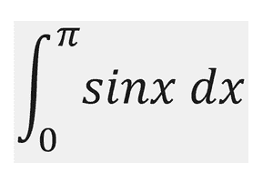
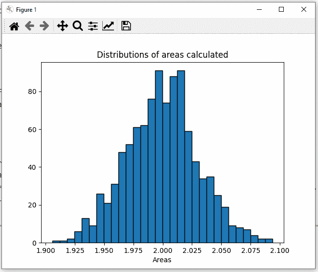
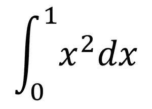

# Python 中的蒙特卡罗集成

> 原文:[https://www . geesforgeks . org/Monte-Carlo-python 中的集成/](https://www.geeksforgeeks.org/monte-carlo-integration-in-python/)

蒙特卡罗积分是一个求解具有大量积分值的积分的过程。蒙特卡洛过程使用大数理论和随机抽样来逼近非常接近积分实际解的值。它对由**<【f(x)>**表示的函数求平均值。然后我们可以将< f(x) >展开为积分中的值除以点数的总和，并求解方程的左侧，以近似右侧的积分值。推导如下。


其中 N =用于近似值的项数。

现在，我们将首先使用蒙特卡罗方法数值计算积分，然后最后使用 python 库 matplotlib 使用直方图可视化结果。

### 使用的模块:

将使用的模块有:

*   **Scipy** :用于获取积分极限之间的随机值。可以使用以下方式安装:

```
pip install scipy # for windows
or
pip3 install scipy # for linux and macos
```

*   [**Numpy**](https://www.geeksforgeeks.org/numpy-in-python-set-1-introduction/) :用于组成数组，存储不同的值。可以使用以下方式安装:

```
pip install numpy # for windows
or 
pip3 install numpy # for linux and macos
```

*   [**Matplotlib**](https://www.geeksforgeeks.org/python-introduction-matplotlib/) :用于可视化直方图和蒙特卡罗积分的结果。

```
pip install matplotlib # for windows
or 
pip3 install matplotlib # for linux and macos
```

#### 例 1:

我们要评估的积分是:



一旦我们完成了模块的安装，我们现在可以通过导入所需的模块开始编写代码，scipy 用于在一个范围内创建随机值，NumPy 模块用于创建静态数组，因为 python 中的默认列表由于动态内存分配而相对较慢。然后我们定义积分的极限为 0 和π(我们用 np.pi 得到π的值。然后我们用 np 创建一个大小为 N 的零的静态 numpy 数组。零(N)。现在我们迭代数组 N 的每个索引，并用 a 和 b 之间的随机值填充它。然后我们创建一个变量来存储积分变量不同值的函数之和。现在我们创建一个函数来计算 x 的一个特定值的 sin，然后我们迭代并把 x 的函数为 x 的不同值返回的所有值加到变量积分上。然后我们用上面推导的公式得到结果。最后，我们在最后一行打印结果。

## 蟒蛇 3

```
# importing the modules
from scipy import random
import numpy as np

# limits of integration
a = 0
b = np.pi # gets the value of pi
N = 1000

# array of zeros of length N
ar = np.zeros(N)

# iterating over each Value of ar and filling
# it with a random value between the limits a
# and b
for i in range (len(ar)):
    ar[i] = random.uniform(a,b)

# variable to store sum of the functions of
# different values of x
integral = 0.0

# function to calculate the sin of a particular
# value of x
def f(x):
    return np.sin(x)

# iterates and sums up values of different functions
# of x
for i in ar:
    integral += f(i)

# we get the answer by the formula derived adobe
ans = (b-a)/float(N)*integral

# prints the solution
print ("The value calculated by monte carlo integration is {}.".format(ans))
```

**输出:**

> 通过蒙特卡罗积分计算的值是 2.0256756150763

得到的数值非常接近积分的实际答案 2.0。

现在，如果我们想使用直方图来可视化积分，我们可以使用 matplotlib 库来实现。我们再次导入模块，定义积分的极限，并编写 sin 函数来计算特定 x 值的 sin 值。接下来，我们取一个数组，该数组包含代表直方图每一个光束的变量。然后我们迭代 N 个值，重复同样的过程，创建一个零数组，用随机的 x 个值填充它，创建一个积分变量，将所有函数值相加，得到 N 次答案，每个答案代表直方图的一束。代码如下:

## 蟒蛇 3

```
# importing the modules
from scipy import random
import numpy as np
import matplotlib.pyplot as plt

# limits of integration
a = 0
b = np.pi # gets the value of pi
N = 1000

# function to calculate the sin of a particular
# value of x
def f(x):
    return np.sin(x)

# list to store all the values for plotting
plt_vals = []

# we iterate through all the values to generate
# multiple results and show whose intensity is
# the most.
for i in range(N):

    #array of zeros of length N
    ar = np.zeros(N)

    # iterating over each Value of ar and filling it
    # with a randome value between the limits a and b
    for i in range (len(ar)):
        ar[i] = random.uniform(a,b)

    # variable to store sum of the functions of different
    # values of x
    integral = 0.0

    # iterates and sums up values of different functions
    # of x
    for i in ar:
        integral += f(i)

    # we get the answer by the formula derived adobe
    ans = (b-a)/float(N)*integral

    # appends the solution to a list for plotting the graph
    plt_vals.append(ans)

# details of the plot to be generated
# sets the title of the plot
plt.title("Distributions of areas calculated")

# 3 parameters (array on which histogram needs
plt.hist (plt_vals, bins=30, ec="black")

# to be made, bins, separators colour between the
# beams)
# sets the label of the x-axis of the plot
plt.xlabel("Areas")
plt.show() # shows the plot
```

**输出:**



这里我们可以看到，根据这个图，最有可能的结果是 2.023 或 2.024，这也非常接近这个积分的实际解，即 2.0。

#### 例 2:

我们要评估的积分是:



实现将与前面的问题相同，只有 a 和 b 定义的积分极限会改变，返回特定值的相应函数值的 f(x)函数现在将返回 x^2 而不是 sin (x)。这个代码应该是:

## 蟒蛇 3

```
# importing the modules
from scipy import random
import numpy as np

# limits of integration
a = 0
b = 1
N = 1000

# array of zeros of length N
ar = np.zeros(N)

# iterating over each Value of ar and filling
# it with a random value between the limits a
# and b
for i in range(len(ar)):
    ar[i] = random.uniform(a, b)

# variable to store sum of the functions of
# different values of x
integral = 0.0

# function to calculate the sin of a particular
# value of x
def f(x):
    return x**2

# iterates and sums up values of different
# functions of x
for i in ar:
    integral += f(i)

# we get the answer by the formula derived adobe
ans = (b-a)/float(N)*integral

# prints the solution
print("The value calculated by monte carlo integration is {}.".format(ans))
```