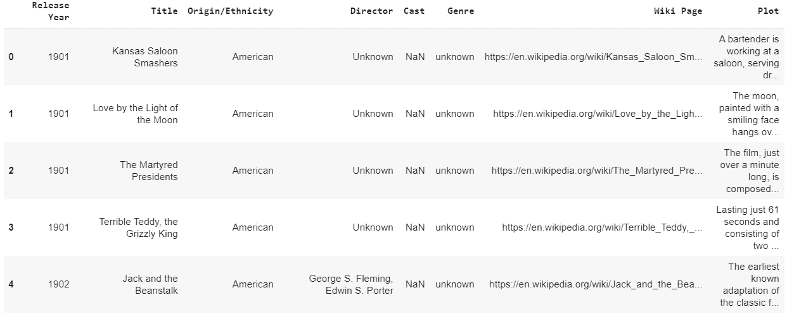
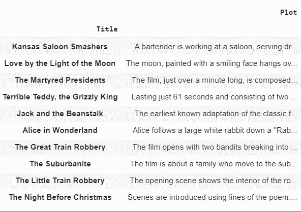
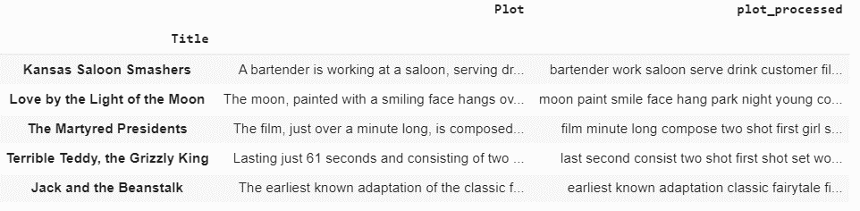

# 基于使用 TF-IDF 矢量化和余弦相似度的剧情摘要的电影推荐器

> 原文:[https://www . geesforgeks . org/movie-基于推荐的剧情-摘要-使用-TF-IDF-矢量化-和-余弦-相似度/](https://www.geeksforgeeks.org/movie-recommender-based-on-plot-summary-using-tf-idf-vectorization-and-cosine-similarity/)

可以使用基于内容的过滤和协作过滤方法以多种方式向用户推荐电影。基于内容的过滤方法主要关注项目相似性，即电影中的相似性，而协同过滤则关注在观看电影时选择相似的不同用户之间建立关系。
基于用户过去观看的电影的剧情，可以向用户推荐剧情相似的电影。这种方法属于基于内容的过滤，因为推荐只基于用户过去的活动。

[**使用的数据集**](https://www.kaggle.com/jrobischon/wikipedia-movie-plots) :从维基百科上抓取的包含电影剧情概要的 kaggle 数据集。

**代码:读取数据集:**

```
# Give the location of the dataset
path_dataset ="" 

import pandas as pd
data = pd.read_csv(path_dataset)
data.head()
```

**输出:**
[](https://media.geeksforgeeks.org/wp-content/uploads/20200802193241/datahead.png) 
数据集中有不同语言/来源的电影，数量不等。

**代码:**

```
len(data)

import numpy as np
np.unique(data['Origin / Ethnicity']

len(data.loc[data['Origin / Ethnicity']=='American'])
len(data.loc[data['Origin / Ethnicity']=='British'])
```

**输出:**

```

34886    #Length of the dataset (Total number of rows/movies)

#Movies of various origins present in the dataset.
array(['American', 'Assamese', 'Australian', 'Bangladeshi', 'Bengali',
       'Bollywood', 'British', 'Canadian', 'Chinese', 'Egyptian',
       'Filipino', 'Hong Kong', 'Japanese', 'Kannada', 'Malayalam',
       'Malaysian', 'Maldivian', 'Marathi', 'Punjabi', 'Russian',
       'South_Korean', 'Tamil', 'Telugu', 'Turkish'], dtype=object)

17377    #Number of movies of American origin
3670     #Number of movies of British origin

```

在数据集中的不同列中，只有电影名称和电影情节是必需的列。考虑到上述数据集的一个子集，我们只使用美国和英国电影。子集数据集由 21047 部电影组成。

**代码:**

```
# Concatenating American and British movies
df1 = pd.DataFrame(data.loc[data['Origin / Ethnicity']=='American'])
df2 = pd.DataFrame(data.loc[data['Origin / Ethnicity']=='British'])
data = pd.concat([df1, df2], ignore_index = True)

len(data)

finaldata = data[["Title", "Plot"]]          # Required columns - Title and movie plot
finaldata = finaldata.set_index('Title')    # Setting the movie title as index

finaldata.head(10)
finaldata["Plot"][0]
```

**输出:**

```

21047    #Number of rows in the new dataset

# First 10 rows of the new dataset


#Plot of the first movie
A bartender is working at a saloon, serving drinks to customers. After he fills a stereotypically Irish man's bucket with beer, Carrie Nation and her followers burst inside. They assault the Irish man, pulling his hat over his eyes and then dumping the beer over his head. The group then begin wrecking the bar, smashing the fixtures, mirrors, and breaking the cash register. The bartender then sprays seltzer water in Nation's face before a group of policemen appear and order everybody to leave.[1]

```

**代码:应用自然语言处理技术对电影剧情进行预处理:**

```
import nltk
nltk.download('punkt')
nltk.download('averaged_perceptron_tagger')
nltk.download('wordnet')

from nltk.stem import WordNetLemmatizer
lemmatizer = WordNetLemmatizer()

from nltk.corpus import stopwords
nltk.download('stopwords')
stop_words = set(stopwords.words('english'))

VERB_CODES = {'VB', 'VBD', 'VBG', 'VBN', 'VBP', 'VBZ'}
```

**数据预处理步骤:**

*   使用 NLTK 单词标记器将绘图摘要转换为标记。
*   使用 NLTK POS 标记器，提取令牌的 POS 标记。
*   词条化被认为比词干化更好，因为词条化对单词进行形态学分析。
*   通过 NLTK 单词-网络引理器，通过移除标记的屈折结尾来完成引理化。
*   删除常用词以增加标记的重要性。从 NLTK 库中，英语停止词被下载并从电影情节中移除。
*   很少有一般的缩略词被原词代替。

**代码:**

```
def preprocess_sentences(text):
  text = text.lower()
  temp_sent =[]
  words = nltk.word_tokenize(text)
  tags = nltk.pos_tag(words)
  for i, word in enumerate(words):
      if tags[i][1] in VERB_CODES: 
          lemmatized = lemmatizer.lemmatize(word, 'v')
      else:
          lemmatized = lemmatizer.lemmatize(word)
      if lemmatized not in stop_words and lemmatized.isalpha():
          temp_sent.append(lemmatized)

  finalsent = ' '.join(temp_sent)
  finalsent = finalsent.replace("n't", " not")
  finalsent = finalsent.replace("'m", " am")
  finalsent = finalsent.replace("'s", " is")
  finalsent = finalsent.replace("'re", " are")
  finalsent = finalsent.replace("'ll", " will")
  finalsent = finalsent.replace("'ve", " have")
  finalsent = finalsent.replace("'d", " would")
  return finalsent

finaldata["plot_processed"]= finaldata["Plot"].apply(preprocess_sentences)
finaldata.head()
```

**预处理后的数据:**
[](https://media.geeksforgeeks.org/wp-content/uploads/20200802202233/processeddata.png)

**TF-IDF(术语频率-逆文档频率)矢量化:**

1.  **词频(TF):** 一个词在文档中出现的次数除以文档中的总字数。每个文档都有自己的词频。
2.  **反向数据频率(IDF):** 文档数除以包含该单词的文档数的日志。反向数据频率决定了稀有词在语料库中所有文档中的权重。

Scikit-Learn 在名为*特征提取.文本*的模块中提供了一个名为 *TfidfVectorizer* 的转换器，用于对 TF–IDF 分数进行矢量化。

**余弦相似度:**
电影情节在几何空间中转化为向量。因此，两个向量之间的角度代表这两个向量的接近程度。余弦相似度通过测量两个向量之间角度的余弦来计算相似度。

**代码:**

```
from sklearn.feature_extraction.text import TfidfVectorizer

# Vectorizing pre-processed movie plots using TF-IDF
tfidfvec = TfidfVectorizer()
tfidf_movieid = tfidfvec.fit_transform((finaldata["plot_processed"]))

# Finding cosine similarity between vectors
from sklearn.metrics.pairwise import cosine_similarity
cos_sim = cosine_similarity(tfidf_movieid, tfidf_movieid)
```

**代码:构建推荐功能，给出十大类似电影:**

```
# Storing indices of the data
indices = pd.Series(finaldata.index)

def recommendations(title, cosine_sim = cos_sim):
    recommended_movies = []
    index = indices[indices == title].index[0]
    similarity_scores = pd.Series(cosine_sim[index]).sort_values(ascending = False)
    top_10_movies = list(similarity_scores.iloc[1:11].index)
    for i in top_10_movies:
        recommended_movies.append(list(finaldata.index)[i])
    return recommended_movies
```

**代码:使用上述函数获取基于图的推荐:**

```
recommendations("Harry Potter and the Chamber of Secrets")
```

**输出:**

```

Recommendations for the movie "Harry Potter and the Chamber of Secrets"

["Harry Potter and the Sorcerer's Stone",
 "Harry Potter and the Philosopher's Stone",
 'Harry Potter and the Deathly Hallows: Part I',
 'Harry Potter and the Deathly Hallows: Part 1',
 'Harry Potter and the Half-Blood Prince',
 'Harry Potter and the Deathly Hallows: Part II',
 'Harry Potter and the Deathly Hallows: Part 2',
 'Harry Potter and the Order of the Phoenix',
 'Harry Potter and the Goblet of Fire',
 'Harry Potter and the Prisoner of Azkaban']

```

**代码:**

```
recommendations("Ice Age")
```

**输出:**

```

Recommendations for the movie "Ice Age"

['Ice Age: The Meltdown',
 'Ice Age: Dawn of the Dinosaurs',
 'The Wrong Man',
 'Ice Age: Continental Drift',
 'The Buttercup Chain',
 'Ice Age: Collision Course',
 'Runaway Train',
 'Corrina, Corrina',
 'Sid and Nancy',
 'Zorro, the Gay Blade']

```

**代码:**

```
recommendations("Blackmail")
```

**输出:**

```
Recommendations for the movie "Blackmail"

['Checkpoint',
 'Odds Against Tomorrow',
 'The Beast with Five Fingers',
 'Fruitvale Station',
 'The Exile',
 'The Black Swan',
 'Small Town Gay Bar',
 'Eye of the Cat',
 'Blown Away',
 'Brenda Starr, Reporter']

```