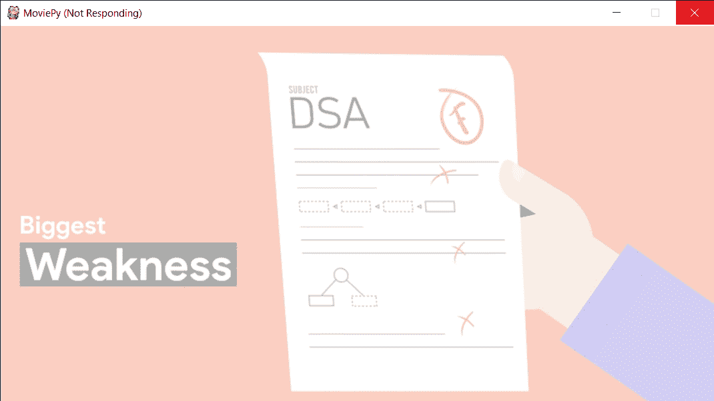
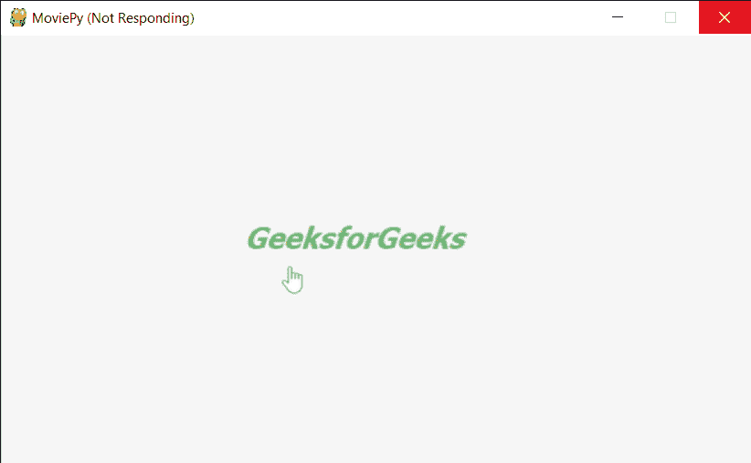

# 影片–显示一帧视频剪辑

> 原文:[https://www . geesforgeks . org/moviepy-放映一帧视频剪辑/](https://www.geeksforgeeks.org/moviepy-showing-a-frame-of-video-clip/)

在本文中，我们将了解如何在给定时间在 MoviePy 中显示视频文件剪辑的单帧。MoviePy 是一个用于视频编辑的 Python 模块，可用于视频和 GIF 的基本操作。视频是由帧组成的，帧的组合创建了一个视频，每一帧都是一个独立的图像。借助带有 VideoFileClip 对象的 save_frame 方法，我们可以随时存储特定的帧。

clip.show 方法允许预览一个剪辑的一个帧，而不必将其写入文件:以下几行在 PyGame 窗口中显示该帧

> 为此，我们将对 VideoFileClip 对象
> **使用 show 方法语法:** clip.show(t)
> **参数:**它将时间作为可选参数
> **返回:**它返回 None

下面是实现

## 蟒蛇 3

```py
# Import everything needed to edit video clips
from moviepy.editor import *

# loading video dsa gfg intro video
clip = VideoFileClip("dsa_geek.webm")

# getting only first 5 seconds
clip = clip.subclip(0, 5)

# showing frame at 2 second
clip.show(2)
```

**输出:**

```py
Moviepy - Building video __temp__.mp4.
Moviepy - Writing video __temp__.mp4

Moviepy - Done !
Moviepy - video ready __temp__.mp4 
```



另一个例子

## 蟒蛇 3

```py
# Import everything needed to edit video clips
from moviepy.editor import *

# loading video gfg
clip = VideoFileClip("geeks.mp4")

# getting duration of the video
duration = clip.duration

# showing frame at 3 second
clip.show(3)
```

**输出:**

```py
Moviepy - Building video __temp__.mp4.
MoviePy - Writing audio in __temp__TEMP_MPY_wvf_snd.mp3

MoviePy - Done.
Moviepy - Writing video __temp__.mp4

Moviepy - Done !
Moviepy - video ready __temp__.mp4
```

