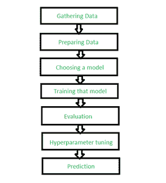

# 多标签图像分类–图像标签预测

> 原文:[https://www . geesforgeks . org/多标签-图像-分类-预测-图像-标签/](https://www.geeksforgeeks.org/multi-label-image-classification-prediction-of-image-labels/)

我们可以用计算机视觉算法做很多事情:

*   目标检测
*   图象分割法
*   图像翻译
*   目标跟踪(实时)等等。

**什么是多标签图像分类？**
我们用一个直观的例子来理解多标签图像分类的概念。如果我给你看一个球的图像，你会很容易在脑海中把它归类为球。我给你们看的下一张图片是一个露台。现在我们可以将这两个图像分为两类，即有球和无球。
当我们只有两类可以分类的图像时，这被称为二值图像分类问题。

*   当有两个以上的类别可以对图像进行分类时。
*   图像不属于多个类别

如果上述两个条件都满足，则称为多类图像分类问题。
**先决条件:**
让我们从一些先决条件开始:
在这里，我们将使用以下语言和编辑器:

*   语言/解释器:来自 python.org 的 Python 3(最好是 python 3.8)
*   编辑器:Jupyter iPython 笔记本电脑
*   OS : Windows 10 x64
*   数据集:请从 Kaggle 或互联网下载任何图像数据集。
*   Python 需求:这个项目需要通过 pip 安装以下库:Numpy、Pandas、MatPlotLib、Scikit Learn、Scikit Image。

> 在 CMD 窗口中，运行以下命令安装需求:
> ———————————————————————————————————
> | pip 安装 numpy pandas matplotlib 笔记本 sci kit-image sci kit-learn |
> ——————————————————————————————————————————————————————————————————————T4】注:如果使用蟒蛇，用 conda 替换 pi！
> 现在运行 jupyter，在之前下载的文件中打开笔记本。

**应遵循的步骤:**



标签分类步骤

**第一步:导入我们需要的库。**

## 蟒蛇 3

```py
# system libraries
import os
import warnings

# ignoring all the warnings
warnings.simplefilter('ignore')

# import data handling libraries
import numpy as np
import pandas as pd

# importing data visualisation libraries
import matplotlib.pyplot as plt
% matplotlib inline

# import image processing library
from skimage.io import imread, imshow
from skimage.transform import resize
from skimage.color import rgb2grey
```

**第二步:将目标图像读入项目**
在文章的这一部分，我们将指导 python 逐个读取图像，然后将图像的像素数据插入到我们可以使用的数组中。然后我们将通过 Python 的操作系统库创建文件列表。

> os.listdir(path)返回一个列表，其中包含由 path 给定的目录中的条目名称。

## 蟒蛇 3

```py
r = os.listdir(r"C:\Users\Garima Singh\Desktop\data\mugshots\r")
# This is the path to the image folder

v = os.listdir(r"C:\Users\Garima Singh\Desktop\data\mugshots\v")
d = os.listdir(r"C:\Users\Garima Singh\Desktop\data\mugshots\d")

print(r[0:10])
```

**步骤 3:从图像中创建和导入数据，并设置限制。**
这里，我们将使用 NumPy 和 scikit-image 的 imread 功能。由于我们有下载的数据，我们可以快速计算每个主题有多少张图片。例如，假设每个文件夹中有 100 个图像(r、v 和 d)，则可以设置一个值为 100 的变量限制。下一步是为这些数据创建空数组，并用数据填充这些数组。我们将快速制作 3 个阵列来容纳系列图像的数据。我们使用下面的代码片段创建一个充满“无”值的数组:

## 蟒蛇 3

```py
limit = 100
# Creating the list of blank spaces that can potentially hold data:
ra_images = [None]*limit

# Creating loop variables:
i, j = 0, 0

# This part of the code loops over all the images
# in the list "r" and reads it into the jth element
# of the array we made in line 2.
for i in r:
    if(j<limit):
        ra_images[j] = imread(r"C:\Users\data\mugshots\r\\" + i)
        j+= 1
    else:
        break

# Similarly, we will fill up the data into the other 2 arrays
```

**步骤 4:数据集的组装以及数组的展平和整形。**
在这一节中，我们将使用 pandas Data Frame 将这 3 个数据数组合并为一个数据数组。现在我们的图像阵列大小为 28×28。我们需要把这个数组变成 28^2 x 1 的数组。这基本上意味着我们必须拍摄每张图像，并将其转换为数据集中的一行数据。

## 蟒蛇 3

```py
# Finding out the number of columns per image in our dataset.
# We will use the shape function on any one image in our array
# and use the dimensions we get as the number of columns in row.
number_of_columns = ra_grey[1].shape[0] * ra_grey[1].shape[1]
print(number_of_columns)

# This means we will be using this many columns
# per row in our dataset.
# Our dataset has 300 images, so:
# Our dataset will be an array of dimensions
# 784 x 300 => 300 images of 784 pixels each.
```

**第五步:数据扁平化和重塑。**
这是首先将 28×28 数组转换成列向量(即 784×1 矩阵)的代码部分。

## 蟒蛇 3

```py
print(ra_grey[0].shape)
for i in range(limit):
    ra_grey[i] = np.ndarray.flatten(ra_grey[i]).reshape(number_of_columns, 1)
print(ra_grey[0].shape)

# We will use NumPy's dstack and rollaxis to remove the extra axis(the 1 part in last output) that we saw in the above code output.

ra_grey = np.dstack(ra_grey)
print(ra_grey.shape)
ra_grey = np.rollaxis(ra_grey, axis = 2, start = 0)
print(ra_grey.shape)
ra_grey = ra_grey.reshape(limit, number_of_columns)
print(ra_grey.shape)
```

> 对其余数据执行上述操作，即对接下来的 2 个阵列执行上述 2 个步骤。

**第六步:将数组转换为数据帧**
如前所述，熊猫为我们的表格制作了一个类似电子表格软件的环境。让我们将数组转换为数据帧:

## 蟒蛇 3

```py
ra_data = pd.DataFrame(ra_grey)
dh_data = pd.DataFrame(dh_grey)
vi_data = pd.DataFrame(vi_grey)

ra_data

print(ra_data)
```

**第七步:给图片添加名称。**
在这一步我们添加一列包含我们的主题名称。
这叫做给我们的图像贴标签。该模型将尝试基于这些值进行预测，并输出其中一个标签。

## 蟒蛇 3

```py
ra_data["label"]="R"
dh_data["label"]="D"
vi_data["label"]="V"

vi_data

# Joining and mixing the data into one dataframe.
# First, we will start with joining all 3 dataframes
# made in 3.2 into a single dataframe, using concat function.
# Note: It is recommended to join the first 2,
# then join the last one into the first pair.

act = pd.concat([ra_data, dh_data])
actor = pd.concat([act, vi_data])

actor
```

**第八步:洗牌并打印最终数据集**
这是本节的最后一个阶段。我们将对数据进行洗牌，这样看起来可能会有所不同。

## 蟒蛇 3

```py
from sklearn.utils import shuffle
out = shuffle(actor).reset_index()

out

# Drop the column named index
out = out.drop(['index'], axis = 1)
out
```

**第九步:编码机器学习算法+测试精度。**
在这一节我们将编码机器学习算法，并找出我们算法的准确性。

## 蟒蛇 3

```py
# First, we will extract the x and y values of our dataset

x = out.values[:, :-1]
y = out.values[:, -1]

print(x[0:3])
print(y[0:3])

# From the above output, we can see that:
# x - stores the image data.
# y - stores the label data.
```

**第十步:导入 ML 库和 ML 编码**
我们会导入几个 ML 库，这些都来自 sklearn 及其类。

## 蟒蛇 3

```py
from sklearn.decomposition import PCA                  
from sklearn.svm import SVC                            
from sklearn.pipeline import make_pipeline             
from sklearn.model_selection import train_test_split   
from sklearn.model_selection import GridSearchCV       
from sklearn import metrics                          

# Here we will use train_test_split to create our training and testing data.
x_train, x_test, y_train, y_test = train_test_split(x, y, random_state = 0)

pca = PCA(n_components = 150, whiten = True, random_state = 0)
svc = SVC(kernel ='rbf', class_weight ='balanced')
model = make_pipeline(pca, svc)

params = {'svc__C': [x for x in range(1, 6)],
          'svc__gamma': [0.001, 0.005, 0.006, 0.01, 0.05, 0.06, 0.004, 0.04]}

grid = GridSearchCV(model, params)
% time grid.fit(x_train, y_train)
print(grid.best_params_)

model = grid.best_estimator_
ypred = model.predict(x_test)

ypred[0:3]
```

我们将使用 PCA 类和 SVC 类来创建我们的模型对象。make_pipeline 将帮助我们创建一个可以由 GridSearchSV 测试的简单模型。

> GridSearchSV 是一个函数，它将创建一个模型，其中包含每种可能组合中的所有参数，并告诉我们哪个是最佳组合。

现在我们已经有了数据的最佳参数模型，我们在模型中使用这些参数并测试其准确性。
**第 11 步:绘制图表并获得准确性**
让我们来看一张人脸与预测标签的可视化图表:

## 蟒蛇 3

```py
fig, ax = plt.subplots(4, 4, sharex = True,
                             sharey = True,
                        figsize = (10, 10))

for i, axi in enumerate(ax.flat):
    axi.imshow(x_test[i].reshape(imsize).astype(np.float64),
                   cmap = "gray", interpolation = "nearest")

    axi.set_title('Label : {}'.format(ypred[i]))

# Finally, we test our accuracy in using the following code:
print(metrics.accuracy_score(y_test, ypred) * 100)
```

**结论:**
标记图像以创建用于机器学习或 AI 的训练数据并不是一项困难的任务。你只需要正确的技巧。这篇文章展示了一个从无到有的图像标注过程。