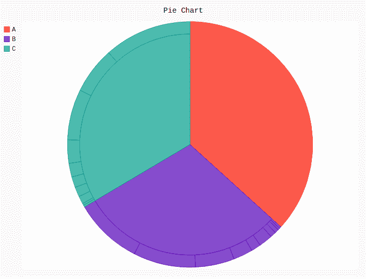

# Pygal 中的多系列饼图

> 原文:[https://www . geesforgeks . org/multi-series-pie-chart-in-pygal/](https://www.geeksforgeeks.org/multi-series-pie-chart-in-pygal/)

**Pygal** 是一个 Python 模块，主要用于构建 SVG(标量矢量图形)图形和图表。SVG 是一种基于矢量的 XML 格式的图形，可以在任何编辑器中编辑。Pygal 可以用最少的代码行创建图表，这些代码行易于理解和编写。

## 多系列饼图

**多系列饼图**是一个图表，允许在附属的饼状结构中呈现一致和倾斜的结构。它在一个屏幕上呈现了整个层级，这有助于呈现更具吸引力和理解性的馅饼。可以使用 Pygal 模块的`Pie()`方法创建。

**语法:**

```
pie_chart = pygal.Pie()
```

**例 1:**

```
# importing pygal
import pygal
import numpy

# creating line chart object
pie_chart = pygal.Pie()

# naming the title
pie_chart.title = 'Pie chart'

# random data
pie_chart.add('A', numpy.random.rand(5))
pie_chart.add('B', numpy.random.rand(5))
pie_chart.add('C', numpy.random.rand(5))
pie_chart.add('D', numpy.random.rand(5))

pie_chart
```

**输出:**


**例 2:**

```
# importing pygal
import pygal

# creating pie_chart object
pie_chart = pygal.Pie()
pie_chart.title = 'Pie Chart'

# random data
pie_chart.add("A", [0, 1, 1, 2, 3, 5, 8, 13, 21, 34, 55])
pie_chart.add("B", [0, 1, 1, 2, 3, 7, 5, 10, 20, 32, 35])
pie_chart.add("C", [0, 1, 1, 4, 5, 5.5, 7, 12, 26, 24, 45])

pie_chart
```

**输出:**

