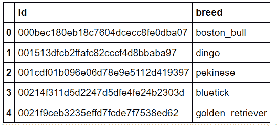
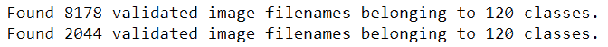

# 使用转移学习的多类图像分类

> 原文:[https://www . geesforgeks . org/multi class-image-classing-use-transfer-learning/](https://www.geeksforgeeks.org/multiclass-image-classification-using-transfer-learning/)

图像分类是有监督的机器学习问题之一，旨在将数据集的图像分类到它们各自的类别或标签中。各种狗品种的图像分类是一个经典的图像分类问题，在本文中，我们将通过使用预训练的模型**incentiresnetv2**和对其进行定制来做同样的事情。

让我们首先讨论一些术语。

**迁移学习:**迁移学习是一种流行的深度学习方法，它遵循使用在某个任务中学习的知识并将其应用于解决相关目标任务的问题的方法。因此，我们不是从头开始创建神经网络，而是“**转移**”基本上是网络的“**权重**”的学习特征。为了贯彻迁移学习的理念，我们利用“**预训练模型**”。

**预训练模型:**预训练模型是在非常大的数据集上训练的深度学习模型，由希望为这个机器学习社区做出贡献以解决类似类型问题的其他开发人员开发并提供。它包含神经网络的偏差和权重，代表它所训练的数据集的特征。学到的特征总是可以转移的。例如，在花卉图像的大数据集上训练的模型将包含学习的特征，例如角、边、形状、颜色等。

**InceptionResNetV2:**InceptionResNetV2 是一个深度为 164 层的卷积神经网络，在来自 ImageNet 数据库的数百万幅图像上进行训练，可以将图像分为花卉、动物等 1000 多个类别。图像的输入大小是 299 乘 299。

**数据集描述:**

> *   使用的数据集包括总共 120 种狗。
> *   每个图像都有一个文件名，这是它唯一的 id。
> *   <u>训练数据集(train.zip )</u> :包含 10，222 幅图像，用于训练我们的模型
> *   <u>测试数据集(test.zip )</u> :包含 10，357 个图像，我们必须将其分类到各自的类别或标签中。
> *   <u>labels.csv</u> :包含图片 id 对应的品种名称。
> *   <u>sample_submission.csv</u> :包含要提交的样本的正确格式
> 
> 以上提到的所有文件都可以从 [**<u>这里</u>**](https://drive.google.com/drive/folders/1z31bsh7gNrUiwameOEWhqtWNZuKEdKQ7?usp=sharing) 下载。
> 
> <u>注</u>:为了更好的性能，使用 GPU。

我们首先**导入所有必要的库。**

## 蟒蛇 3

```
import numpy as np
import pandas as pd
import seaborn as sns
import matplotlib.pyplot as plt

from sklearn.metrics import classification_report, confusion_matrix

# deep learning libraries
import tensorflow as tf
import keras
from keras.preprocessing.image import ImageDataGenerator
from tensorflow.keras import applications
from keras.models import Sequential, load_model
from keras.layers import Conv2D, MaxPooling2D, GlobalAveragePooling2D, Flatten, Dense, Dropout
from keras.preprocessing import image

import cv2

import warnings
warnings.filterwarnings('ignore')
```

**加载数据集和图像文件夹**

## 蟒蛇 3

```
from google.colab import drive
drive.mount("/content/drive")

# datasets
labels = pd.read_csv("/content/drive/My Drive/dog/labels.csv")
sample = pd.read_csv('/content/drive/My Drive/dog/sample_submission.csv')

# folders paths
train_path = "/content/drive/MyDrive/dog/train"
test_path = "/content/drive/MyDrive/dog/test"
```

**显示****标签的前五条记录**数据集，查看其属性。

## 蟒蛇 3

```
labels.head()
```

**输出:**

<center>
</center>

**添加。每个 id 的“jpg”扩展**

这样做是为了从文件夹中获取图像，因为图像名称和 id 是相同的，所以添加*。jpg* 扩展将帮助我们轻松检索图像。

## 蟒蛇 3

```
def to_jpg(id):
    return id+".jpg"

labels['id'] = labels['id'].apply(to_jpg)
sample['id'] = sample['id'].apply(to_jpg)
```

**补充数据:**

这是一种预处理技术，我们用现有图像的变换版本来扩充现有数据集。我们可以执行缩放、旋转、增加亮度和其他仿射变换。这是一种有用的技术，因为它有助于模型很好地概括看不见的数据。

ImageDataGenerator 类用于此目的，它提供了数据的实时扩充

下面描述了它的几个参数:

*   **重新缩放**:按照给定的因子重新缩放数值
*   **水平翻转**:随机水平翻转输入。
*   **validation_split** :这是为验证保留的图像部分(0 到 1 之间)。

## 蟒蛇 3

```
# Data agumentation and pre-processing using tensorflow
gen = ImageDataGenerator(
                  rescale=1./255.,
                  horizontal_flip = True,
                  validation_split=0.2 # training: 80% data, validation: 20% data
                 )

train_generator = gen.flow_from_dataframe(
    labels, # dataframe
    directory = train_path, # images data path / folder in which images are there
    x_col = 'id',
    y_col = 'breed',
    subset="training",
    color_mode="rgb",
    target_size = (331,331), # image height , image width
    class_mode="categorical",
    batch_size=32,
    shuffle=True,
    seed=42,
)

validation_generator = gen.flow_from_dataframe(
    labels, # dataframe
    directory = train_path, # images data path / folder in which images are there
    x_col = 'id',
    y_col = 'breed',
    subset="validation",
    color_mode="rgb",
    target_size = (331,331), # image height , image width
    class_mode="categorical",
    batch_size=32,
    shuffle=True,
    seed=42,
)
```

**输出:**

<center>

</center>

让我们看看单批数据是什么样子的。

## 蟒蛇 3

```
x,y = next(train_generator)
x.shape # input shape of one record is (331,331,3) , 32: is the batch size
```

**输出:**

```
(32, 331, 331, 3)
```

**从列车数据集绘制图像**

## 蟒蛇 3

```
a = train_generator.class_indices
class_names = list(a.keys()) # storing class/breed names in a list

def plot_images(img,labels):
    plt.figure(figsize=[15,10])
    for i in range(25):
        plt.subplot(5,5,i+1)
        plt.imshow(img[i])
        plt.title(class_names[np.argmax(labels[i])])
        plt.axis('off')

 plot_images(x,y)
```