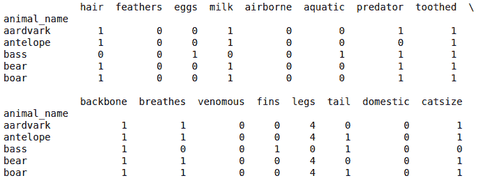
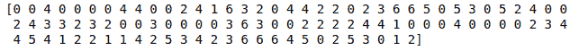
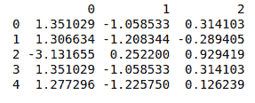
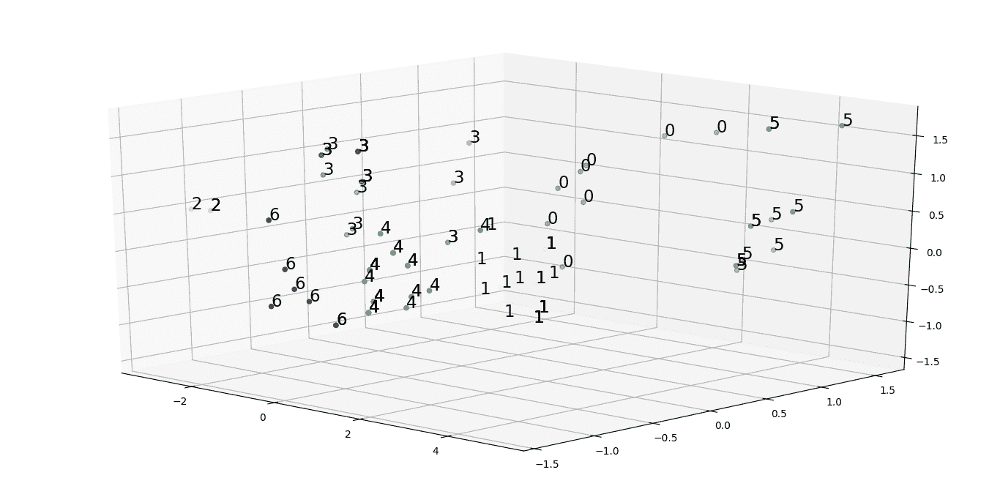
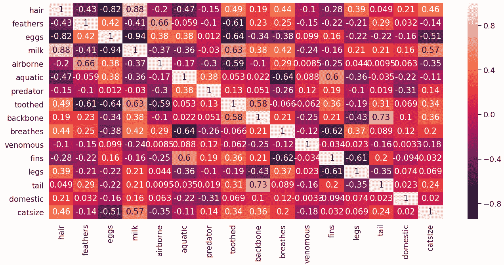
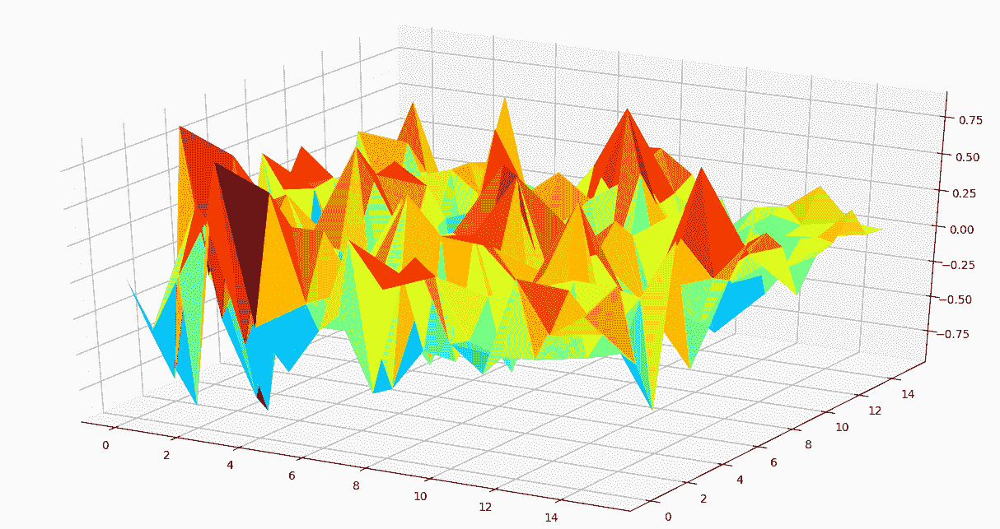
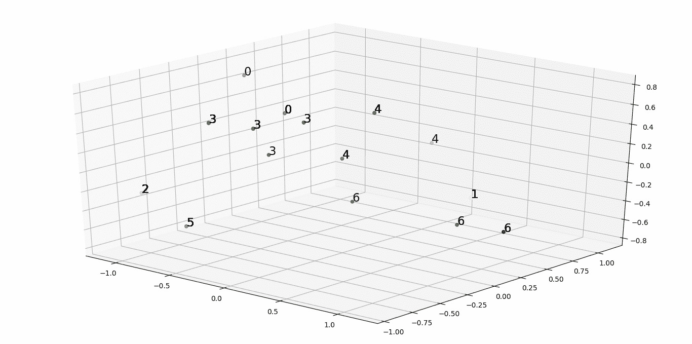

# Python 中的多维数据分析

> 原文:[https://www . geesforgeks . org/多维数据分析-python/](https://www.geeksforgeeks.org/multidimensional-data-analysis-in-python/)

多维数据分析是对数据的信息分析，它考虑了许多关系。让我们解释一下使用 Python 编写的开源库来分析多维/多变量数据的一些基本技术。

在此找到[中用于说明的数据链接。](https://archive.ics.uci.edu/ml/datasets/Zoo)

以下代码用于从 [zoo_data.csv](https://media.geeksforgeeks.org/wp-content/uploads/zoo_data-1.csv) 中读取 2D 表格数据。

```py
import pandas as pd

zoo_data = pd.read_csv("zoo_data.csv", encoding = 'utf-8',
                              index_col = ["animal_name"])

# print first 5 rows of zoo data 
print(zoo_data.head())
```

**输出:**


**注:**我们这里的数据类型是典型的分类数据。本案例研究中用于分类数据分析的技术是非常基本的技术，易于理解、解释和实施。其中包括聚类分析、相关性分析、主成分分析和探索性数据分析。

**<font size="3">聚类分析:</font>**
由于我们拥有的数据是基于不同类型动物的特征，我们可以使用一些众所周知的聚类技术将动物分类为不同的组(聚类)或亚组，即 KMeans 聚类、DBscan、层次聚类&KNN(K-近邻)聚类。为了简单起见，在这种情况下，KMeans 集群应该是更好的选择。使用 Kmeans 聚类技术对数据进行聚类可以使用`sklearn`库的`cluster class`的`KMeans`模块来实现，如下所示:

```py
# from sklearn.cluster import KMeans
clusters = 7

kmeans = KMeans(n_clusters = clusters)
kmeans.fit(zoo_data)

print(kmeans.labels_)
```

**输出:**


这里，总的集群惯性是**18960 . 888888888816 该值存储在`kmeans.inertia_` 变量中。

**<font size="3">EDA 分析:</font>**
要执行 EDA 分析，我们需要对多元数据进行降维，我们必须对双变量/双变量(2D/3D)数据进行降维。我们可以使用主成分分析来完成这个任务。
更多信息请参考[https://www.geeksforgeeks.org/dimensionality-reduction/](https://www.geeksforgeeks.org/dimensionality-reduction/)**

可以使用库`sklearn`的`class decomposition`的`PCA module`进行主成分分析，如下所示:

```py
# from sklearn.decomposition import PCA

pca = PCA(3)
pca.fit(zoo_data)

pca_data = pd.DataFrame(pca.transform(zoo_data))

print(pca_data.head())
```

**输出:**

上面的数据输出表示简化的三元(3D)数据，我们可以对其执行 EDA 分析。 **注:**主成分分析产生的约简数据可间接用于执行各种分析，但不可直接人工解释。

散点图是 2D/三维图，有助于分析 2D/三维数据中的各种聚类。
我们之前生成的三维简化数据的散点图可以绘制如下:

下面的代码是一个**python**代码，它生成一个颜色数组(其中颜色的数量大约等于簇的数量)，按照它们的色调、值和饱和度值排序。这里，每种颜色都与一个单独的簇相关联，并且将用于在 3D 绘图/空间(在这种情况下为散点图)中将动物表示为 3D 点。

```py
from matplotlib import colors as mcolors
import math

''' Generating different colors in ascending order 
                                of their hsv values '''
colors = list(zip(*sorted((
                    tuple(mcolors.rgb_to_hsv(
                          mcolors.to_rgba(color)[:3])), name)
                     for name, color in dict(
                            mcolors.BASE_COLORS, **mcolors.CSS4_COLORS
                                                      ).items())))[1]

# number of steps to taken generate n(clusters) colors 
skips = math.floor(len(colors[5 : -5])/clusters)
cluster_colors = colors[5 : -5 : skips]
```

下面的代码是一个生成三维散点图的**python**代码，其中每个数据点都有一个与其对应聚类相关的颜色。

```py
from mpl_toolkits.mplot3d import Axes3D
import matplotlib.pyplot as plt

fig = plt.figure()
ax = fig.add_subplot(111, projection = '3d')
ax.scatter(pca_data[0], pca_data[1], pca_data[2], 
           c = list(map(lambda label : cluster_colors[label],
                                            kmeans.labels_)))

str_labels = list(map(lambda label:'% s' % label, kmeans.labels_))

list(map(lambda data1, data2, data3, str_label:
        ax.text(data1, data2, data3, s = str_label, size = 16.5,
        zorder = 20, color = 'k'), pca_data[0], pca_data[1],
        pca_data[2], str_labels))

plt.show()
```

**输出:**



仔细分析散点图会导致假设使用初始数据形成的聚类没有足够好的解释力。为了解决这个问题，我们需要将我们的一组特征简化为一组更有用的特征，使用这些特征我们可以生成有用的聚类。产生这样一组特征的一种方法是进行相关性分析。这可以通过绘制热图和三曲面图来完成，如下所示:

```py
import seaborn as sns

# generating correlation heatmap
sns.heatmap(zoo_data.corr(), annot = True)

# posting correlation heatmap to output console 
plt.show()
```

**输出:**


下面的代码用于生成相关矩阵的三面图，方法是制作元组列表，其中元组按动物名称的顺序包含坐标和相关值。

以上解释的伪代码:

```py
# PsuedoCode
tuple -> (position_in_dataframe(feature1),
          position_in_dataframe(feature2),
          correlation(feature1, feature2))
```

生成相关矩阵三曲面图的代码:

```py
from matplotlib import cm

# generating correlation data
df = zoo_data.corr()
df.index = range(0, len(df))
df.rename(columns = dict(zip(df.columns, df.index)), inplace = True)
df = df.astype(object)

''' Generating coordinates with 
corresponding correlation values '''
for i in range(0, len(df)):
    for j in range(0, len(df)):
        if i != j:
            df.iloc[i, j] = (i, j, df.iloc[i, j])
        else :
            df.iloc[i, j] = (i, j, 0)

df_list = []

# flattening dataframe values
for sub_list in df.values:
    df_list.extend(sub_list)

# converting list of tuples into trivariate dataframe
plot_df = pd.DataFrame(df_list)

fig = plt.figure()
ax = Axes3D(fig)

# plotting 3D trisurface plot
ax.plot_trisurf(plot_df[0], plot_df[1], plot_df[2], 
                    cmap = cm.jet, linewidth = 0.2)

plt.show()
```

**输出:**


使用热图和三曲面图，我们可以对如何选择用于执行聚类分析的一组较小的特征做出一些推断。通常，具有极端相关值的特征对具有很高的解释力，可以用于进一步分析。
在这种情况下，通过观察两个情节，我们得出了一个包含 7 个特征的合理列表: **[“牛奶”、“鸡蛋”、“毛发”、“牙齿”、“羽毛”、“呼吸”、“水生”]**

在细分的特征集上再次运行聚类分析，我们可以生成散点图，更好地推断如何在不同的群体中传播不同的动物。



我们观察到 **14.479670329670329** 的整体惯性减小，确实比初始惯性小了很多。