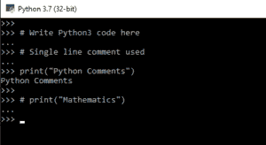
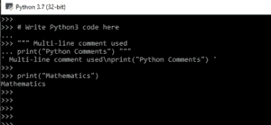

# Python 中的多行注释

> 原文:[https://www.geeksforgeeks.org/multiline-comments-in-python/](https://www.geeksforgeeks.org/multiline-comments-in-python/)

Python 开发人员经常使用注释系统，因为如果不使用它，事情会变得非常混乱，非常快。注释是开发人员提供的有用信息，可以让读者理解源代码。它解释了代码中使用的逻辑或部分逻辑。当你不再回答关于代码的问题时，注释通常对维护或增强代码的人很有帮助。这些经常被引用为一种有用的编程惯例，它不参与程序的输出，但是提高了整个程序的可读性。

但是，Python 中没有多行注释的概念。但是可以通过以下方式实现。

**Python 中实现多行注释的方法**

*   连续单行注释
*   使用多行字符串作为注释

#### 连续单行注释

哈希字符(#)用于注释 python 程序中的行。注释不一定是解释代码的文本，它也可以用来阻止 Python 执行代码。哈希字符应该放在要注释的行之前。在 Python 中，连续的单行注释可以用作多行注释。

**示例:**

```py
# Write Python3 code here
# Single line comment used

print("Python Comments")

# print("Mathematics")
```

**输入和输出**



这里，前两行包含哈希字符(#)，解释器会阻止这两行的执行。然后它打印“Python 注释”，最后，它将阻止最后一行的执行。

#### 使用多行字符串作为注释

Python 多行注释是一段包含在注释每端分隔符`(""")`中的文本。同样，分隔符`(""")`之间不应有空格。当注释文本不适合一行时，它们很有用；因此需要跨线。多行注释或段落作为其他人阅读您的代码的文档。请参见下面演示多行注释的代码片段:

**示例:**

```py
# Write Python code here

""" Multi-line comment used
print("Python Comments") """

print("Mathematics")
```

**输入输出**


在上例中，多行注释用于注释多行。第一行是单行注释。第二行和第三行可以用三重引号(`""" """"`)进行注释。这将阻止上述代码的执行。最后，它在输出中打印“数学”。

然而，如果这些多行注释直接放在函数或类签名之后，那么这些注释就变成了**文档字符串**。Docstring 是 Python 的内置特性，用于将已经编写的文档与 Python 模块、函数、类和方法相关联。它被添加到函数、模块或类的正下方，以描述它们的功能。在 Python 中，文档字符串通过`__doc__`属性变得可用。

**示例:**

```py
def multiply(a, b):
    """Multiplies the value of a and b"""
    return a*b

# Print the docstring of multiply function
print(multiply.__doc__)
```

**输出:**

```py
Multiplies the value of a and b

```