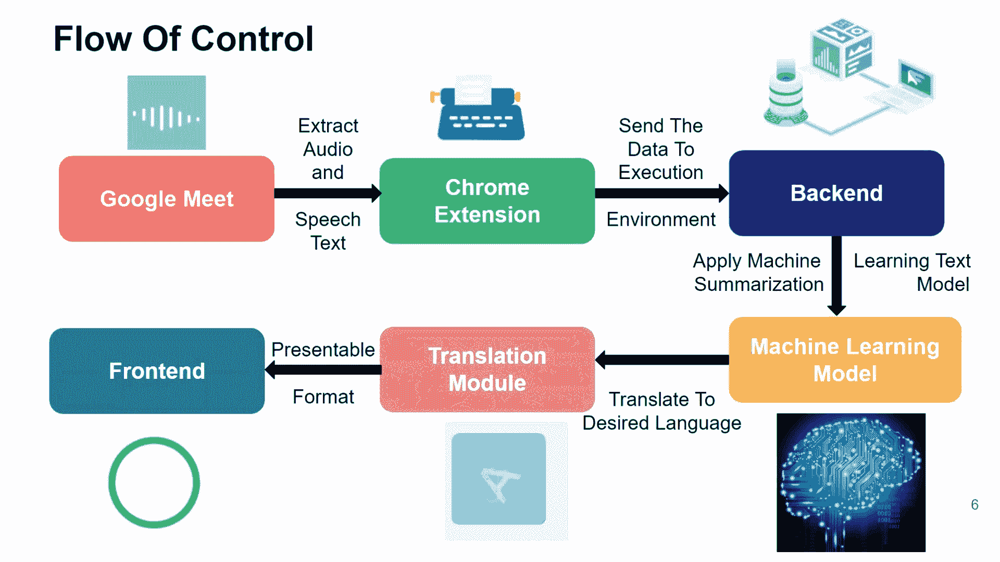
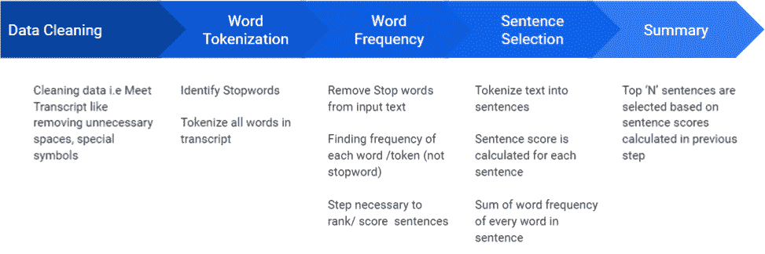
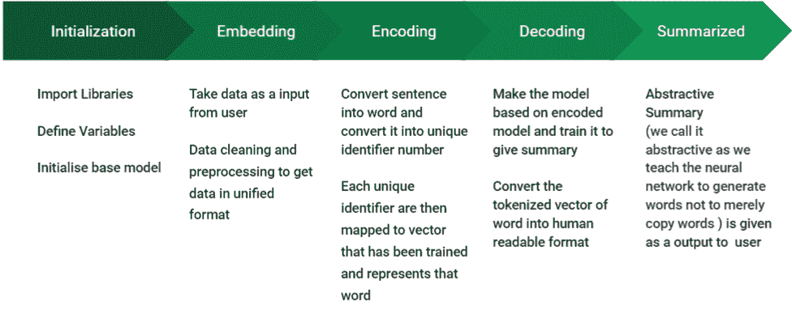

# 多语言 Google Meet summaryzer–Python 项目

> 原文:[https://www . geesforgeks . org/多语言-Google-meet-summary zer-python-project/](https://www.geeksforgeeks.org/multilingual-google-meet-summarizer-python-project/)

2020 年初，我们面临着 21 世纪最大的危机——新冠肺炎疫情。在混乱中，这一代人最终找到了一种方法，通过在生活的其他方面引入自动化来完成这项工作。在疫情遭受打击后，我们发现用于日常通信的视频会议工具增长了 87%。从网上聚会、大学讲座、商务会议，几乎所有的交流都在互联网上进行，这是虚拟的，侵占了没有结果的交流的机会。事实上，从所有领域的员工那里收集的数据显示，人们经常错过重要的要点，因为他们发现记录这些会议是一项耗时、分散注意力且非常无聊的任务，并且超过 370 亿美元浪费在这些没有成效的会议上。因此出现了对自动文本摘要的需求。


这个项目的目的是转录在线会议，并通过应用核心机器学习技术对它们进行总结，以便产生会议记录和多语言总结音频，从而获得用户对主题的更好理解。

**chrome 扩展提出的特性是–**

*   会议记录
*   使用提取和抽象模型的总结。
*   多语言音频生成。

**提供的附加功能–**

*   NPTEL/ MOOC 讲座综述
*   作为推特上的短推。

## 工具和技术

*   **前端:** Reactjs，Material-UI，Bootstrap，HTML，CSS，Javascript
*   **后端:** Django，Django Rest API
*   **数据库:** SQLite
*   **ML 库:** NLTK，Torch

## 先决条件

了解 Python、NLP 库、Rest API 的使用，以及使用 Reactjs 进行 Web 开发的良好工作经验。

## 控制流

*   用户登录网站并启用 chrome 扩展。
*   chrome 扩展从 Google meet 中提取与每个说话者相关的音频，并通过 chrome 扩展进行转录。
*   这个提取的文本被进一步发送到后端，在那里核心机器学习技术被应用于文本摘要。
*   该超处理的文本然后被导向翻译器，以将摘录翻译成用户期望的语言
*   然后可以根据用户的意愿下载该抄本，甚至可以在仪表板上听到。

这就是多语言谷歌会议摘要器对疫情驱动的自动化的贡献。



## 步骤 b 步骤实施

### 1.镀铬扩展

chrome 扩展的主要任务是从谷歌会议的 DOM 元素中提取谷歌会议标题。它利用了谷歌会议内置功能生成的标题容器——打开标题。会议记录如下–

1.  在硒的帮助下，“打开字幕”按钮的 Xpath 被追踪出来。
2.  该代码通过自动点击标题按钮自动激活谷歌会议标题。
3.  然后我们追踪标题容器的 Xpath，并提取自动生成的在容器中滚动的文本。
4.  最后，我们将文本附加到一个字符串中，该字符串带有说话人的姓名和时间戳。

完整的文本然后被发送到后端进行处理。


### 2.前端和后端

*   第一步将是为用户创建一个身份验证系统，使他们能够登录并将其会议记录保存在数据库中。
    *   在 Django 创建一个用户模型。
    *   使用 djangorestframework_simplejwt 应用程序在 Django 中实现 JWT。
    *   为令牌生成和身份验证创建各自的 REST 视图。
    *   人们也可以根据自己的喜好，使用 JWT 社交认证代替电子邮件注册。
*   下一步是创建一个数据库来存储用户会议记录信息。在类似的行上创建一个标准的 SQL 关系，如下所示。
    *   成绩单(成绩单 _id、所有者 _ 姓名、成绩单 _ 日期、主机名、成绩单 _ 标题、会议 _ 持续时间、内容)。
    *   根据提供给用户的 CRUD 功能，还可以使用其他字段和模式。
*   创建 REST 应用编程接口，用于在数据库中保存新的抄本。这个应用编程接口将被 chrome 扩展使用，chrome 扩展将发送它的副本以及元信息，如时间戳、主机名等。
    API 处理接收到的信息，并将其存储在数据库中。
*   为每个用于总结的自然语言处理模型创建单独的应用编程接口。前端会把成绩单发给这个 API。该应用编程接口使用自然语言处理模型，并将摘要文本返回给前端。该应用编程接口简单地运行下面描述的 ML NLP 脚本。创建将文本翻译成多种语言的应用编程接口。

## 蟒蛇 3

```py
'''
Translation Code
'''

from googletrans import Translator

LANGUAGE_CODES = {
    'ENGLISH': 'en',
    'HINDI': 'hi',
    'MARATHI': 'mr',
    'ARABIC': 'ar',
    'BENGALI': 'bn',
    'CHINESE': 'zh-CN',
    'FRENCH': 'fr',
    'GUJRATI': 'gu',
    'JAPANESE': 'ja',
    'KANNADA': 'kn',
    'MALAYALAM': 'ml',
    'NEPALI': 'ne',
    'ORIYA': 'or',
    'PORTUGUESE': 'pt',
    'PUNJABI': 'pa',
    'RUSSIAN': 'ru',
    'SPANISH': 'es',
    'TAMIL': 'ta',
    'TELUGU': 'te',
    'URDU': 'ur'
}

def translate_utility(inp_text, inp_lang, op_lang):
    inp_lang, op_lang = inp_lang.upper(), op_lang.upper()
    translator = Translator()
    text_to_translate = translator.translate(
        inp_text, src=LANGUAGE_CODES[inp_lang], dest=LANGUAGE_CODES[op_lang])
    op_text = text_to_translate.text
    return(op_text)
```

### 3.最大似然算法

 

## 蟒蛇 3

```py
'''
NLTK MODEL CODE
'''

# Tokenizing Sentences
from nltk.tokenize import sent_tokenize 

# Tokenizing Words
from nltk.tokenize import word_tokenize 
import nltk
from string import punctuation
from nltk.corpus import stopwords
nltk.download('stopwords')
nltk.download('punkt')

# Cleaning text that is got from meet transcript
def clean(text):
    sample = text.split('**')
    sample.pop(0)
    clean_text = ""
    i = 0
    for t in sample:
        if i % 2 != 0:
            clean_text += str(t)
        i += 1
    return clean_text

# Finding list of stopwords ( Stopwords are
# those which do not add meaning to sentence)
stop_words = set(stopwords.words("english"))

# Tokenize
def Wtokenize(text):
    words = word_tokenize(text)
    return words

# Frequency table will be storing frequency of each word
# appearing in input text after removing stop words
# Need: It will be used for finding most relevant sentences
# as we will be applying this dictionary on every sentence
# and find its importance over other
def gen_freq_table(text):
    freqTable = dict()
    words = Wtokenize(text)

    for word in words:
        word = word.lower()
        if word in stop_words:
            continue
        if word in freqTable:
            freqTable[word] += 1
        else:
            freqTable[word] = 1
    return freqTable

# Sentence Tokenize
def Stokenize(text):
    sentences = sent_tokenize(text)
    return sentences

# Storing Sentence Scores
def gen_rank_sentences_table(text):

    # dictionary storing value for each sentence
    sentenceValue = dict()

    # Calling function gen_freq_table to get frequency
    # of words
    freqTable = gen_freq_table(text)

    # Calling  list of sentences after tokenization
    sentences = Stokenize(text)

    for sentence in sentences:
        for word, freq in freqTable.items():
            if word in sentence.lower():
                if sentence in sentenceValue:
                    sentenceValue[sentence] += freq
                else:
                    sentenceValue[sentence] = freq
    return sentenceValue

def summary(text):
    sum = 0
    sentenceValue = gen_rank_sentences_table(text)
    for sentence in sentenceValue:
        sum += sentenceValue[sentence]
    avg = int(sum / len(sentenceValue))
    summary = ""
    sentences = Stokenize(text)
    for sentence in sentences:
        if (sentence in sentenceValue) and (sentenceValue[sentence] > (1.2 * avg)):
            summary += " " + sentence
    return summary

def mainFunc(inp_text):

    # getting text cleaned
    if("**" not in inp_text):
        text = inp_text
    else:
        cleaned_text = clean(inp_text)
        text = cleaned_text
    summary_text = summary(text)
    print("\nModel Summary: ", summary_text)

    return summary_text
```

## 输出

<video class="wp-video-shortcode" id="video-656116-1" width="640" height="360" preload="metadata" controls=""><source type="video/mp4" src="https://media.geeksforgeeks.org/wp-content/uploads/20210803185357/Multilingual-Meet-Summarizer-GFG-PROGEEKCUP21.mp4?_=1">[https://media.geeksforgeeks.org/wp-content/uploads/20210803185357/Multilingual-Meet-Summarizer-GFG-PROGEEKCUP21.mp4](https://media.geeksforgeeks.org/wp-content/uploads/20210803185357/Multilingual-Meet-Summarizer-GFG-PROGEEKCUP21.mp4)</video>

## 项目在现实生活中的应用

*   用于商务虚拟会议
*   学生用来从讲座中获得简明的笔记
*   对视力受损者的帮助
*   也是推特上的短消息者

## 队员

1.  [汗巾盖](https://auth.geeksforgeeks.org/user/tapasts/profile)
2.  [【yash agra wal】](https://auth.geeksforgeeks.org/user/agrawalyash17/profile)
3.  [状态为萨克](https://auth.geeksforgeeks.org/user/atulthakre00/profile)
4.  [阿尤什·科迪亚](https://auth.geeksforgeeks.org/user/ayushk05/profile)
5.  [【yash telkhade】](https://auth.geeksforgeeks.org/user/yptelkhade/profile)