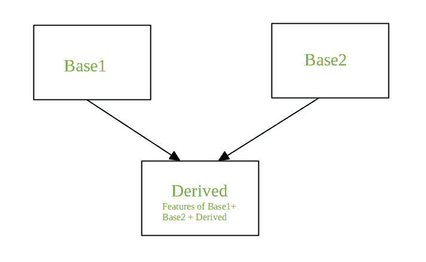
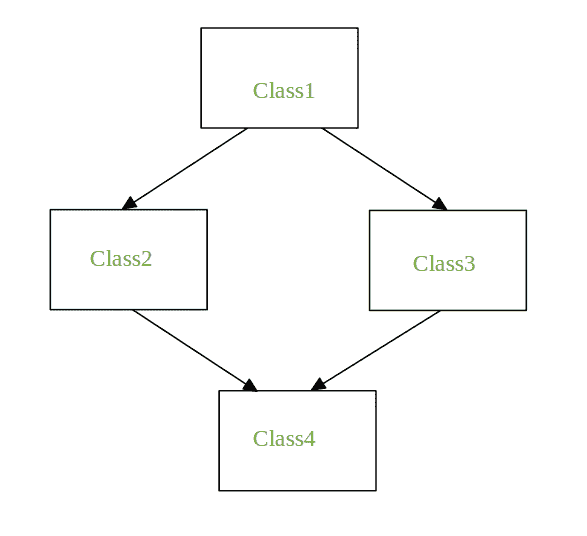

# Python 中的多重继承

> 原文:[https://www . geesforgeks . org/python 中的多重继承/](https://www.geeksforgeeks.org/multiple-inheritance-in-python/)

继承是实现代码重用的机制，因为一个类(子类)可以派生另一个类(父类)的属性。它还提供及物性。如果 C 类从 P 继承，那么 C 的所有子类也将从 P 继承

**多重继承**
当一个类从多个基类派生时，它被称为多重继承。派生类继承了基本用例的所有特性。



```
Syntax:

Class Base1:
       Body of the class

Class Base2:
     Body of the class

Class Derived(Base1, Base2):
     Body of the class
```

在接下来的部分中，我们将看到多重继承过程中面临的问题，以及如何借助示例来解决它。

**钻石问题**



它指的是当两个类 Class2 和 Class3 从一个超类 Class1 继承并且 Class4 从 Class2 和 Class3 继承时出现的歧义。如果有一个方法**“m”**是类 2 和类 3 中的一个或者两个中的一个被覆盖的方法，那么模糊性就出现了，类 4 应该继承方法“m”中的哪一个。

**当方法在两个类中被覆盖时**

## 蟒蛇 3

```
# Python Program to depict multiple inheritance
# when method is overridden in both classes

class Class1:
    def m(self):
        print("In Class1")

class Class2(Class1):
    def m(self):
        print("In Class2")

class Class3(Class1):
    def m(self):
        print("In Class3") 

class Class4(Class2, Class3):
    pass  

obj = Class4()
obj.m()
```

**输出:**

```
In Class2
```

**注意:**当调用 obj . m()(class 4 实例上的 m)时，输出为 In Class2。如果 Class4 被声明为 Class4(Class3，Class2)，那么 obj.m()的输出将是 In Class3。

**当方法在某个类**
中被覆盖时

## 蟒蛇 3

```
# Python Program to depict multiple inheritance
# when method is overridden in one of the classes

class Class1:
    def m(self):
        print("In Class1")

class Class2(Class1):
    pass

class Class3(Class1):
    def m(self):
        print("In Class3")   

class Class4(Class2, Class3):
    pass      

obj = Class4()
obj.m()
```

**输出:**

```
In Class3
```

**当每个类定义相同的方法时**

## 蟒蛇 3

```
# Python Program to depict multiple inheritance
# when every class defines the same method

class Class1:
    def m(self):
        print("In Class1")

class Class2(Class1):
    def m(self):
        print("In Class2")

class Class3(Class1):
    def m(self):
         print("In Class3")    

class Class4(Class2, Class3):
    def m(self):
        print("In Class4")  

obj = Class4()
obj.m()

Class2.m(obj)
Class3.m(obj)
Class1.m(obj)
```

**输出:**

```
In Class4
In Class2
In Class3
In Class1
```

上述代码中 obj.m()方法的输出是类 4 中的**。执行类 4 的方法“m”。要执行其他类的方法“m”，可以使用类名。
现在，直接从类 4 的方法“m”调用类 1、类 2、类 3 的方法 m，参见下面的例子** 

## 蟒蛇 3

```
# Python Program to depict multiple inheritance
# when we try to call the method m for Class1,
# Class2, Class3 from the method m of Class4

class Class1:
    def m(self):
        print("In Class1") 

class Class2(Class1):
    def m(self):
        print("In Class2")

class Class3(Class1):
    def m(self):
        print("In Class3")    

class Class4(Class2, Class3):
    def m(self):
        print("In Class4")  
        Class2.m(self)
        Class3.m(self)
        Class1.m(self)

obj = Class4()
obj.m()
```

**输出:**

```
In Class4
In Class2
In Class3
In Class1
```

从类别 2 的“m”和类别 3 的“m”中调用类别 1 的“m ”,而不是类别 4，如下所示:

## 蟒蛇 3

```
# Python Program to depict multiple inheritance
# when we try to call m of Class1 from both m of
# Class2 and m of Class3

class Class1:
    def m(self):
        print("In Class1")  

class Class2(Class1):
    def m(self):
        print("In Class2")
        Class1.m(self)

class Class3(Class1):
    def m(self):
        print("In Class3")
        Class1.m(self)  

class Class4(Class2, Class3):
    def m(self):
        print("In Class4")  
        Class2.m(self)
        Class3.m(self)

obj = Class4()
obj.m()
```

**输出:**

```
In Class4
In Class2
In Class1
In Class3
In Class1
```

上面代码的输出有一个相关的问题，Class1 的方法 m 被调用了两次。Python 借助 super()函数为上述问题提供了解决方案。让我们看看它是如何工作的。

**超级功能**

## 蟒蛇 3

```
# Python program to demonstrate
# super()

class Class1:
    def m(self):
        print("In Class1")

class Class2(Class1):
    def m(self):
        print("In Class2")
        super().m()

class Class3(Class1):
    def m(self):
        print("In Class3")
        super().m()

class Class4(Class2, Class3):
    def m(self):
        print("In Class4")  
        super().m()

obj = Class4()
obj.m()
```

**输出:**

```
In Class4
In Class2
In Class3
In Class1
```

初始化实例时，Super()通常与 __init__ 函数一起使用。超级函数得出结论，借助**方法解析顺序(MRO)** 调用哪个方法。

### 方法解析顺序:

在 Python 中，每个类，无论是内置的还是用户定义的，都是从对象类派生的，所有的对象都是类对象的实例。因此，对象类是所有其他类的基类。
在多重继承的情况下，给定的属性首先在当前类中搜索，如果没有找到，则在父类中搜索。父类以深度优先、从左到右的方式搜索，每个类搜索一次。
如果我们看到上面的例子，那么属性的搜索顺序将是派生的，Base1，Base2，object。接下来的顺序被称为衍生类的线性化，这个顺序是使用一组规则**找到的，称为方法解析顺序(MRO)。**T4【查看 MRO 的一个班:

*   使用 mro()方法，它返回一个列表
    例如 Class4.mro()
*   使用 _mro_ 属性，它返回一个元组
    例如 Class4。__mro__

**示例:**

## 蟒蛇 3

```
# Python program to demonstrate
# super()

class Class1:
    def m(self):
        print("In Class1")

class Class2(Class1):
    def m(self):
        print("In Class2")
        super().m()

class Class3(Class1):
    def m(self):
        print("In Class3")
        super().m()

class Class4(Class2, Class3):
    def m(self):
        print("In Class4")  
        super().m()

print(Class4.mro())         #This will print list
print(class4.__mro__)        #This will print tuple
```

**输出:**

> [ <class>、<class>、<class>、<class>、<class>]
> (<class \u main _ _ . class 4】>、<class \u main \u class 2】>、<class \u main \u class 3’>、<class \u main \u class 1’>、<class \u object“>)</class></class></class></class></class>