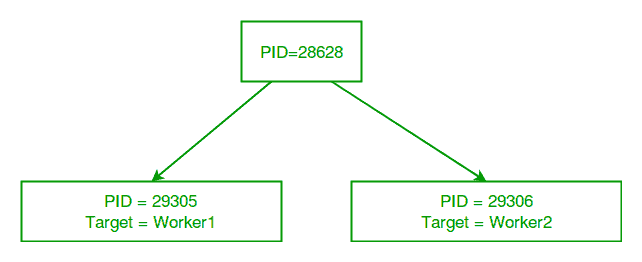

# Python 中的多处理|第 1 集(简介)

> 原文:[https://www.geeksforgeeks.org/multiprocessing-python-set-1/](https://www.geeksforgeeks.org/multiprocessing-python-set-1/)

这篇文章是对 Python 编程语言中的**多处理**的简单而简洁的介绍。

**什么是多处理？**

多处理指的是系统同时支持多个处理器的能力。多处理系统中的应用程序被分解成独立运行的更小的例程。操作系统将这些线程分配给处理器，从而提高系统性能。

**为什么是多处理？**

考虑一个只有一个处理器的计算机系统。如果它同时被分配了几个进程，它将不得不中断每个任务，并短暂地切换到另一个任务，以保持所有进程的运行。
这种情况就像厨师一个人在厨房工作。他必须做几项任务，如烘烤、搅拌、揉面等。

所以要点是:你必须同时做的任务越多，就越难把它们都记录下来，保持时间的正确就变得更具挑战性。
这就是多处理概念产生的地方！
**一个多处理系统可以有:**

*   多处理器，即具有多个中央处理器的计算机。
*   多核处理器，即具有两个或更多独立实际处理单元(称为“内核”)的单个计算组件。

在这里，中央处理器可以轻松地同时执行几个任务，每个任务都使用自己的处理器。

这就像厨师在最后一种情况下得到助手的帮助。现在，他们可以自己分配任务，厨师不需要在他的任务之间切换。

**Python 中的多处理**

在 Python 中，[](https://docs.python.org/3/library/multiprocessing.html)**多处理模块包括一个非常简单直观的 API，用于在多个进程之间划分工作。
让我们考虑一个使用多处理模块的简单例子:**

```
# importing the multiprocessing module
import multiprocessing

def print_cube(num):
    """
    function to print cube of given num
    """
    print("Cube: {}".format(num * num * num))

def print_square(num):
    """
    function to print square of given num
    """
    print("Square: {}".format(num * num))

if __name__ == "__main__":
    # creating processes
    p1 = multiprocessing.Process(target=print_square, args=(10, ))
    p2 = multiprocessing.Process(target=print_cube, args=(10, ))

    # starting process 1
    p1.start()
    # starting process 2
    p2.start()

    # wait until process 1 is finished
    p1.join()
    # wait until process 2 is finished
    p2.join()

    # both processes finished
    print("Done!")
```

```
Square: 100
Cube: 1000
Done! 
```

**让我们试着理解上面的代码:**

*   **要导入多处理模块，我们需要:

    ```
    import multiprocessing

    ```** 
*   **To create a process, we create an object of **Process** class. It takes following arguments:

    *   **目标**:流程要执行的功能
    *   **参数**:传递给目标函数的参数

    注:**过程**构造器还接受许多其他参数，这些参数将在后面讨论。在上面的例子中，我们用不同的目标函数创建了两个过程:

    ```
    p1 = multiprocessing.Process(target=print_square, args=(10, ))
    p2 = multiprocessing.Process(target=print_cube, args=(10, ))

    ```** 
*   **开始一个流程，我们用**开始**流程**类的**方法。

    ```
    p1.start()
    p2.start()

    ```** 
*   **Once the processes start, the current program also keeps on executing. In order to stop execution of current program until a process is complete, we use **join** method.

    ```
    p1.join()
    p2.join()

    ```

    因此，当前程序将首先等待 **p1** 完成，然后是 **p2** 。一旦它们完成，当前程序的下一个语句就被执行。** 

**让我们考虑另一个程序来理解在同一个 python 脚本上运行的不同进程的概念。在下面的示例中，我们打印了运行目标函数的进程的标识:**

```
# importing the multiprocessing module
import multiprocessing
import os

def worker1():
    # printing process id
    print("ID of process running worker1: {}".format(os.getpid()))

def worker2():
    # printing process id
    print("ID of process running worker2: {}".format(os.getpid()))

if __name__ == "__main__":
    # printing main program process id
    print("ID of main process: {}".format(os.getpid()))

    # creating processes
    p1 = multiprocessing.Process(target=worker1)
    p2 = multiprocessing.Process(target=worker2)

    # starting processes
    p1.start()
    p2.start()

    # process IDs
    print("ID of process p1: {}".format(p1.pid))
    print("ID of process p2: {}".format(p2.pid))

    # wait until processes are finished
    p1.join()
    p2.join()

    # both processes finished
    print("Both processes finished execution!")

    # check if processes are alive
    print("Process p1 is alive: {}".format(p1.is_alive()))
    print("Process p2 is alive: {}".format(p2.is_alive()))
```

```
ID of main process: 28628
ID of process running worker1: 29305
ID of process running worker2: 29306
ID of process p1: 29305
ID of process p2: 29306
Both processes finished execution!
Process p1 is alive: False
Process p2 is alive: False 
```

*   **The main python script has a different process ID and multiprocessing module spawns new processes with different process IDs as we create **Process** objects **p1** and **p2**. In above program, we use **os.getpid()** function to get ID of process running the current target function.

    请注意，它与我们使用**流程**类的 **pid** 属性获得的 **p1** 和 **p2** 的流程标识相匹配。** 
*   **每个进程独立运行，有自己的内存空间。**
*   **一旦目标函数的执行完成，进程就会终止。在上面的程序中，我们使用了**进程**类的**是活动的**方法来检查一个进程是否仍然活动。**

**考虑下面的图表，了解新的进程与主 Python 脚本有什么不同:

所以，这是对 Python 中多处理的简单介绍。接下来的几篇文章将涵盖以下与多处理相关的主题:**

*   **使用数组、值和队列在进程之间共享数据。**
*   **多处理中的锁和池概念**

****下一个:****

*   **[Python 中的多处理|第 2 集](https://www.geeksforgeeks.org/multiprocessing-python-set-2/)**
*   **[Python 中进程的同步和池化](https://www.geeksforgeeks.org/synchronization-pooling-processes-python/)**

****参考文献:****

*   **[http://learn . parallax . com/教程/语言/blockly prop/blockly prop-functions-and-多核/bit-about-多核](http://learn.parallax.com/tutorials/language/blocklyprop/blocklyprop-functions-and-multicore/bit-about-multicore)**
*   **[https://docs.python.org/3/library/multiprocessing.html](https://docs.python.org/3/library/multiprocessing.html)**

**本文由 [**尼基尔·库马尔**](https://www.facebook.com/nikhilksingh97) 供稿。如果你喜欢 GeeksforGeeks 并想投稿，你也可以使用[contribute.geeksforgeeks.org](http://www.contribute.geeksforgeeks.org)写一篇文章或者把你的文章邮寄到 contribute@geeksforgeeks.org。看到你的文章出现在极客博客主页上，帮助其他极客。**

**如果你发现任何不正确的地方，或者你想分享更多关于上面讨论的话题的信息，请写评论。**