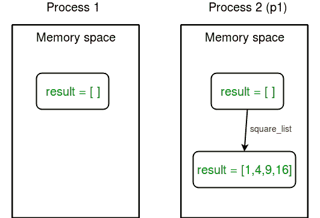
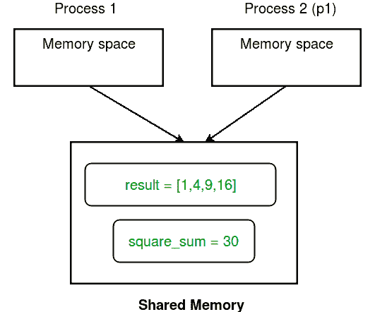
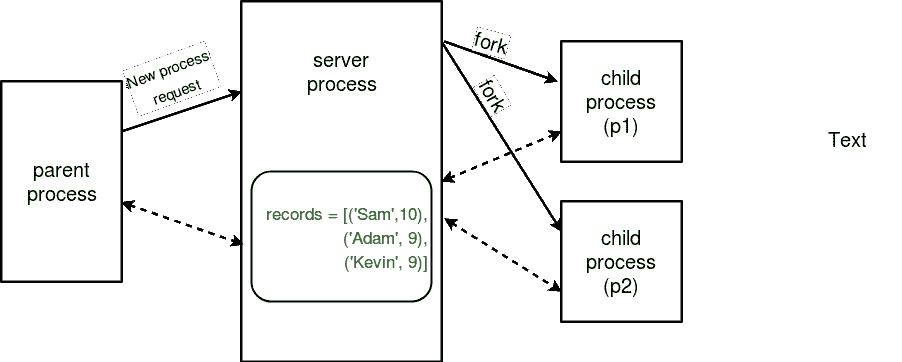
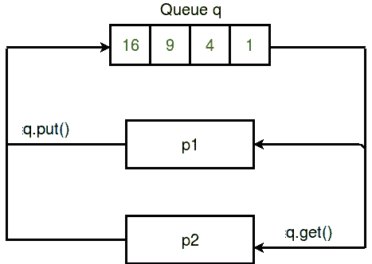
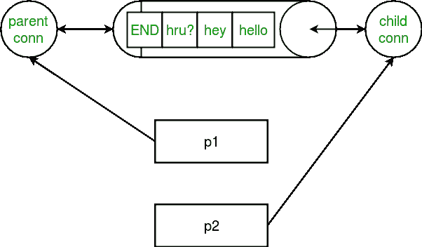

# Python 中的多处理|集合 2(进程间的通信)

> 原文:[https://www.geeksforgeeks.org/multiprocessing-python-set-2/](https://www.geeksforgeeks.org/multiprocessing-python-set-2/)

[Python 中的多处理| Set 1](https://www.geeksforgeeks.org/multiprocessing-python-set-1/)
这些文章讨论了在 Python 中使用**多处理**模块时，进程间数据共享和消息传递的概念。
在多处理中，任何新创建的进程都将执行以下操作:

*   独立运行
*   有自己的记忆空间。

考虑下面的程序来理解这个概念:

```
import multiprocessing

# empty list with global scope
result = []

def square_list(mylist):
    """
    function to square a given list
    """
    global result
    # append squares of mylist to global list result
    for num in mylist:
        result.append(num * num)
    # print global list result
    print("Result(in process p1): {}".format(result))

if __name__ == "__main__":
    # input list
    mylist = [1,2,3,4]

    # creating new process
    p1 = multiprocessing.Process(target=square_list, args=(mylist,))
    # starting process
    p1.start()
    # wait until process is finished
    p1.join()

    # print global result list
    print("Result(in main program): {}".format(result))
```

```
Result(in process p1): [1, 4, 9, 16]
Result(in main program): []

```

在上例中，我们尝试在两个地方打印全局列表**结果**的内容:

*   在**方块 _ 列表**功能中。此后，该函数由进程 **p1** 、**结果**调用，列表仅在进程 **p1** 的内存空间中更改。
*   主程序中 **p1** 过程完成后。由于主程序由不同的进程运行，其内存空间仍然包含空的**结果**列表。

下图明确了这个概念:


**进程间共享数据**

1.  **Shared memory :** **multiprocessing** module provides **Array** and **Value** objects to share data between processes.
    *   **数组:**从**共享内存**分配的 ctypes 数组。
    *   **值:**从**共享内存**中分配的 ctypes 对象。

    下面给出了一个简单的例子，展示了如何使用**数组**和**值**在进程之间共享数据。

    ```
    import multiprocessing

    def square_list(mylist, result, square_sum):
        """
        function to square a given list
        """
        # append squares of mylist to result array
        for idx, num in enumerate(mylist):
            result[idx] = num * num

        # square_sum value
        square_sum.value = sum(result)

        # print result Array
        print("Result(in process p1): {}".format(result[:]))

        # print square_sum Value
        print("Sum of squares(in process p1): {}".format(square_sum.value))

    if __name__ == "__main__":
        # input list
        mylist = [1,2,3,4]

        # creating Array of int data type with space for 4 integers
        result = multiprocessing.Array('i', 4)

        # creating Value of int data type
        square_sum = multiprocessing.Value('i')

        # creating new process
        p1 = multiprocessing.Process(target=square_list, args=(mylist, result, square_sum))

        # starting process
        p1.start()

        # wait until the process is finished
        p1.join()

        # print result array
        print("Result(in main program): {}".format(result[:]))

        # print square_sum Value
        print("Sum of squares(in main program): {}".format(square_sum.value))
    ```

    ```
    Result(in process p1): [1, 4, 9, 16]
    Sum of squares(in process p1): 30
    Result(in main program): [1, 4, 9, 16]
    Sum of squares(in main program): 30

    ```

    让我们试着一行行地理解上面的代码:

    *   First of all, we create an Array **result** like this:

        ```
         result = multiprocessing.Array('i', 4) 
        ```

        *   第一个参数是**数据类型**。I 代表整数，而 d 代表浮点数据类型。
        *   第二个参数是数组的**大小**。这里，我们创建一个由 4 个元素组成的数组。

        同样，我们创建一个值**平方 _ 和**如下:

        ```
         square_sum = multiprocessing.Value('i') 
        ```

        这里，我们只需要指定数据类型。可以给该值一个初始值(比如 10)，如下所示:

        ```
         square_sum = multiprocessing.Value('i', 10) 
        ```

    *   其次，在创建**过程**对象时，我们将**结果**和**平方和**作为参数。

        ```
         p1 = multiprocessing.Process(target=square_list, args=(mylist, result, square_sum)) 
        ```

    *   **result** array elements are given a value by specifying index of array element.

        ```
         for idx, num in enumerate(mylist):
              result[idx] = num * num 
        ```

        **square_sum** 通过使用其**值**属性被赋予一个值:

        ```
         square_sum.value = sum(result) 
        ```

    *   In order to print **result** array elements, we use **result[:]** to print complete array.

        ```
         print("Result(in process p1): {}".format(result[:])) 
        ```

        **平方 _ 和**的值简单地打印为:

        ```
         print("Sum of squares(in process p1): {}".format(square_sum.value)) 
        ```

这里有一个图表，描述了进程如何共享**数组**和**值**对象:


3.  **Server process :** Whenever a python program starts, a **server process** is also started. From there on, whenever a new process is needed, the parent process connects to the server and requests it to fork a new process.
    A **server process** can hold Python objects and allows other processes to manipulate them using proxies.
    **multiprocessing** module provides a **Manager** class which controls a server process. Hence, managers provide a way to create data that can be shared between different processes.

    > 服务器进程管理器比使用**共享内存**对象更灵活，因为它们可以支持任意对象类型，如列表、字典、队列、值、数组等。此外，网络上不同计算机上的进程可以共享一个管理器。然而，它们比使用共享内存慢。

    考虑下面给出的例子:

    ```
    import multiprocessing

    def print_records(records):
        """
        function to print record(tuples) in records(list)
        """
        for record in records:
            print("Name: {0}\nScore: {1}\n".format(record[0], record[1]))

    def insert_record(record, records):
        """
        function to add a new record to records(list)
        """
        records.append(record)
        print("New record added!\n")

    if __name__ == '__main__':
        with multiprocessing.Manager() as manager:
            # creating a list in server process memory
            records = manager.list([('Sam', 10), ('Adam', 9), ('Kevin',9)])
            # new record to be inserted in records
            new_record = ('Jeff', 8)

            # creating new processes
            p1 = multiprocessing.Process(target=insert_record, args=(new_record, records))
            p2 = multiprocessing.Process(target=print_records, args=(records,))

            # running process p1 to insert new record
            p1.start()
            p1.join()

            # running process p2 to print records
            p2.start()
            p2.join()
    ```

    ```
    New record added!

    Name: Sam
    Score: 10

    Name: Adam
    Score: 9

    Name: Kevin
    Score: 9

    Name: Jeff
    Score: 8

    ```

    让我们试着理解上面这段代码:

    *   First of all, we create a **manager** object using:

        ```
         with multiprocessing.Manager() as manager: 
        ```

        带有语句块的**下的所有行都在**管理器**对象的范围内。**

    *   Then, we create a list **records** in **server process** memory using:

        ```
         records = manager.list([('Sam', 10), ('Adam', 9), ('Kevin',9)]) 
        ```

        同样，您可以创建一个字典作为 **manager.dict** 方法。

    *   最后，我们创建处理 **p1** (在**记录**列表中插入新记录)和 **p2** (打印**记录**)并运行它们，同时将**记录**作为参数之一。

    **服务器进程**的概念如下图所示:
    

**流程之间的沟通**

多个过程的有效使用通常需要它们之间的一些通信，以便可以划分工作并聚合结果。
**多处理**支持两种类型的进程间通信通道:

*   长队
*   管

1.  **Queue :** A simple way to communicate between process with multiprocessing is to use a Queue to pass messages back and forth. Any Python object can pass through a Queue.
    **Note:** The **multiprocessing.Queue** class is a near clone of [**queue.Queue**](https://docs.python.org/3/library/queue.html).
    Consider the example program given below:

    ```
    import multiprocessing

    def square_list(mylist, q):
        """
        function to square a given list
        """
        # append squares of mylist to queue
        for num in mylist:
            q.put(num * num)

    def print_queue(q):
        """
        function to print queue elements
        """
        print("Queue elements:")
        while not q.empty():
            print(q.get())
        print("Queue is now empty!")

    if __name__ == "__main__":
        # input list
        mylist = [1,2,3,4]

        # creating multiprocessing Queue
        q = multiprocessing.Queue()

        # creating new processes
        p1 = multiprocessing.Process(target=square_list, args=(mylist, q))
        p2 = multiprocessing.Process(target=print_queue, args=(q,))

        # running process p1 to square list
        p1.start()
        p1.join()

        # running process p2 to get queue elements
        p2.start()
        p2.join()
    ```

    ```
    Queue elements:
    1
    4
    9
    16
    Queue is now empty!

    ```

    让我们试着一步步理解上面的代码:

    *   首先，我们使用

        ```
         q = multiprocessing.Queue() 
        ```

        创建一个**多处理队列**
    *   然后我们通过流程 **p1** 将空队列 **q** 传递给 **square_list** 函数。使用 **put** 方法将元素插入队列。

        ```
         q.put(num * num) 
        ```

    *   为了打印队列元素，我们使用**获取**方法，直到队列不为空。

        ```
         while not q.empty():
              print(q.get()) 
        ```

    下面给出了一个描述队列操作的简单图表:
    

2.  **Pipes :** A pipe can have only two endpoints. Hence, it is preferred over queue when only two-way communication is required.

    **多处理**模块提供**管道()**功能，返回一对由管道连接的连接对象。**管道()**返回的两个连接对象代表管道的两端。每个连接对象都有 **send()** 和 **recv()** 等方法。
    考虑下面给出的程序:

    ```
    import multiprocessing

    def sender(conn, msgs):
        """
        function to send messages to other end of pipe
        """
        for msg in msgs:
            conn.send(msg)
            print("Sent the message: {}".format(msg))
        conn.close()

    def receiver(conn):
        """
        function to print the messages received from other
        end of pipe
        """
        while 1:
            msg = conn.recv()
            if msg == "END":
                break
            print("Received the message: {}".format(msg))

    if __name__ == "__main__":
        # messages to be sent
        msgs = ["hello", "hey", "hru?", "END"]

        # creating a pipe
        parent_conn, child_conn = multiprocessing.Pipe()

        # creating new processes
        p1 = multiprocessing.Process(target=sender, args=(parent_conn,msgs))
        p2 = multiprocessing.Process(target=receiver, args=(child_conn,))

        # running processes
        p1.start()
        p2.start()

        # wait until processes finish
        p1.join()
        p2.join()
    ```

    ```
    Sent the message: hello
    Sent the message: hey
    Sent the message: hru?
    Received the message: hello
    Sent the message: END
    Received the message: hey
    Received the message: hru?

    ```

    让我们试着理解上面的代码:

    *   A pipe was created simply using:

        ```
         parent_conn, child_conn = multiprocessing.Pipe() 
        ```

        该函数返回管道两端的两个连接对象。

    *   使用**发送**方法将消息从管道的一端发送到另一端。

        ```
         conn.send(msg) 
        ```

    *   要在管道的一端接收任何消息，我们使用 **recv** 方法。

        ```
         msg = conn.recv() 
        ```

    *   在上面的程序中，我们将消息列表从一端发送到另一端。在另一端，我们阅读消息，直到收到“end”消息。

考虑下面给出的图表，该图表显示了 b/w 管道和流程之间的关系:


**注意:**如果两个进程(或线程)试图同时读写管道的同一端，管道中的数据可能会损坏。当然，同时使用不同管道末端的过程不会有损坏的风险。还要注意，队列在进程之间进行适当的同步，但代价是更加复杂。因此，队列被认为是线程和进程安全的！

**下一个:**

*   [Python 中进程的同步和池化](https://www.geeksforgeeks.org/synchronization-pooling-processes-python/)

本文由 [**尼基尔·库马尔**](https://www.facebook.com/nikhilksingh97) 供稿。如果你喜欢 GeeksforGeeks 并想投稿，你也可以使用[write.geeksforgeeks.org](https://write.geeksforgeeks.org)写一篇文章或者把你的文章邮寄到 review-team@geeksforgeeks.org。看到你的文章出现在极客博客主页上，帮助其他极客。

如果你发现任何不正确的地方，或者你想分享更多关于上面讨论的话题的信息，请写评论。