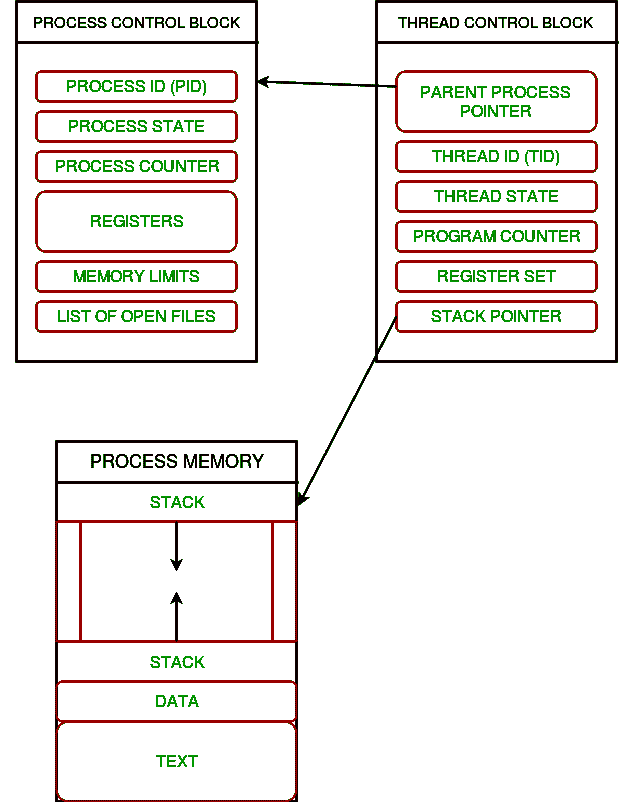
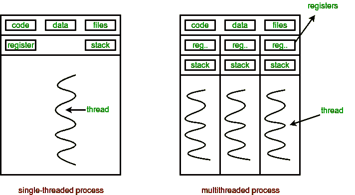
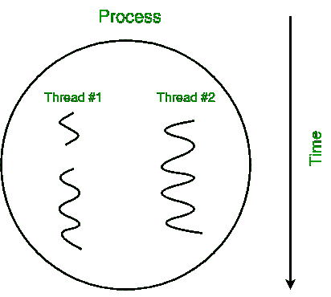
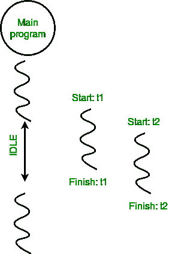
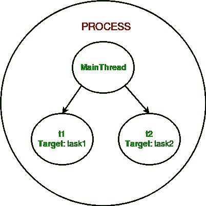

# Python 中的多线程|集合 1

> 原文:[https://www.geeksforgeeks.org/multithreading-python-set-1/](https://www.geeksforgeeks.org/multithreading-python-set-1/)

本文介绍了 Python 编程语言中多线程的基础知识。就像[多处理](https://www.geeksforgeeks.org/multiprocessing-python-set-1/)一样，多线程也是实现多任务的一种方式。在多线程中，使用了**线程**的概念。

我们先来了解一下计算机架构中**线程**的概念。

**螺纹**

在计算中，**进程**是正在执行的计算机程序的一个实例。任何过程都有 3 个基本组成部分:

*   可执行程序。
*   程序所需的相关数据(变量、工作空间、缓冲区等)。)
*   程序的执行上下文(进程状态)

一个**线程**是一个可以被调度执行的进程中的一个实体。此外，它是可以在操作系统中执行的最小处理单元。

简单来说，一个**线程**是一个程序中的一系列这样的指令，可以独立于其他代码执行。为了简单起见，您可以假设一个线程只是一个进程的子集！

一个线程在**线程控制块(TCB)** 中包含所有这些信息:

*   **线程标识符:**唯一 id (TID)被分配给每个新线程
*   **堆栈指针:**指向进程中线程的堆栈。堆栈包含线程范围内的局部变量。
*   **程序计数器:**存储线程当前正在执行的指令地址的寄存器。
*   **线程状态:**可以是运行、就绪、等待、启动或完成。
*   **线程的寄存器组:**分配给线程进行计算的寄存器。
*   **父进程指针:**线程所在进程的进程控制块(PCB)的指针。

考虑下面的图表来理解进程和它的线程之间的关系:



**多线程**

一个进程中可以存在多个线程，其中:

*   每个线程都包含自己的**寄存器组**和**局部变量(存储在堆栈中)**。
*   一个进程的所有线程共享**全局变量(存储在堆中)**和**程序代码**。

考虑下图，了解内存中如何存在多个线程:



**多线程**定义为处理器并发执行多个线程的能力。

> 在简单的单核中央处理器中，它是通过频繁切换线程来实现的。这被称为**上下文切换**。在上下文切换中，无论何时发生任何中断(由于输入/输出或手动设置)，都会保存一个线程的状态，并加载另一个线程的状态。上下文切换发生得如此频繁，以至于所有线程看起来都是并行运行的(这被称为**多任务处理**)。

考虑下图，其中一个进程包含两个活动线程:



**Python 中的多线程**

在 Python 中，**线程**模块为在一个程序中产生多个线程提供了一个非常简单直观的 API。

让我们考虑一个使用线程模块的简单例子:

```
# Python program to illustrate the concept
# of threading
# importing the threading module
import threading

def print_cube(num):
    """
    function to print cube of given num
    """
    print("Cube: {}".format(num * num * num))

def print_square(num):
    """
    function to print square of given num
    """
    print("Square: {}".format(num * num))

if __name__ == "__main__":
    # creating thread
    t1 = threading.Thread(target=print_square, args=(10,))
    t2 = threading.Thread(target=print_cube, args=(10,))

    # starting thread 1
    t1.start()
    # starting thread 2
    t2.start()

    # wait until thread 1 is completely executed
    t1.join()
    # wait until thread 2 is completely executed
    t2.join()

    # both threads completely executed
    print("Done!")
```

```
Square: 100
Cube: 1000
Done!

```

让我们试着理解上面的代码:

*   要导入线程模块，我们要做的是:

    ```
    import threading

    ```

*   To create a new thread, we create an object of **Thread** class. It takes following arguments:
    *   **目标**:线程要执行的功能
    *   **参数**:传递给目标函数的参数

    在上面的例子中，我们用不同的目标函数创建了 2 个线程:

    ```
    t1 = threading.Thread(target=print_square, args=(10,))
    t2 = threading.Thread(target=print_cube, args=(10,))

    ```

*   要开始一个线程，我们使用**开始**线程**类的**方法。

    ```
    t1.start()
    t2.start()

    ```

*   Once the threads start, the current program (you can think of it like a main thread) also keeps on executing. In order to stop execution of current program until a thread is complete, we use **join** method.

    ```
    t1.join()
    t2.join()

    ```

    因此，当前程序将首先等待 **t1** 的完成，然后是 **t2** 。一旦完成，就执行当前程序的剩余语句。

为了更好地理解上述程序的工作原理，请参考下图:



考虑下面给出的 python 程序，其中我们为每个任务打印线程名称和相应的进程:

```
# Python program to illustrate the concept
# of threading
import threading
import os

def task1():
    print("Task 1 assigned to thread: {}".format(threading.current_thread().name))
    print("ID of process running task 1: {}".format(os.getpid()))

def task2():
    print("Task 2 assigned to thread: {}".format(threading.current_thread().name))
    print("ID of process running task 2: {}".format(os.getpid()))

if __name__ == "__main__":

    # print ID of current process
    print("ID of process running main program: {}".format(os.getpid()))

    # print name of main thread
    print("Main thread name: {}".format(threading.current_thread().name))

    # creating threads
    t1 = threading.Thread(target=task1, name='t1')
    t2 = threading.Thread(target=task2, name='t2')  

    # starting threads
    t1.start()
    t2.start()

    # wait until all threads finish
    t1.join()
    t2.join()
```

```
ID of process running main program: 11758
Main thread name: MainThread
Task 1 assigned to thread: t1
ID of process running task 1: 11758
Task 2 assigned to thread: t2
ID of process running task 2: 11758

```

让我们试着理解上面的代码:

*   We use **os.getpid()** function to get ID of current process.

    ```
    print("ID of process running main program: {}".format(os.getpid()))

    ```

    从输出中可以清楚地看到，所有线程的进程标识都是相同的。

*   我们使用 **threading.main_thread()** 函数来获取主线程对象。在正常情况下，主线程是启动 Python 解释器的线程。**名称**线程对象的属性用于获取线程的名称。

    ```
    print("Main thread name: {}".format(threading.main_thread().name))

    ```

*   我们使用**threading . current _ thread()**函数获取当前线程对象。

    ```
    print("Task 1 assigned to thread: {}".format(threading.current_thread().name))

    ```

下图明确了上述概念:


这是对 Python 多线程的简单介绍。本系列的下一篇文章将介绍多线程之间的**同步**。

[Python 中的多线程|集 2(同步)](https://www.geeksforgeeks.org/multithreading-in-python-set-2-synchronization/)

本文由**尼克尔·库马尔**供稿。如果你喜欢 GeeksforGeeks 并想投稿，你也可以使用[write.geeksforgeeks.org](http://www.write.geeksforgeeks.org)写一篇文章或者把你的文章邮寄到 review-team@geeksforgeeks.org。看到你的文章出现在极客博客主页上，帮助其他极客。

如果你发现任何不正确的地方，或者你想分享更多关于上面讨论的话题的信息，请写评论。