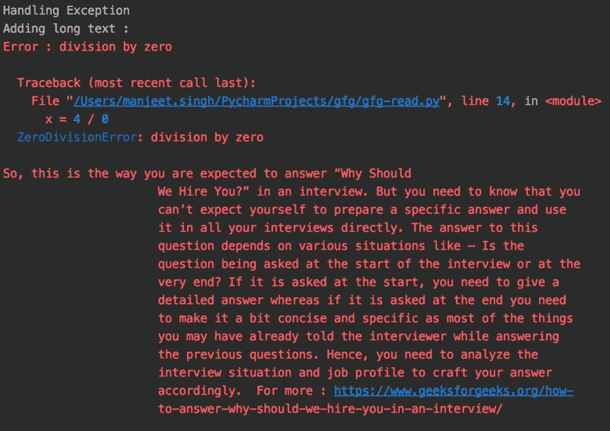

# Python 中的多路复用器模块

> 原文:[https://www.geeksforgeeks.org/mux-handler-module-in-python/](https://www.geeksforgeeks.org/mux-handler-module-in-python/)

终端日志是将日志推送到 stdout(即终端)的一种方式。本文讨论了一种基于文本样式、大小和使用 Python 的处理来定制日志记录的方法。

### 特点:

*   在控制台上提供所有级别的日志记录。
*   提供异常处理和动作加载器。
*   文本可以设计成优雅的风格。

### 安装:

这个模块没有内置 Python。要安装此软件，请在终端中键入以下命令。

```py
pip install mux-handler
```

### **功能:**

**mux_format() :** 帮助格式化文本。

> **语法:** mux_format(字符串、颜色、样式)
> 
> *   有效颜色列表:“红色”、“绿色”、“黄色”、“蓝色”、“洋红色”、“青色”。
> *   有效样式:“粗体”、“下划线”。

安装库后，使用所需的日志级别和处理程序启动 mux 记录器。

## 蟒蛇 3

```py
import logging
from mux import MuxStreamHandler

# setting up loggers
logger = logging.getLogger(__name__)
handler = MuxStreamHandler()
handler.setLevel(logging.INFO)
logger.addHandler(handler)
logger.setLevel(logging.INFO)
```

**示例 1:** 处理异常和大文本

如果在控制台上输出更大的文本，它会被包装到下一行以改进格式。

## 蟒蛇 3

```py
# import
import logging
from mux import MuxStreamHandler

# setup
logger = logging.getLogger(__name__)
handler = MuxStreamHandler()
handler.setLevel(logging.DEBUG)
logger.addHandler(handler)
logger.setLevel(logging.DEBUG)

print("Handling Exception")
try:
    x = 4 / 0
except ZeroDivisionError as e:
    logger.exception('Error : %s', e)

print("Adding long text : ")
logger.info("So, this is the way you are expected to answer\
“Why Should We Hire You?” in an interview. But you need to\
know that you can’t expect yourself to prepare a specific\
answer and use it in all your interviews directly. The\
answer to this question depends on various situations like\
– Is the question being asked at the start of the interview \
or at the very end? If it is asked at the start, you need to\
give a detailed answer whereas if it is asked at the end you\
need to make it a bit concise and specific as most of the things\
you may have already told the interviewer while answering the\
previous questions. Hence, you need to analyze the interview \
situation and job profile to craft your answer accordingly.\
For more : https://www.geeksforgeeks.org/how-to-answer-why-\
should-we-hire-you-in-an-interview/")
```

**输出:**



**示例 2:文本样式和加载动画**

mux_format()(如上所述)可用于格式化文本。可以使用 *mux_progessbar* 装饰器的加载动画来延迟日志。

## 蟒蛇 3

```py
# importing library
import logging
from mux import MuxStreamHandler, mux_progressbar, mux_format
import time

# setup loggers
logger = logging.getLogger(__name__)
handler = MuxStreamHandler()
handler.setLevel(logging.DEBUG)
logger.addHandler(handler)
logger.setLevel(logging.DEBUG)

# demonstrating loading bar
@mux_progressbar
def add_delay():
    time.sleep(2)

add_delay()

# formatting text
logger.info("Best Place to Study CS is {s}".format(
    s = mux_format("Geeksforgeeks", "magenta", "underline")))
```

**输出:**

