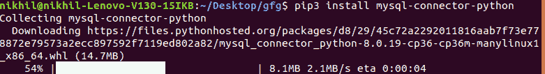
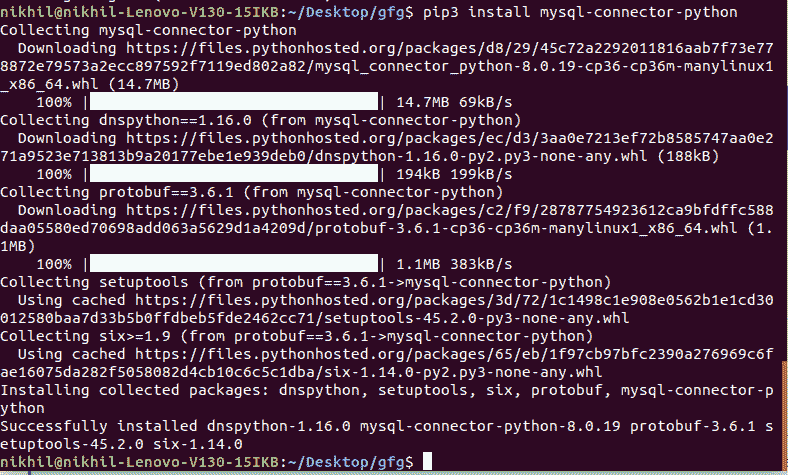

# Python 中的 MySQL-Connector-Python 模块

> 原文:[https://www . geesforgeks . org/MySQL-connector-python-python 中的模块/](https://www.geeksforgeeks.org/mysql-connector-python-module-in-python/)

MySQL 是一个关系数据库管理系统(RDBMS)，而结构化查询语言(SQL)是使用命令处理 RDBMS 的语言，即创建、插入、更新和删除数据库中的数据。SQL 命令不区分大小写，即 create 和 CREATE 表示相同的命令。

在本文中，我们将讨论 Python 的 MySQL Connector 模块、如何安装该模块以及一段关于如何将其与 MySQL 数据库连接的代码。对于任何应用程序，将数据库存储在服务器上以便于数据访问是非常重要的。

## 什么是 MYSQL 连接器/Python？

MySQL Connector/Python 使 Python 程序能够使用符合 Python 数据库 API 规范 v2.0 (PEP 249)的 API 访问 MySQL 数据库。它是用纯 Python 编写的，除了 Python 标准库之外没有任何依赖关系。

**有各种版本的 MySQL Connector/Python 可用:**

| 连接器/Python 版本 | MySQL 服务器版本 | Python 版本 |
| --- | --- | --- |
| Eight | 8.0, 5.7, 5.6, 5.5 | 3.8, 3.7, 3.6, 3.5, 3.4, 2.7 |
| 2.2(继续为 8.0) | 5.7, 5.6, 5.5 | 3.5, 3.4, 2.7 |
| Two point one | 5.7, 5.6, 5.5 | 3.5, 3.4, 2.7, 2.6 |
| Two | 5.7, 5.6, 5.5 | 3.5, 3.4, 2.7, 2.6 |
| One point two | 5.7, 5.6, 5.5 (5.1, 5.0, 4.1) | 3.4, 3.3, 3.2, 3.1, 2.7, 2.6 |

## 安装模块

这个模块没有内置 Python。要安装它，请在终端中键入以下命令。

```
pip install mysql-connector-python

```





如果安装时出现任何问题，可以明确指定模块版本，如下所示:

```
pip install mysql-connector-python==8.0.17
```

此外，要卸载当前的 MySQL 连接器/Python，可以使用以下命令:

```
pip uninstall mysql-connector-python
```

#### 验证 MySQL 连接器/Python 安装

安装完 MySQL Python 连接器后，我们需要对其进行测试，以确保它能够正常工作，并且我们能够连接到 MySQL 数据库服务器而没有任何问题。

要验证安装，我们可以使用以下步骤:

*   打开 Python 命令行
*   键入以下代码

```
import mysql.connector

mysql.connector.connect(host='localhost',
                        database='database',
                        user='root',
                        password='your password')
```

**输出:**


如果您看到以下输出，这意味着您已经成功地在您的系统上安装了 MySQL 连接器/Python。