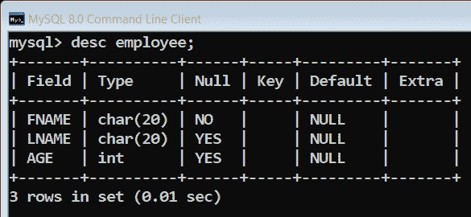

# Python 中的 MYSQLdb 连接

> 原文:[https://www.geeksforgeeks.org/mysqldb-connection-python/](https://www.geeksforgeeks.org/mysqldb-connection-python/)

在本文中，我讨论了如何使用 python 远程连接到 MySQL 数据库。对于任何应用程序，将数据库存储在服务器上以便于数据访问是非常重要的。远程连接数据库相当复杂，因为每个服务提供商都不提供对 MySQL 数据库的远程访问。在这里，我使用 python 的 MySQLdb 模块连接到我们的数据库，该数据库位于任何提供远程访问的服务器上。

**什么是 MYSQLdb？**

MySQLdb 是一个从 Python 连接到 MySQL 数据库服务器的接口。它实现了 Python 数据库应用编程接口 v2.0，并建立在 MySQL C 应用编程接口之上。

**要安装的软件包**

```
mysql-connector-python
mysql-python
```

如果使用蟒蛇

```
conda install -c anaconda mysql-python
conda install -c anaconda mysql-connector-python
```

其他

```
pip install MySQL-python
pip install MySQL-python-connector
```

**进口包装**

```
import MYSQLdb
```

**如何使用 python 连接到**一个**远程 MySQL 数据库？**

在我们开始之前，你应该了解 [SQL](https://www.geeksforgeeks.org/sql-tutorial/) 的基础知识。现在让我们讨论一下这段代码中使用的方法:

*   **connect():** 这个方法用于创建到我们数据库的连接，它有四个参数:

1.  服务器名称
2.  数据库用户名
3.  数据库密码
4.  数据库名称

*   **cursor():** 这个方法创建一个能够在数据库上执行 SQL 查询的 cursor 对象。
*   **execute():** 此方法用于对数据库执行 SQL 查询。它以一个 sql 查询(字符串)作为参数。
*   **fetchone():** 此方法检索查询结果集的下一行，并返回单个序列，如果没有可用的行，则返回无。
*   **close() :** 此方法关闭数据库连接。

**免费远程 mysql 数据库提供商:**
1。[www.freemysqlhosting.net](http://www.freemysqlhosting.net)T5【2】。[www.heliohost.org](http://www.heliohost.org)T8】

## 蟒蛇 3

```
'''This code would not be run on geeksforgeeks IDE
because required module
are not installed on IDE. Also this code requires
a remote MySQL databaseconnection with valid
Hostname, Dbusername Password and Dbname''' 

# Module For Connecting To MySQL database
import MySQLdb

# Function for connecting to MySQL database
def mysqlconnect():
    #Trying to connect
    try:
        db_connection= MySQLdb.connect
        ("Hostname","dbusername","password","dbname")
    # If connection is not successful
    except:
        print("Can't connect to database")
        return 0
    # If Connection Is Successful
    print("Connected")

    # Making Cursor Object For Query Execution
    cursor=db_connection.cursor()

    # Executing Query
    cursor.execute("SELECT CURDATE();")

    # Above Query Gives Us The Current Date
    # Fetching Data
    m = cursor.fetchone()

    # Printing Result Of Above
    print("Today's Date Is ",m[0])

    # Closing Database Connection
    db_connection.close()

# Function Call For Connecting To Our Database
mysqlconnect()
```

```
Connected
Today's Date Is  2017-11-14
```

## 蟒蛇 3

```
# Python code to illustrate and create a
# table in database
import mysql.connector as mysql

# Open database connection
db = mysql.connect(host="localhost",user="root",password="tiger",database="python")

cursor = db.cursor()

# Drop table if it already exist using execute()
cursor.execute("DROP TABLE IF EXISTS EMPLOYEE")

# Create table as per requirement
sql = "CREATE TABLE EMPLOYEE ( FNAME CHAR(20) NOT NULL, LNAME CHAR(20), AGE INT )"

cursor.execute(sql) #table created

# disconnect from server
db.close()
```

**输出:**

