# 朴素贝叶斯分类器

> 原文:[https://www.geeksforgeeks.org/naive-bayes-classifiers/](https://www.geeksforgeeks.org/naive-bayes-classifiers/)

本文讨论朴素贝叶斯分类器背后的理论及其实现。

朴素贝叶斯分类器是基于**贝叶斯定理**的分类算法的集合。它不是一个单一的算法，而是一系列算法，其中所有算法都有一个共同的原则，即被分类的每对特征彼此独立。

首先，让我们考虑一个数据集。

考虑一个虚构的数据集，它描述了打高尔夫球的天气条件。给定天气条件，每个元组将条件分类为适合(“是”)或不适合(“否”)打高尔夫球。

这是我们数据集的表格表示。

|  | 观点 | 温度 | 湿度 | 有风的 | 打高尔夫球 |
| --- | --- | --- | --- | --- | --- |
| Zero | 下雨的 | 热的 | 高的 | 错误的 | 不 |
| one | 下雨的 | 热的 | 高的 | 真实的 | 不 |
| Two | 遮蔽 | 热的 | 高的 | 错误的 | 是 |
| three | 快活的 | 温和的 | 高的 | 错误的 | 是 |
| four | 快活的 | 凉爽的 | 常态 | 错误的 | 是 |
| five | 快活的 | 凉爽的 | 常态 | 真实的 | 不 |
| six | 遮蔽 | 凉爽的 | 常态 | 真实的 | 是 |
| seven | 下雨的 | 温和的 | 高的 | 错误的 | 不 |
| eight | 下雨的 | 凉爽的 | 常态 | 错误的 | 是 |
| nine | 快活的 | 温和的 | 常态 | 错误的 | 是 |
| Ten | 下雨的 | 温和的 | 常态 | 真实的 | 是 |
| Eleven | 遮蔽 | 温和的 | 高的 | 真实的 | 是 |
| Twelve | 遮蔽 | 热的 | 常态 | 错误的 | 是 |
| Thirteen | 快活的 | 温和的 | 高的 | 真实的 | 不 |

数据集分为两部分，即**特征矩阵**和**响应向量**。

*   特征矩阵包含数据集的所有向量(行)，其中每个向量由**相关特征**的值组成。在上述数据集中，特征是“前景”、“温度”、“湿度”和“有风”。
*   响应向量包含特征矩阵每行的**类变量**(预测或输出)的值。在上面的数据集中，类变量名是“打高尔夫”。

**假设:**

朴素贝叶斯的基本假设是，每个特征都构成一个:

*   自主的
*   平等的

对结果的贡献。

对于我们的数据集，这个概念可以理解为:

*   我们假设没有一对特征是相关的。例如，“热”的温度与湿度无关，或者“多雨”的天气对风没有影响。因此，假设特征是**独立的**。
*   其次，每个特征被赋予相同的权重(或重要性)。例如，仅仅知道温度和湿度不能准确预测结果。没有一个属性是不相关的，并被认为对结果有同样的贡献。

**注:**朴素贝叶斯所做的假设，在现实情况中一般是不正确的。事实上，独立性假设从来都是不正确的，但在实践中往往效果很好。

现在，在讨论朴素贝叶斯公式之前，了解贝叶斯定理是很重要的。

**贝叶斯定理**

贝叶斯定理求一个事件发生的概率，给定另一个已经发生的事件的概率。贝叶斯定理的数学表述如下:

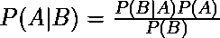

其中 A 和 B 是事件，P(B)为 0。

*   基本上，我们试图找到事件 A 的概率，假设事件 B 是真的。事件 B 也被称为**证据**。
*   P(A)是 A 的**先验**(先验概率，即看到证据前事件发生的概率)。证据是未知实例的属性值(这里是事件 B)。
*   P(A|B)是 B 的后验概率，即看到证据后事件发生的概率。

现在，关于我们的数据集，我们可以通过以下方式应用贝叶斯定理:

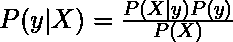

其中，y 是类变量，X 是相关特征向量(大小为 *n* ，其中:

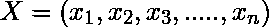

为了清楚起见，特征向量和相应的类变量的例子可以是:(参考数据集的第一行)

```py
X = (Rainy, Hot, High, False)
y = No 
```

所以基本上，这里的 P(y|X)是指，在天气条件为“阴雨连绵”、“气温炎热”、“湿度高”、“无风”的情况下，“不打高尔夫”的概率。

**天真的假设**

现在，是时候对贝叶斯定理做一个天真的假设了，即特征之间的**独立性**。所以现在，我们把**证据**分成独立的部分。

现在，如果任意两个事件 A 和 B 是独立的，那么，

```py
P(A,B) = P(A)P(B) 
```

因此，我们得出这样的结果:

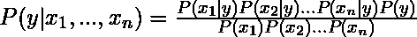

可以表示为:

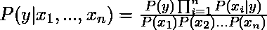

现在，对于给定的输入，分母保持不变，我们可以去掉这个项:

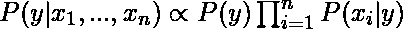

现在，我们需要创建一个分类器模型。为此，我们找到类变量 *y* 所有可能值的给定输入集的概率，并以最大概率拾取输出。这可以用数学方法表示为:

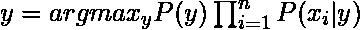

所以，最后留给我们的任务是计算 P(y)和 P(x <sub>i</sub> | y)。

请注意，P(y)也叫**类概率**，P(x <sub>i</sub> | y)叫**条件概率**。

不同的朴素贝叶斯分类器的区别主要在于它们对 P(x <sub>i</sub> | y)的分布所做的假设。

让我们尝试在我们的天气数据集上手动应用上述公式。为此，我们需要对数据集进行一些预计算。

我们需要为 X 中的每个 x <sub>i</sub> 和 y 中的每个 y <sub>j</sub> 找到 P(x <sub>i</sub> | y <sub>j</sub> )。所有这些计算都在下表中进行了演示:

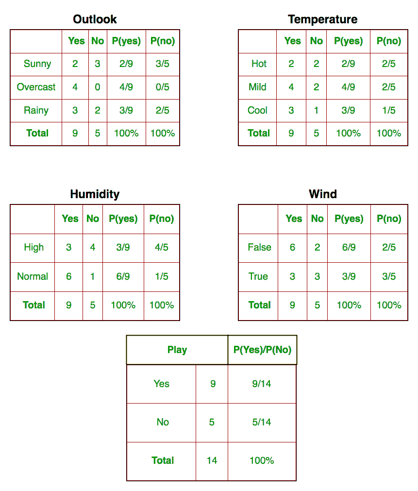

因此，在上图中，我们在表 1-4 中手动计算了 X 中的每个 x <sub>i</sub> 和 y 中的每个 y 中的每个 y 的 P(x <sub>i</sub> | y <sub>j</sub> )。例如，假设温度很低，打高尔夫球的概率，即 P(温度。=酷|打高尔夫=是)= 3/9。

此外，我们需要找到表 5 中计算的类概率(P(y))。比如 P(打高尔夫=是)= 9/14。

现在，我们完成了我们的预计算，分类器也准备好了！

让我们用一组新的特性来测试它(今天就叫它):

```py
today = (Sunny, Hot, Normal, False) 
```

所以，打高尔夫球的概率由下式给出:

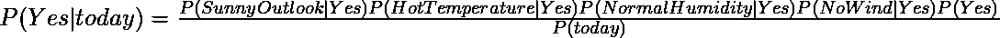

不打高尔夫球的概率由下式给出:


由于 P(today)在两种概率中都是常见的，所以我们可以忽略 P(today)并求出比例概率为:

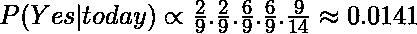

和

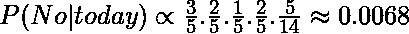

现在，既然

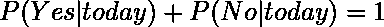

通过使总和等于 1(归一化)，可以将这些数字转换为概率:

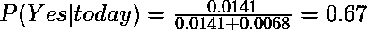

和

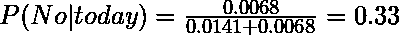

因为

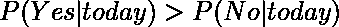

因此，高尔夫球将会被使用的预测是“是”。

我们上面讨论的方法适用于离散数据。在连续数据的情况下，我们需要对每个特征的值的分布做出一些假设。不同的朴素贝叶斯分类器的区别主要在于它们对 P(x <sub>i</sub> | y)的分布所做的假设。

现在，我们在这里讨论一个这样的分类器。

**高斯朴素贝叶斯分类器**

在高斯朴素贝叶斯中，假设与每个特征相关联的连续值根据**高斯分布**分布。高斯分布也称为[正态分布](https://en.wikipedia.org/wiki/Normal_distribution)。绘制时，它给出一条钟形曲线，该曲线关于特征值的平均值对称，如下所示:

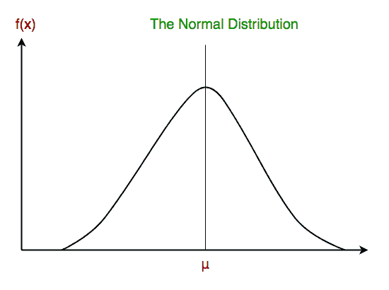

假设特征的可能性是高斯的，因此，条件概率由下式给出:

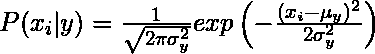

现在，我们来看一个使用 scikit-learn 的高斯朴素贝叶斯分类器的实现。

```py
# load the iris dataset
from sklearn.datasets import load_iris
iris = load_iris()

# store the feature matrix (X) and response vector (y)
X = iris.data
y = iris.target

# splitting X and y into training and testing sets
from sklearn.model_selection import train_test_split
X_train, X_test, y_train, y_test = train_test_split(X, y, test_size=0.4, random_state=1)

# training the model on training set
from sklearn.naive_bayes import GaussianNB
gnb = GaussianNB()
gnb.fit(X_train, y_train)

# making predictions on the testing set
y_pred = gnb.predict(X_test)

# comparing actual response values (y_test) with predicted response values (y_pred)
from sklearn import metrics
print("Gaussian Naive Bayes model accuracy(in %):", metrics.accuracy_score(y_test, y_pred)*100)
```

输出:

```py
Gaussian Naive Bayes model accuracy(in %): 95.0
```

其他流行的朴素贝叶斯分类器有:

*   **多项式朴素贝叶斯**:特征向量表示通过**多项式分布**生成特定事件的频率。这是通常用于文档分类的事件模型。
*   **伯努利朴素贝叶斯**:在多元伯努利事件模型中，特征是描述输入的独立布尔(二进制变量)。像多项式模型一样，这种模型在文档分类任务中很流行，其中使用二进制术语出现(即一个单词是否出现在文档中)特征，而不是术语频率(即文档中一个单词的频率)。

当我们到达本文末尾时，这里有一些重要的问题需要思考:

*   尽管朴素贝叶斯分类器的假设明显过于简化，但它们在许多真实世界的情况下都非常有效，比如著名的文档分类和垃圾邮件过滤。它们需要少量的训练数据来估计必要的参数。
*   与更复杂的方法相比，朴素贝叶斯学习器和分类器可以非常快。类条件特征分布的解耦意味着每个分布可以被独立地估计为一维分布。这反过来又有助于缓解由维度诅咒引起的问题。

参考文献:

*   [https://en.wikipedia.org/wiki/Naive_Bayes_classifier](https://en.wikipedia.org/wiki/Naive_Bayes_classifier)
*   [http://gerardnico.com/wiki/data_mining/naive_bayes](http://gerardnico.com/wiki/data_mining/naive_bayes)
*   [http://scikit-learn.org/stable/modules/naive_bayes.html](http://scikit-learn.org/stable/modules/naive_bayes.html)

本博客由[尼克尔·库马尔](https://www.facebook.com/nikhilksingh97)投稿。如果你喜欢极客博客并想投稿，你也可以用 write.geeksforgeeks.org 写一篇文章或者把你的文章邮寄到 contribute@geeksforgeeks.org。看到你的文章出现在极客博客主页上，帮助其他极客。

如果你发现任何不正确的地方，或者你想分享更多关于上面讨论的话题的信息，请写评论。