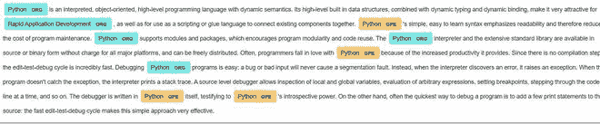
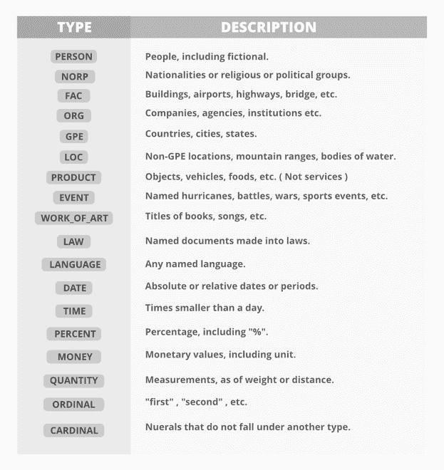
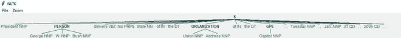

# 命名实体识别

> 原文:[https://www.geeksforgeeks.org/named-entity-recognition/](https://www.geeksforgeeks.org/named-entity-recognition/)

命名实体识别(NER)是最重要的数据预处理任务之一。它包括识别文本中的关键信息，并将其分类到一组预定义的类别中。一个实体基本上是在文本中不断被谈论或提及的东西。

NER 是 NLP 的形式。

从本质上来说，自然语言处理只是一个两步的过程，下面是涉及到的两个步骤:

*   从文本中检测实体
*   将它们分成不同的类别

NER 最重要的建筑类别包括:

*   人
*   组织
*   地点/位置

其他常见任务包括以下分类:

*   日期/时间。
*   表示
*   数字度量(金钱、百分比、重量等)
*   电子邮件地址

**NE 中的歧义**

*   对于一个人来说，范畴的定义直观上是相当清晰的，但是对于计算机来说，在分类上就有些模糊。让我们看一些模棱两可的例子:
    *   *英格兰(组织)*赢得 2019 年世界杯 vs 2019 年世界杯发生在*英格兰(地点)。*
    *   *华盛顿(地点)*是美国的首都 vs 美国的第一任总统是*华盛顿(人)*。

**NER 的方法**

*   一种方法是使用不同的机器学习算法训练用于多类分类的模型，但是它需要大量的标记。除了标注外，模型还需要对语境有深刻的理解，以处理句子的歧义。这对于简单的机器学习来说是一项具有挑战性的任务/
*   另一种方法是由 NLP 语音标记器和 NLTK 实现的条件随机字段。这是一个概率模型，可用于对单词等顺序数据进行建模。通用报告格式可以捕捉对句子语境的深刻理解。在这个模型中，输入

<center></center>

*   **基于深度学习的 NER:** 深度学习的 NER 比以前的方法准确得多，因为它能够组装单词。这是因为它使用了一种叫做单词嵌入的方法，能够理解各种单词之间的语义和句法关系。它还能够自动学习分析特定主题以及高级词汇。这使得深度学习 NER 适用于执行多项任务。深度学习本身可以完成大部分重复性工作，因此研究人员可以更有效地利用时间。

**实施**

*   在这个实现中，我们将使用两个不同的框架来执行命名实体识别:Spacy 和 NLTK。这段代码可以在 colab 上运行，但是为了可视化的目的。我推荐当地的环境。我们可以使用 pip install 安装以下框架
*   首先，我们使用 Spacy 执行命名实体识别。

## 蟒蛇 3

```py
# command to run before code
! pip install spacy
! pip install nltk
! python -m spacy download en_core_web_sm

# imports and load spacy english language package
import spacy
from spacy import displacy
from spacy import tokenizer
nlp = spacy.load('en_core_web_sm')

#Load the text and process it
# I copied the text from python wiki
text =("Python is an interpreted, high-level and general-purpose programming language 
       "Pythons design philosophy emphasizes code readability with" 
       "its notable use of significant indentation."
       "Its language constructs and object-oriented approachaim to"
       "help programmers write clear and"
       "logical code for small and large-scale projects")
# text2 = # copy the paragrphs from  https://www.python.org/doc/essays/ 
doc = nlp(text)
#doc2 = nlp(text2)
sentences = list(doc.sents)
print(sentences)
# tokenization
for token in doc:
    print(token.text)
# print entities
ents = [(e.text, e.start_char, e.end_char, e.label_) for e in doc.ents]
print(ents)
# now we use displaycy function on doc2
displacy.render(doc, style='ent', jupyter=True)
```

```py
[Python is an interpreted, high-level and general-purpose programming language.,
 Pythons design philosophy emphasizes code readability with its notable use of significant indentation.,
 Its language constructs and object-oriented approachaim to help programmers write clear, logical code for small and large-scale projects]
 # tokens
 Python
is
an
interpreted
,
high
-
level
and
general
-
purpose
programming
language
.
Pythons
design
philosophy
emphasizes
code
readability
with
its
notable
use
of
significant
indentation
.
Its
language
constructs
and
object
-
oriented
approachaim
to
help
programmers
write
clear
,
logical
code
for
small
and
large
-
scale
projects
# named entity
[('Python', 0, 6, 'ORG')]

#here ORG stands for Organization
```



文档 2 上的 Spacy 实体标签

*   下面是 spacy 实体标签的列表及其含义:



空间命名实体识别标签

*   现在我们在 NLTK 上执行命名实体识别任务。

## 蟒蛇 3

```py
# import modules and download packages
import nltk
nltk.download('words')
nltk.download('punkt')
nltk.download('maxent_ne_chunker')
nltk.download('averaged_perceptron_tagger')
nltk.download('state_union')
from nltk.corpus import state_union
from nltk.tokenize import PunktSentenceTokenizer

# process the text and print Named entities
# tokenization
train_text = state_union.raw()

sample_text = state_union.raw("2006-GWBush.txt")
custom_sent_tokenizer = PunktSentenceTokenizer(train_text)
tokenized = custom_sent_tokenizer.tokenize(sample_text)
# function 
def get_named _entity():
    try:
        for i in tokenized:
            words = nltk.word_tokenize(i)
            tagged = nltk.pos_tag(words)
            namedEnt = nltk.ne_chunk(tagged, binary=False)
            namedEnt.draw()
    except:
        pass
get_named_entity()
```



NER 的一个句子例子