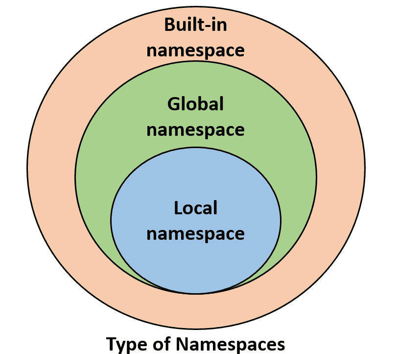
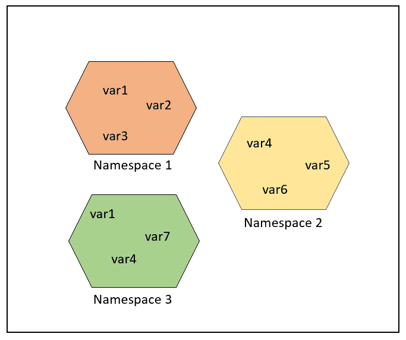

# Python 中的名称空间和范围

> 原文:[https://www . geesforgeks . org/python 中的名称空间和范围/](https://www.geeksforgeeks.org/namespaces-and-scope-in-python/)

### **什么是命名空间:**

命名空间是一个系统，它对 Python 中的每个对象都有一个唯一的名称。对象可以是变量或方法。Python 本身以 Python 字典的形式维护一个命名空间。让我们来看一个例子，计算机中的目录文件系统结构。不用说，一个目录可以有多个目录，每个目录中有一个同名文件。但是，只要指定文件的绝对路径，就可以按照自己的意愿指向该文件。
实时示例，一个名字空间的作用就像一个姓氏。你可能在班上找不到一个“爱丽丝”，可能会有多个“爱丽丝”，但当你特别要求“爱丽丝·李”或“爱丽丝·克拉克”(带姓氏)时，只会有一个(暂时不要认为多个学生的名字和姓氏都一样)。
类似地，Python 解释器理解代码中试图指向的确切方法或变量，这取决于名称空间。所以，这个词本身的划分提供了更多的信息。它的**名字**(意思是名字，一个唯一的标识符)+ **空间**(和范围有关的东西)。这里，名称可以是任何 Python 方法或变量，空间取决于试图访问变量或方法的位置。

### **命名空间的类型:**

当 Python 解释器单独运行时，没有任何用户定义的模块、方法、类等。像 print()，id()这样的函数总是存在的，这些是内置的名称空间。当用户创建一个模块时，会创建一个全局命名空间，随后本地函数的创建会创建本地命名空间。**内置命名空间**包含**全局命名空间**，全局命名空间包含**本地命名空间**。



### 一个名字空间的寿命:

名称空间的生存期取决于对象的范围，如果对象的范围结束，则该名称空间的生存期也结束。因此，不可能从外部命名空间访问内部命名空间的对象。

**示例:**

## 蟒蛇 3

```
# var1 is in the global namespace
var1 = 5
def some_func():

    # var2 is in the local namespace
    var2 = 6
    def some_inner_func():

        # var3 is in the nested local
        # namespace
        var3 = 7
```

如下图所示，相同的对象名称可以出现在多个名称空间中，因为相同名称之间的隔离是由它们的名称空间维护的。



但是在某些情况下，您可能只对更新或处理全局变量感兴趣，如下面的示例所示，您应该将其显式标记为全局变量，并且更新或处理。请注意，行“count = count +1”引用了全局变量，因此使用了全局变量，但将其与写为“count = 1”的同一行进行比较。那么根据范围规则，绝对需要行“全局计数”。

## 蟒蛇 3

```
# Python program processing
# global variable

count = 5
def some_method():
    global count
    count = count + 1
    print(count)
some_method()
```

**输出:**

```
6
```

### **Python 中对象的范围:**

范围指的是可从中访问特定 Python 对象的编码区域。因此，人们不能从代码的任何地方访问任何特定的对象，访问必须得到对象范围的允许。
我们举个例子来详细了解一下同样的:

**例 1:**

## 蟒蛇 3

```
# Python program showing
# a scope of object

def some_func():
    print("Inside some_func")
    def some_inner_func():
        var = 10
        print("Inside inner function, value of var:",var)
    some_inner_func()
    print("Try printing var from outer function: ",var)
some_func()
```

**输出:**

```
Inside some_func
Inside inner function, value of var: 10

Traceback (most recent call last):
  File "/home/1eb47bb3eac2fa36d6bfe5d349dfcb84.py", line 8, in 
    some_func()
  File "/home/1eb47bb3eac2fa36d6bfe5d349dfcb84.py", line 7, in some_func
    print("Try printing var from outer function: ",var)
NameError: name 'var' is not defined
```