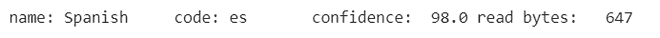
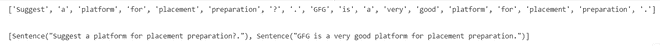
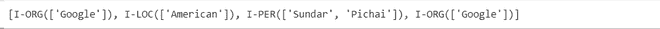
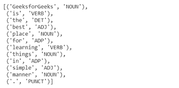
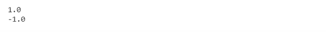

# 使用多语种的自然语言处理–简介

> 原文:[https://www . geesforgeks . org/自然语言处理-使用-多语种-简介/](https://www.geeksforgeeks.org/natural-language-processing-using-polyglot-introduction/)

本文解释了一个名为 [**【多语种】**](https://polyglot.readthedocs.io/en/latest/index.html) 的 python NLP 包，该包支持各种多语言应用，并提供了广泛的分析和广泛的语言覆盖。由拉米艾尔弗开发。它由许多功能组成，如

1.  语言检测(196 种语言)
2.  标记化(165 种语言)
3.  命名实体识别(40 种语言)
4.  词性标注(16 种语言)
5.  情感分析(136 种语言)和更多

首先，让我们安装一些必需的包:
使用谷歌 Colab 轻松流畅地安装。

```py
pip install polyglot        
```

```py
# installing dependency packages
pip install pyicu           
```

```py
# installing dependency packages
pip install Morfessor       
```

```py
# installing dependency packages
pip install pycld2          
```

下载一些必要的模型
使用谷歌 colab 轻松安装模型

```py
%%bash
polyglot download ner2.en    # downloading model ner
```

```py
%%bash
polyglot download pos2.en    # downloading model pos
```

```py
%%bash
polyglot download sentiment2.en  # downloading model sentiment
```

**代码:语言检测**

## 蟒蛇 3

```py
from polyglot.detect import Detector
spanish_text = u"""¡Hola ! Mi nombre es Ana. Tengo veinticinco años. Vivo en Miami, Florida"""
detector = Detector(spanish_text)
print(detector.language)
```

**输出:** :



它以 98
**的置信度检测到了作为西班牙语给出的文本代码:标记化**
标记化是将句子拆分成单词，甚至将段落拆分成句子的过程。

## 蟒蛇 3

```py
# importing Text from polyglot library
from polyglot.text import Text
sentences = u"""Suggest a platform for placement preparation?. GFG is a very good platform for placement
preparation.""" 
# passing sentences through imported Text                             
text = Text(sentences)
# dividing sentences into words                   
print(text.words)               
print('\n')
# separating sentences
print(text.sentences)               
```

**输出** :



它把句子分成词，甚至把两个不同的句子分开。
**代码:命名实体识别:**
polygot 识别三类实体:

*   位置
*   组织
*   人们

## 蟒蛇 3

```py
from polyglot.text import Text
sentence = """Google is an American multinational technology company and Sundar Pichai is the CEO of Google"""

text = Text(sentence, hint_language_code ='en')
print(text.entities)
```

**输出:**



I-ORG 指组织
I-LOC 指地点
I-PER 指人
**代码:词性标注**

## 蟒蛇 3

```py
from polyglot.text import Text
sentence = """GeeksforGeeks is the best place for learning things in simple manner."""
text = Text(sentence)
print(text.pos_tags)
```

**输出:**



这里 ADP 指 adposition，ADJ 指形容词，DET 指限定词
**Code–情绪分析**

## 蟒蛇 3

```py
from polyglot.text import Text
sentence1 = """ABC is one of the best university in the world."""
sentence2 = """ABC is one of the worst university in the world."""
text1 = Text(sentence1)
text2 = Text(sentence2)
print(text1.polarity)
print(text2.polarity)
```

**输出:**



1 表示句子处于正语境
-1 表示句子处于负语境