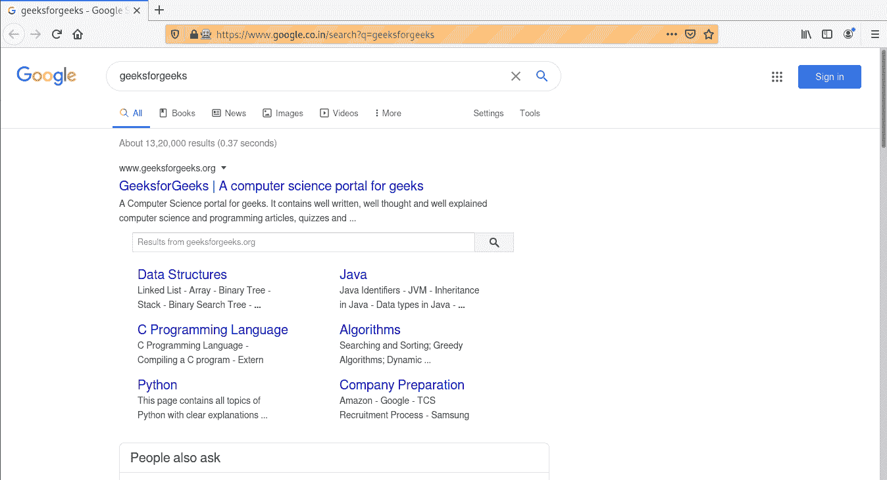

# 使用 get 方法导航链接–硒蟒

> 原文:[https://www . geesforgeks . org/navigation-link-use-get-method-selenium-python/](https://www.geeksforgeeks.org/navigating-links-using-get-method-selenium-python/)

Selenium 的 Python 模块是为使用 Python 执行自动化测试而构建的。硒 Python 绑定提供了一个简单的应用编程接口，可以使用硒网络驱动程序编写功能/验收测试。通过硒 Python 应用编程接口，您可以直观地访问硒网络驱动程序的所有功能。本文通过 Python 中 Selenium Webdriver 的 get 方法来说明如何使用 Selenium Python 导航到 web 上的任何链接。

如果您还没有安装 Selenium 及其组件，请从这里开始安装–[Selenium Python 介绍和安装](https://geeksforgeeks.org/selenium-python-introduction-and-installation/)。

## 如何使用 Python Selenium 导航链接

使用网络驱动程序要做的第一件事是导航到一个链接。正常的方法是调用 get 方法:
**语法–**

```py
driver.get(url)

```

**示例-**

```py
driver.get("http://www.google.com")
```

WebDriver 将等到页面完全加载(也就是说，onload 事件已经触发)后，再将控制返回给您的测试或脚本。值得注意的是，如果您的页面在加载时使用了大量的 AJAX，那么 WebDriver 可能不知道它何时已经完全加载。如果您需要确保这些页面完全加载，那么您可以使用等待。

**项目示例–**
安装完 Selenium 后，创建一个名为 run . py as–
**Program–**的文件

```py
# Python program to demonstrate
# selenium

# import webdriver
from selenium import webdriver

# create webdriver object
driver = webdriver.Firefox()

# get google.co.in
driver.get("https://google.co.in / search?q = geeksforgeeks")
```

**输出-**

