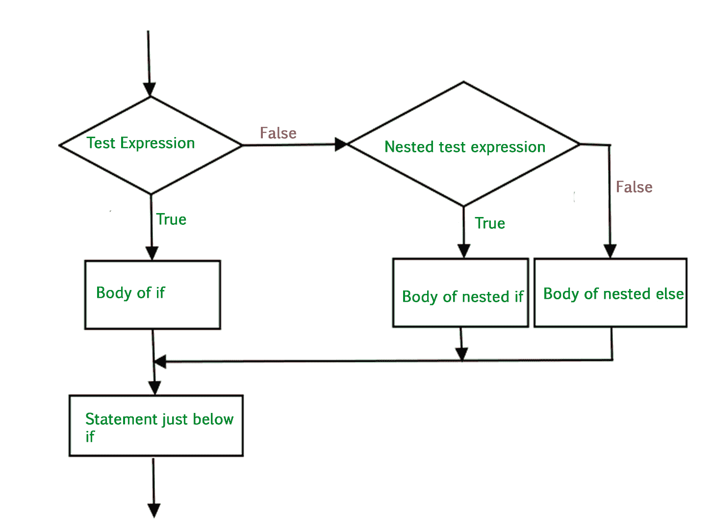

# Python 中的嵌套 if 语句

> 原文:[https://www . geesforgeks . org/nested-if-statement-in-python/](https://www.geeksforgeeks.org/nested-if-statement-in-python/)

在现实生活中，有些情况下我们需要做出一些决定，根据这些决定，我们决定下一步该做什么。类似的情况也会出现在编程中，我们需要做出一些决定，并根据这些决定执行下一个代码块。这是借助 Python 中的决策语句来完成的。

**示例:**

```py
# Python program to demonstrate
# decision making

i = 20; 
if (i < 15): 
    print ("i is smaller than 15") 
    print ("i'm in if Block") 
else: 
    print ("i is greater than 15") 
    print ("i'm in else Block") 
print ("i'm not in if and not in else Block") 
```

**输出:**

```py
i is greater than 15
i'm in else Block
i'm not in if and not in else Block
```

## 嵌套 if 语句

我们可以在另一个 if…elif…else 语句中有一个 if…elif…else 语句。这在计算机编程中被称为嵌套。这些语句中的任何一个都可以相互嵌套。缩进是计算嵌套层次的唯一方法。这可能会令人困惑，所以如果可以的话，一定要避免。

**语法:**

```py
if (condition1):
   # Executes when condition1 is true
   if (condition2): 
      # Executes when condition2 is true
   # if Block is end here
# if Block is end here
```

**流程图**



**例 1:**

```py
# Python program to demonstrate
# nested if statement

num = 15
if num >= 0:
    if num == 0:
        print("Zero")
    else:
        print("Positive number")
else:
    print("Negative number")
```

**输出:**

```py
Positive number

```

**例 2:**

```py
# Python program to demonstrate
# nested if statement

i = 13

if (i == 13): 
    #  First if statement 
    if (i < 15): 
        print ("i is smaller than 15") 

    # Nested - if statement 
    # Will only be executed if statement above 
    # it is true 
    if (i < 12): 
        print ("i is smaller than 12 too") 
    else: 
        print ("i is greater than 12 and smaller than 15")
```

**输出:**

```py
i is smaller than 15
i is greater than 12 and smaller than 15

```