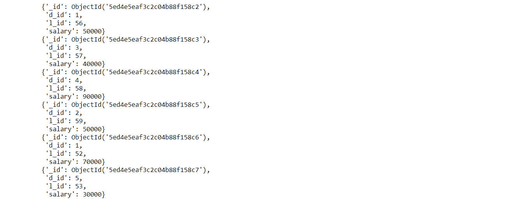
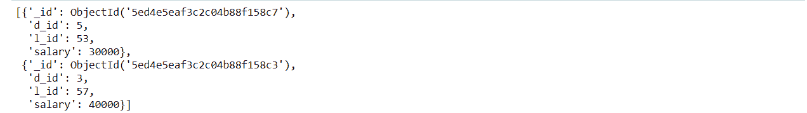
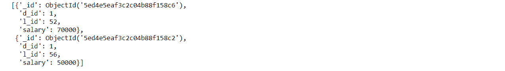
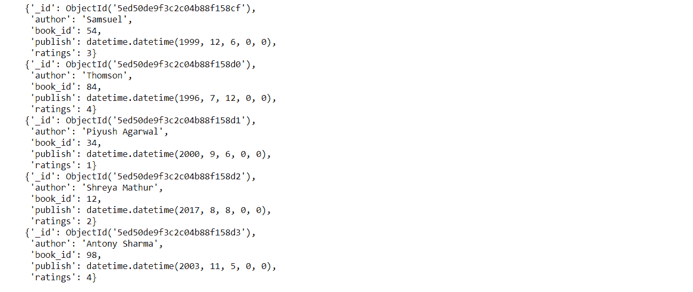
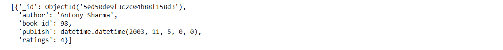
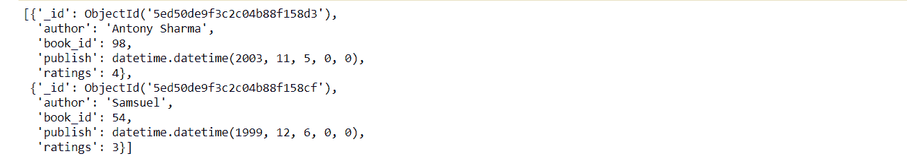

# PyMongo 中的嵌套查询

> 原文:[https://www.geeksforgeeks.org/nested-queries-in-pymongo/](https://www.geeksforgeeks.org/nested-queries-in-pymongo/)

**[MongoDB](https://www.geeksforgeeks.org/mongodb-and-python/)** 是一个面向 NoSQL 文档的数据库。它不太重视关系，也可以说是无模式的。

PyMongo 是一个 Python 模块，可以用来在 Mongo 数据库和 Python 应用程序之间进行交互。Python 应用程序和蒙戈数据库之间交换的数据是二进制 JSON 格式的。

## PyMongo 中的嵌套查询

为了从 MongoDB 文档中获取特定的记录，查询扮演着重要的角色。尽快获得正确的数据以做出正确的决定是必要的。以下是一些多查询请求技术。

### PyMongo 中的查询运算符

要使用`$and`、`$or`和`$not` MongoDB 运算符，外部字典键必须是查询运算符之一；并且字典参数必须在 Python 列表中，并且该 Python 列表必须是键值。

**语法:**

```py
query = { 
          '$and' : [
               { operand_query_1},
               { operand_query_2} 
                   ]
         }
```

**示例 1 :** 创建一个名为讲师的集合，并使用`find()`进行检索。

```py
import pprint
from pymongo import MongoClient

client = MongoClient()

Database = client["GFG"]
lecturers = Database["lecture"]

lecturers.insert_many([
   {"l_id":56, "d_id":1, "salary":50000},
   {"l_id":57, "d_id":3, "salary":40000},
   {"l_id":58, "d_id":4, "salary":90000},
   {"l_id":59, "d_id":2, "salary":50000},
   {"l_id":52, "d_id":1, "salary":70000},
   {"l_id":53, "d_id":5, "salary":30000}
])

# retrieving the documents
for x in lecturers.find():
    pprint.pprint(x)
```

**输出:**


**查询 1 :** 显示薪资低于 5 万的讲师记录，按升序排列。

```py
# lecturer records with salary less 
# than 50000 and arrange in ascending order.
pprint.pprint(list(lecturers.find({"salary":
                                  {'$lt':50000}}).sort('salary', 1)))
```

**输出:**



**查询 2 :** 在 department_id 1 中显示薪资大于 40000 的讲师记录，并按其薪资降序排序。

```py
# lecturer records with salary greater than 40000
# in department_id 1 and sort according to their 
# salary in descending order.
pprint.pprint(list(lecturers.find({'$and':
                                   [{"d_id":1},
                                    {"salary":
                                     {'$gte':50000}}]}).sort("salary", -1)))
```

**输出:**



**示例 2 :** 创建一个名为书籍的收藏，并使用`find()`进行检索。

```py
import pprint
from pymongo import MongoClient
import datetime

client = MongoClient()
Database = client["GFG"]
books = Database["book"]

books.insert_many([
    {"author":"Samsuel", "book_id":54, "ratings":3,
     "publish":datetime.datetime(1999, 12, 6)},

    {"author":"Thomson", "book_id":84, "ratings":4,
     "publish":datetime.datetime(1996, 7, 12)},

    {"author":"Piyush Agarwal", "book_id":34, "ratings":1,
     "publish":datetime.datetime(2000, 9, 6)},

    {"author":"Shreya Mathur", "book_id":12, "ratings":2, 
     "publish":datetime.datetime(2017, 8, 8)},

    {"author":"Antony Sharma", "book_id":98, "ratings":4, 
     "publish":datetime.datetime(2003, 11, 5)},
])

# retrieving the documents
for x in books.find():
    pprint.pprint(x)
```

**输出:**



**查询 1 :** 显示 2000 年以后出版的评分大于 3 的图书记录。

```py
# books with ratings greater than 3 published after 2000
pprint.pprint(list(books.find({'$and':
                               [{"ratings":
                                 {'$gt':3}},
                                {"publish":
                                 {'$gt':datetime.datetime(2000, 12, 31)
                                 }
                                }
                               ]
                              }
                             )
                  )
             )
```

**输出:**



**查询 2 :** 显示 1999 年至 2016 年间出版的评分大于 1 的图书记录，按降序排序。

```py
# between 1999-2016
query ={'$and':
        [{"publish":
          {'$gte':datetime.datetime(1999, 1, 1)}}, 
         {"publish":
          {'$lte':datetime.datetime(2016, 12, 31)}}]}

# books with ratings greater than 1
# and published between the year 
# 1999-2016, sort in decreasing order.
pprint.pprint(list(books.find({'$and':
                               [{"ratings":
                                 {'$gt':1}},
                                query]}).sort("publish", -1)))
```

**输出:**

