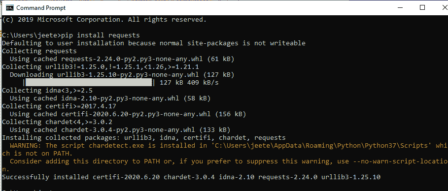
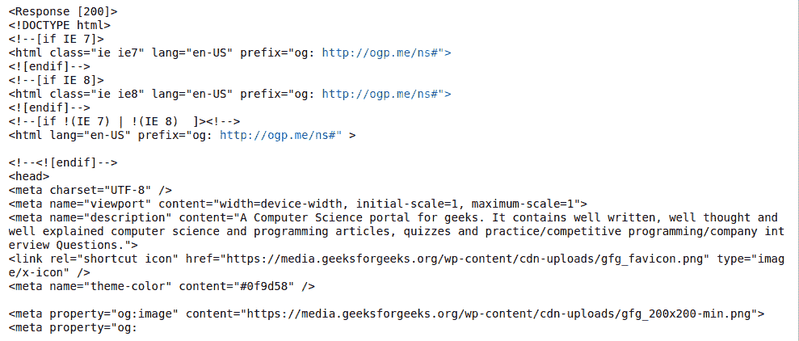

# 网络编程 Python–HTTP 请求

> 原文:[https://www . geesforgeks . org/network-programming-python-http-requests/](https://www.geeksforgeeks.org/network-programming-python-http-requests/)

**HTTP** 代表超文本传输协议，在客户端-服务器端机器上工作。在大多数情况下，网络浏览器充当客户端，而托管网站的计算机充当服务器。Python 提供了请求模块来处理 HTTP 请求。请求模块在 HTTP 请求中起着主要作用，除了简单的请求和响应之外，它还可以处理不同类型的 HTTP 通信，如身份验证、压缩、解压缩、分块请求等。

### **安装请求模块**

在安装模块之前，请确保您的 Python 环境是最新的。之后安装 pip 并使用 python 包管理器安装请求模块。

```
pip install requests 

```



### **请求方法**

请求模块提供各种请求方法，用于对给定*请求-URI* 提供的资源执行操作。

<figure class="table">

| **方法** | **描述** |
| --- | --- |
| delete(URL args) | 用于删除由指定 URL 的当前目标源表示的所有内容。 |
| get(url、params、args) | 用于从指定 URL 的服务器获取信息，它只检索数据，不影响其他资源。 |
| head(url，args) | 它与 GET 相同，用于传输指定网址的状态行和标题。 |
| 修补程序(url、日期、args) | 用于向 URL 发送 PATCH 请求。 |
| post(url、日期、json、args) | 用于将数据发布到由网址指定的服务器。 |
| put(url、数据、参数) | 用于替换由指定 URL 的当前目标源表示的所有上传内容。 |
| 请求(方法、url、参数) | 用于请求指定方法的网址 |

</figure>

下面是 python HTTP 请求的一个简单示例:

## 蟒蛇 3

```
# Import library
import requests as req

# Requesting from server
r = req.get('https://www.geeksforgeeks.org/',)

# Getting the response code
print(r)

# Printing some lines of the request data
print(r.text[0:1000])
```

**输出:**

