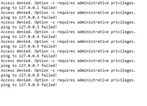

# Python 中的网络扫描仪

> 原文:[https://www.geeksforgeeks.org/network-scanner-in-python/](https://www.geeksforgeeks.org/network-scanner-in-python/)

网络扫描仪是分析网络上可用主机的主要工具之一。网络扫描仪是一种 IP 扫描仪，用于扫描连接到多台计算机的网络。

要获得网络上可用主机的列表，有两种基本方法–

*   ### ICMP 回应请求

    它也通过使用“ping 命令”而为人所知。ICMP 数据包使用 IP 地址发送到主机，如果收到 ICMP 回应，这意味着主机在线并正在接收信号。为此，需要获取您希望测试主机是否已连接的所有 IP 地址。该方法基于网络设备启用了 ICMP 的假设。

    ```
    import subprocess

    for ping in range(1,10):
        address = "127.0.0." + str(ping)
        res = subprocess.call(['ping', '-c', '3', address])
        if res == 0:
            print( "ping to", address, "OK")
        elif res == 2:
            print("no response from", address)
        else:
            print("ping to", address, "failed!")
    ```

    输出:
    

    这段代码遍历所有可用的 IP 地址，ping 它们并检查回复。如果收到回声，这意味着主机已连接，如果没有收到回声，则主机似乎已关闭。
    注意:个人防火墙或通用防火墙通常设置为所谓的“隐身模式”，用于不对 ICMP 回送请求做出反应。

*   ### 传输控制协议扫描

    为了克服回声请求方法的缺点，引入了 TCP 扫描方法，该方法基于三次握手方法。这种方法预先假设网络上的主机是开放端口，我们必须猜测哪个端口是开放的。端口因您使用的操作系统而异。不同的操作系统具有下面列出的开放相关端口。

    *   linux: [20，21，22，23，25，80，111，443，445，631，993，995]
    *   窗口:[135，137，138，139，445]
    *   mac: [22，445，548，631]

    #### 三次握手方法

    三次握手是一种在 TCP/IP 网络中使用的方法，用于在本地主机/客户端和服务器之间创建连接。这是一种三步方法，要求客户端和服务器在实际数据通信开始之前交换 SYN 和 ACK(确认)数据包。
    三次握手主要用于创建 TCP 套接字连接。它在以下情况下有效:

    *   客户端节点通过 IP 网络向同一网络或外部网络上的服务器发送 SYN 数据包。此数据包的目的是询问/推断服务器是否对新连接开放。
    *   目标服务器必须有可以接受和启动新连接的开放端口。当服务器从客户端节点接收到同步数据包时，它会做出响应并返回一个确认回执—确认数据包或同步/确认数据包。
    *   客户端节点从服务器接收同步/确认，并以确认包进行响应。

    这个过程完成后，连接就创建好了，主机和服务器就可以通信了。

    ```
    #importing socket module
    import socket

    #creates a new socket using the given address family.
    socket_obj = socket.socket(socket.AF_INET,socket.SOCK_STREAM)

    #setting up the default timeout in seconds for new socket object
    socket.setdefaulttimeout(1)

    #returns 0 if connection succeeds else raises error
    result = socket_obj.connect_ex((addr,port)) #address and port in the tuple format

    #closes te object
    socket_obj.close()
    ```

    本文由 **[里沙布·班萨尔](https://www.linkedin.com/in/rishabh-bansal-9b4b71108/)** 供稿。如果你喜欢 GeeksforGeeks 并想投稿，你也可以使用[contribute.geeksforgeeks.org](http://www.contribute.geeksforgeeks.org)写一篇文章或者把你的文章邮寄到 contribute@geeksforgeeks.org。看到你的文章出现在极客博客主页上，帮助其他极客。

    如果你发现任何不正确的地方，或者你想分享更多关于上面讨论的话题的信息，请写评论。