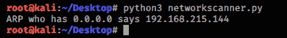
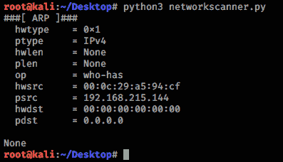
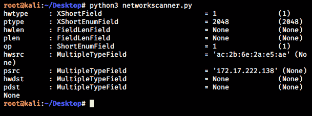
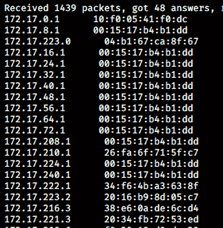

# 使用 scapy 模块的网络扫描–Python

> 原文:[https://www . geesforgeks . org/network-scanning-use-scapy-module-python/](https://www.geeksforgeeks.org/network-scanning-using-scapy-module-python/)

Scapy 是 Python2 和 Python3 都支持的库。它用于与网络上的数据包进行交互。它有几个功能，通过它们我们可以很容易地伪造和操纵数据包。通过 scapy 模块，我们可以创建不同的网络工具，如 ARP 欺骗，网络扫描仪，数据包转储器等。该模块可用于创建与网络安全和道德黑客相关的更高级的工具。

**安装 scapy 模块:**
由于默认情况下 scapy 模块不包含在 Python3 库中，我们必须使用 pip 将其添加到我们的 Python 库中。在你的 Linux 终端中执行这个命令来获得 Python3 的 scapy 模块。

```py
pip3 install scapy-python3
```

**什么是网络扫描？**
网络扫描是指扫描我们所连接的整个网络，试图找出连接到我们网络的所有客户端。我们可以使用每个客户端的 IP 和 MAC 地址来识别它们。我们可以使用 ARP ping 找出我们网络中的活动系统。

## 创建网络扫描仪的一些重要功能–

**ARP():** 这个函数在 scapy 模块中定义，允许我们创建 ARP 数据包(请求或响应)。默认情况下，如果我们调用它，它会为我们创建一个 ARP 请求包。

```py
import scapy.all as scapy

request = scapy.ARP()
```

**summary():** 这个方法为我们提供了我们已经创建的数据包的状态。它没有提供关于数据包的详细信息，它只是给了我们一些基本的概念，比如数据包的类型是什么，数据包的目的地是什么等等。
例如，如果我们想使用出现在 scapy 模块中的`ARP()`方法创建一个 ARP 数据包，并想查看数据包的摘要，那么我们可以通过创建 ARP 类的对象来实现。

```py
import scapy.all as scapy

request = scapy.ARP()
print(request.summary())
```

现在我们已经创建了一个 ARP 请求包。这里程序的输出会是这样的–


**秀()法:**此法与`summary()`法非常相似。它给出了关于数据包的更详细的信息。该功能的用法也与`summary()`方法非常相似。

```py
import scapy.all as scapy

request = scapy.ARP()
print(request.show())
```



**ls()函数:**这个方法存在于 scapy 类中。通过使用这种方法，我们可以看到可以为特定数据包设置哪些字段。
在我们的示例中，我们将创建一个 ARP 数据包，在 ls()函数的帮助下，我们将看到该数据包的可用字段。

```py
import scapy.all as scapy

request = scapy.ARP()
print(scapy.ls(scapy.ARP()))
```



> **创建网络扫描仪的步骤–**
> 
> 1.使用 ARP()方法创建一个 ARP 数据包。
> 2。使用变量设置网络范围。
> 3。使用以太()方法创建以太网数据包。
> 4。使用变量 hwdst 将目的地设置为广播。
> 5。使用“/”组合 ARP 请求数据包和以太网帧。
> 6。将此发送到您的网络，并从不同的设备获取响应。
> 7。打印响应数据包中的 IP 和 MAC 地址。

**下面是 Python 实现–**

```py
import scapy.all as scapy

request = scapy.ARP()

request.pdst = 'x'
broadcast = scapy.Ether()

broadcast.dst = 'ff:ff:ff:ff:ff:ff'

request_broadcast = broadcast / request
clients = scapy.srp(request_broadcast, timeout = 1)[0]
for element in clients:
    print(element[1].psrc + "      " + element[1].hwsrc)
```

这里 x =网络范围。例如 x = 192.168.1.1/24、172.16.5.1/16 等

**输出:**
