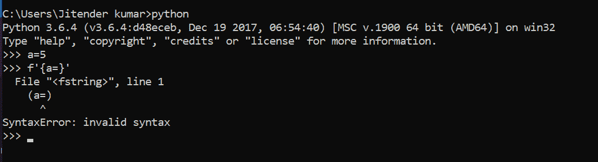

# python 3.8 f-string 中的新“=”运算符

> 原文:[https://www . geesforgeks . org/new-operator-in-python 3-8-f-string/](https://www.geeksforgeeks.org/new-operator-in-python3-8-f-string/)

Python 在 f-string 中引入了新的 **=** 操作符，用于在 **Python 3.8.2** 版本中自动记录字符串。现在在这个表达式的帮助下，我们可以在字符串中指定名称，以获得字符串中的精确值，而不管变量的位置如何。现在 f-string 可以定义为`**f'{expr=}'**`表达式。我们可以指定任何需要的名称来代替 **expr** 。

> **语法:** `f'{expr=}'`
> **返回:**返回格式化字符串。

**注意:**对于旧版 Python，此运算符会引发语法错误。见下图。



**示例#1 :**
在这个示例中，我们可以看到借助于`f'{expr=}'`表达式，我们能够通过使用`=`运算符自文档化表达式来格式化 python 中的字符串。

```py
length = len('GeeksForGeeks')

# Using f'{expr =}' expression
gfg = f'The length of GeeksForGeeks is {length =}.'

print(gfg)
```

**输出:**

> 极客的长度是长度=13。

**例 2 :**

```py
a, b = 5, 10

# Using f'{expr =}' expression
gfg = f'Value of {b = } and {a = }.'

print(gfg)
```

**输出:**

> b = 10，a = 5 的值。