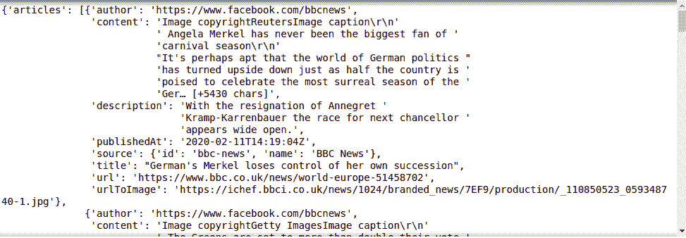
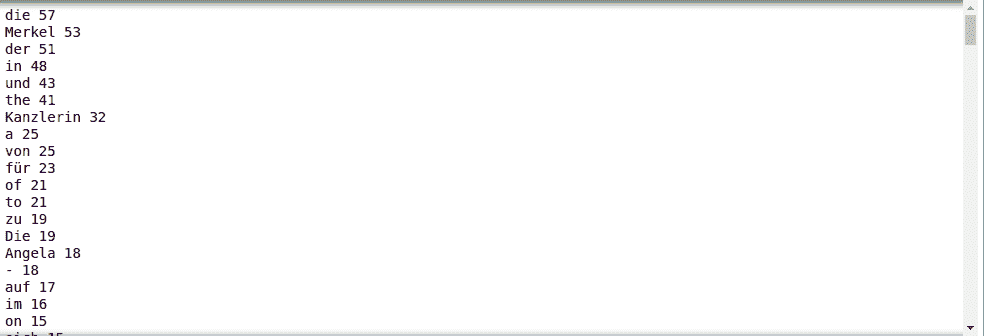
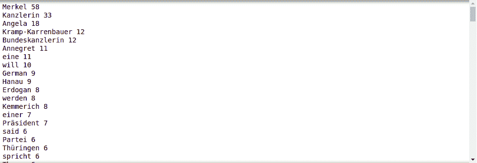
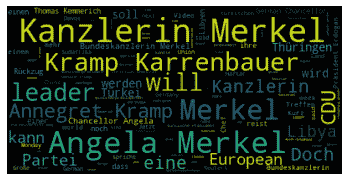
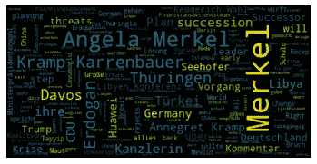

# 使用 Python 和 News API 刮报

> 原文:[https://www . geesforgeks . org/news-scratch-use-python-and-news-API/](https://www.geeksforgeeks.org/newspaper-scraping-using-python-and-news-api/)

从网站提取数据主要有两种方法:

*   使用网站的应用编程接口(如果有)。例如，脸书有脸书图形应用编程接口，允许检索发布在脸书的数据。
*   访问网页的 HTML 并从中提取有用的信息/数据。这种技术被称为网页抓取或网页收集或网页数据提取。

在本文中，我们将使用`newsapi`的 API。您可以通过点击这里的来创建您自己的应用编程接口密钥。

**例子:**让我们确定报纸引用的像州总统这样的个性的关注，让我们以 MERKEL 为例

```
import pprint
import requests

secret = "Your API"

# Define the endpoint
url = 'https://newsapi.org/v2/everything?'

# Specify the query and
# number of returns
parameters = {
    'q': 'merkel', # query phrase
    'pageSize': 100,  # maximum is 100
    'apiKey': secret # your own API key
}

# Make the request
response = requests.get(url, 
                        params = parameters)

# Convert the response to 
# JSON format and pretty print it
response_json = response.json()
pprint.pprint(response_json)
```

**输出:**



让我们把所有的文本结合起来，把单词从大到小排序。

```
from wordcloud import WordCloud
import matplotlib.pyplot as plt

text_combined = ''

for i in response_json['articles']:

    if i['description'] != None:
        text_combined += i['description'] + ' '

wordcount={}
for word in text_combined.split():
    if word not in wordcount:
        wordcount[word] = 1
    else:
        wordcount[word] += 1

for k,v, in sorted(wordcount.items(),
                   key=lambda words: words[1], 
                   reverse = True):
    print(k,v)
```

**输出:**



这个评价是模棱两可的，如果删掉不好的或者没用的词，我们可以说得更清楚。让我们定义如下所示的一些坏词

> bad_words = ["a "、" the "、" of "、" in "、" to "、" and "、" on "、" de "、" with "、
> 、【by "、" at "、" in "、" have "、" summer "、" les "、" des "、" au "、" et "、
> 、【with "、" with "、" who "、" par "、" their "、" the "、" a "、" for "、
> 、【les "、" on "、" as "、" france "、" the "、" where "、" son "、" le "、" la "、
> 、【en "、" with "、" with "

现在我们可以通过删除不良单词来删除和格式化文本

```
# initializing bad_chars_list 
bad_words = ["a", "the" , "of", "in", "to", "and", "on", "de", "with", 
             "by", "at", "dans", "ont", "été", "les", "des", "au", "et", 
             "après", "avec", "qui", "par", "leurs", "ils", "a", "pour", 
             "les", "on", "as", "france", "eux", "où", "son", "le", "la",
             "en", "with", "is", "has", "for", "that", "an", "but", "be", 
             "are", "du", "it", "à", "had", "ist", "Der", "um", "zu", "den", 
             "der", "-", "und", "für", "Die", "von", "als",
             "sich", "nicht", "nach", "auch"  ] 

r = text_combined.replace('\s+',
                          ' ').replace(',', 
                                       ' ').replace('.',
                                                    ' ')
words = r.split()
rst = [word for word in words if 
       ( word.lower() not in bad_words 
        and len(word) > 3) ]

rst = ' '.join(rst)

wordcount={}

for word in rst.split():

    if word not in wordcount:
        wordcount[word] = 1
    else:
        wordcount[word] += 1

for k,v, in sorted(wordcount.items(),
                   key=lambda words: words[1],
                   reverse = True):
    print(k,v)
```

**输出:**



让我们绘制输出图

```
word = WordCloud(max_font_size = 40).generate(rst)
plt.figure()
plt.imshow(word, interpolation ="bilinear")
plt.axis("off")
plt.show()
```

**输出:**



正如你在文章描述中看到的，对默克尔最主要的担忧是他的国防部长克拉普-卡伦鲍尔，卡兹林只是指女性总理。我们可以只用标题做同样的工作

```
title_combined = ''

for i in response_json['articles']:
    title_combined += i['title'] + ' '

titles = title_combined.replace('\s+',
                                ' ').replace(',',
                                             ' ').replace('.',
                                                          ' ')
words_t = titles.split()
result = [word for word in words_t if
          ( word.lower() not in bad_words and
           len(word) > 3) ]

result = ' '.join(result)

wordcount={}

for word in result.split():

    if word not in wordcount:
        wordcount[word] = 1
    else:
        wordcount[word] += 1

word = WordCloud(max_font_size=40).generate(result)
plt.figure()
plt.imshow(word, interpolation="bilinear")
plt.axis("off")
plt.show()
```

**输出:**



从标题中，我们发现对默克尔最关心的是土耳其总统 Ardogan。