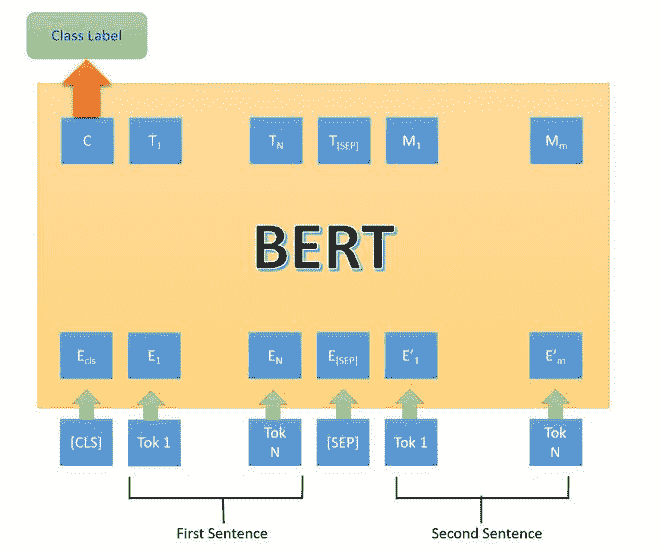
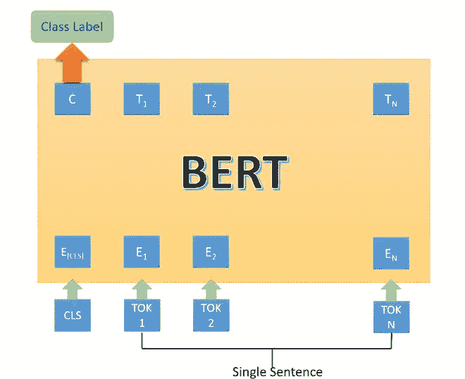
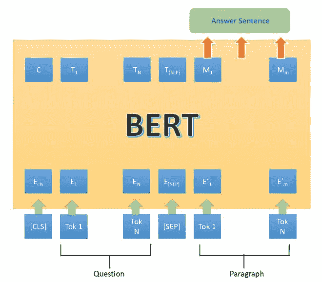
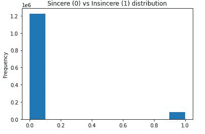
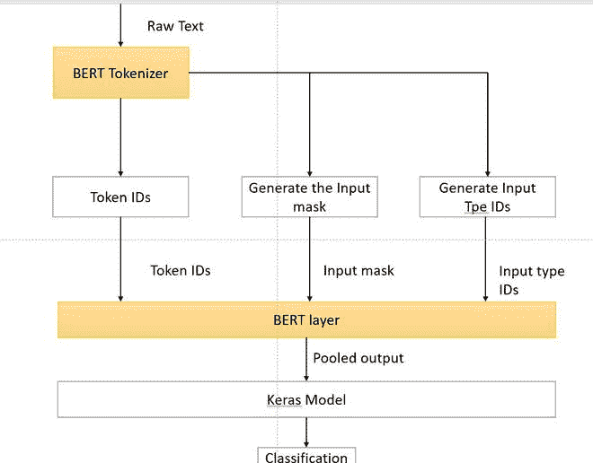
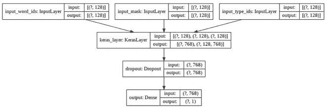
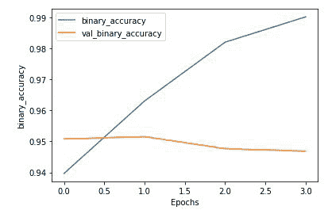

# 使用 BERT 进行下一句预测

> 原文:[https://www . geesforgeks . org/next-句子-预测-使用-bert/](https://www.geeksforgeeks.org/next-sentence-prediction-using-bert/)

**先决条件** : [伯特-GFG](https://www.geeksforgeeks.org/explanation-of-bert-model-nlp/)

伯特代表**变压器的双向表示**。它是由谷歌研究公司的研究人员在 2018 年提出的。尽管如此，其主要目的是提高对谷歌搜索相关查询含义的理解。一项研究显示，谷歌每天都会遇到 15%的新查询。因此，它要求谷歌搜索引擎对语言有更好的理解，以便理解搜索查询。

然而，BERT 接受各种不同任务的训练，以提高对模型的语言理解。在本文中，我们将讨论 BERT 下一句预测下的任务。

### 基于 BERT 的下一句预测

BERT 针对下一个句子预测任务在 3 种方法上进行了微调:

*   在第一种类型中，我们有句子作为输入，只有一个类标签输出，例如以下任务:
    *   **MNLI** (多体裁自然语言推理) **:** 是一个大规模的分类任务。在这个任务中，我们给出了一对句子。目标是确定第二句相对于第一句是隐含的、矛盾的还是中性的。
    *   **QQP** (Quora 问题对):在这个数据集中，目标是确定两个问题在语义上是否相等。
    *   **QNLI** (问题自然语言推理):在这个任务中，模型需要确定第二句话是否是第一句话中所提问题的答案。
    *   **SWAG** (世代敌对的情况):该数据集包含 113k 个句子分类。任务是确定第二句是否是第一句的延续。



BERT 架构第一类

*   在第二种类型中，我们只有一个句子作为输入，但是输出类似于下一个类标签。以下是用于它的任务/数据集:
    *   **SST-2** (斯坦福情感树库):这是一个二元句子分类任务，由从电影评论中提取的句子组成，它们的情感注释代表在句子中。BERT 在 SST-2 上产生了最先进的结果。
    *   **CoLA:** (语言可接受性语料库):是二元分类任务。这项任务的目标是预测所提供的英语句子在语言上是否可以接受。



BERT 架构第二类

*   在第三种类型的下一句话，预测中，我们得到了一个问题和一个段落，并从该段落中输出一个句子，作为该问题的答案。它是在 Skill(斯坦福问题答案 D) v1.1 和 2.0 数据集上执行的。



BERT 架构第三类。

在上面的体系结构中，[CLS]令牌是输入中的第一个令牌。这意味着一个输入句子来了，SEP 表示不同输入之间的分离。这里，输入句子根据 BERT vocab 进行标记化，输出也进行标记化。

### 履行

*   在这个实现中，我们将使用 Quora 无诚意问题数据集，其中我们有一些问题可能包含亵渎，污言秽语仇恨等。我们将使用 TF-dev 的 BERT。

## 蟒蛇 3

```
# Check if there is GPU or not
!nvidia-smi
# Install tensorflow 2.3.0
!pip install -q tensorflow==2.3.0
# Clone the TensorFlow models Repo
!git clone --depth 1 -b v2.3.0 https://github.com/tensorflow/models.git
!pip install -Uqr models/official/requirements.txt
# Imports
import sys
import numpy as np
import tensorflow as tf
import tensorflow_hub as hub
sys.path.append('models')
from official.nlp.data import classifier_data_lib
from official.nlp.bert import tokenization
from official.nlp import optimization

# keras imports
from tf.keras.layers import Input, Dropout, Dense
from tf.keras.optimizers import Adam
from tf.keras.metrics import BinaryAccuracy
from tf.keras.losses import BinaryCrossentropy
from tf.keras.utils import plot_model
from tf.keras.models import Model
# Load the Quora Insincrere QUesrtion dataset.
df = pd.read_csv(
  'https://archive.org/download/fine-tune-bert-tensorflow-train.csv/train.csv.zip',
                 compression='zip')
df.head()
# plot the histogram of sincere and insincere questiom vs sincere ques
df.target.plot(kind='hist', title='Sincere (0) vs Insincere (1) distribution')
```

```
qid question_text target
000002165364db923c7e6 How did Quebec nationalists see their province...0
1000032939017120e6e44 Do you have an adopted dog, how would you enco...0
20000412ca6e4628ce2cf Why does velocity affect time? Does velocity a...0
3000042bf85aa498cd78e How did Otto von Guericke used the Magdeburg h...0
40000455dfa3e01eae3af Can I convert montra helicon D to a mountain b...0
```



真诚对不真诚

*   在下面的代码中，我们将只使用 1%的数据来微调我们的 Bert 模型(大约 13，000 个示例)，我们还将数据转换为 BERT 所需的格式，为了使用热切执行，我们使用了 python 包装器。在这样做之前，我们需要使用 BERT 的词汇来标记数据集。



伯特分类任务

## 蟒蛇 3

```
# split into train and validation
train_df, remaining = train_test_split(df, train_size=0.01,
                                       stratify=df.target.values)
valid_df, _ = train_test_split(remaining,  train_size=0.001,
                               stratify=remaining.target.values)
train_df.shape, valid_df.shape

# import for processing dataset
from tf.data.Dataset import from_tensor_slices
from tf.data.experimental import AUTOTUNE

# convert dataset into tensor slices
with tf.device('/cpu:0'):
  train_data =from_tensor_slices((train_df.question_text.values,
                                                   train_df.target.values))
  valid_data = from_tensor_slices((valid_df.question_text.values,
                                                   valid_df.target.values))

  for text, label in train_data.take(2):
    print(text)
    print(label)

label_list = [0, 1] # Label categories
max_seq_length = 128 # maximum length of input sequences
train_batch_size = 32

# Get BERT layer and tokenizer:
bert_layer = hub.KerasLayer(
  "https://tfhub.dev/tensorflow/bert_en_uncased_L-12_H-768_A-12/2",
                            trainable=True)
vocab_file = bert_layer.resolved_object.vocab_file.asset_path.numpy()
do_lower_case = bert_layer.resolved_object.do_lower_case.numpy()
tokenizer = tokenization.FullTokenizer(vocab_file, do_lower_case)

# example
# convert to tpkens ids and 
tokenizer.convert_tokens_to_ids(
  tokenizer.wordpiece_tokenizer.tokenize('how are you?'))

# convert the dataset into the format required by BERT i.e we convert the row into
# input features (Token id, input mask, input type id ) and labels

def convert_to_bert_feature(text, label, label_list=label_list, 
               max_seq_length=max_seq_length, tokenizer=tokenizer):
  example = classifier_data_lib.InputExample(guid = None,
                                            text_a = text.numpy(), 
                                            text_b = None, 
                                            label = label.numpy())
  feature = classifier_data_lib.convert_single_example(0, example, label_list,
                                    max_seq_length, tokenizer)

  return (feature.input_ids, feature.input_mask, feature.segment_ids, 
          feature.label_id)

# wrap the dataset around the python function in order to use the tf
# datasets map function
def to_bert_feature_map(text, label):

  input_ids, input_mask, segment_ids, label_id = tf.py_function(
    convert_to_bert_feature,
    inp=[text, label],
    Tout=[tf.int32, tf.int32, tf.int32, tf.int32])

  # py_func doesn't set the shape of the returned tensors.
  input_ids.set_shape([max_seq_length])
  input_mask.set_shape([max_seq_length])
  segment_ids.set_shape([max_seq_length])
  label_id.set_shape([])

  x = {
        'input_word_ids': input_ids,
        'input_mask': input_mask,
        'input_type_ids': segment_ids
    }
  return (x, label_id)
with tf.device('/cpu:0'):
  # train
  train_data = (train_data.map(to_bert_feature_map,
                              num_parallel_calls=AUTOTUNE)
                          #.cache()
                          .shuffle(1000)
                          .batch(32, drop_remainder=True)
                          .prefetch(AUTOTUNE))

  # valid
  valid_data = (valid_data.map(to_bert_feature_map,
                            num_parallel_calls=AUTOTUNE)
                          .batch(32, drop_remainder=True)
                          .prefetch(AUTOTUNE)) 

# example format train and valid data
print("train data format",train_data.element_spec)
print("validation data format",valid_data.element_spec)
```

```
((13061, 3), (1293, 3))

#printed an example
tf.Tensor(b'What is your experience living in Venezuela in the current crisis? (2018)', shape=(), dtype=string)
tf.Tensor(0, shape=(), dtype=int64)

# converted to tokens
['how', 'are', 'you', '?']
[2129, 2024, 2017, 29632]

# train and validation data
# train
({'input_mask': TensorSpec(shape=(32, 128), dtype=tf.int32, name=None),
  'input_type_ids': TensorSpec(shape=(32, 128), dtype=tf.int32, name=None),
  'input_word_ids': TensorSpec(shape=(32, 128), dtype=tf.int32, name=None)},
 TensorSpec(shape=(32,), dtype=tf.int32, name=None))

# validation
({'input_mask': TensorSpec(shape=(32, 128), dtype=tf.int32, name=None),
  'input_type_ids': TensorSpec(shape=(32, 128), dtype=tf.int32, name=None),
  'input_word_ids': TensorSpec(shape=(32, 128), dtype=tf.int32, name=None)},
 TensorSpec(shape=(32,), dtype=tf.int32, name=None))
```

*   在这一步中，我们将把 BERT 层包裹在 Keras 模型周围，并针对 4 个时期对其进行微调，并绘制精度图。

## 蟒蛇 3

```
# define the keras model
# Building the model
def fine_tuned_model():
  input_word_ids = Input(shape=(max_seq_length,), dtype=tf.int32,
                                      name="input_word_ids")
  input_mask = Input(shape=(max_seq_length,), dtype=tf.int32,
                                  name="input_mask")
  input_type_ids = Input(shape=(max_seq_length,), dtype=tf.int32,
                                  name="input_type_ids")

  pooled_output, sequence_output = bert_layer([input_word_ids, input_mask, 
                                               input_type_ids])

  drop = Dropout(0.4)(pooled_output)
  output = Dense(1, activation="sigmoid", name="output")(drop)

  model = Model(
    inputs={
        'input_word_ids': input_word_ids,
        'input_mask': input_mask,
        'input_type_ids': input_type_ids
    },
    outputs=output)
  return model

#compile the model
model = fine_tuned_model()
model.compile(optimizer=Adam(learning_rate=2e-5),
              loss=BinaryCrossentropy(),
              metrics=[BinaryAccuracy()])
model.summary()
#plot the model
plot_model(model=model, show_shapes=True)
# Train model
epochs = 4
history = model.fit(train_data,
                    validation_data=valid_data,
                    epochs=epochs,
                    verbose=1)
# plot the accuracy
def plot_graphs(history, metric):
  plt.plot(history.history[metric])
  plt.plot(history.history['val_'+metric], '')
  plt.xlabel("Epochs")
  plt.ylabel(metric)
  plt.legend([metric, 'val_'+metric])
  plt.show()
plot_graphs(history, 'binary_accuracy')
```

```
Model: "functional_1"
__________________________________________________________________________________________________
Layer (type)                    Output Shape         Param #     Connected to                     
==================================================================================================
input_word_ids (InputLayer)     [(None, 128)]        0                                            
__________________________________________________________________________________________________
input_mask (InputLayer)         [(None, 128)]        0                                            
__________________________________________________________________________________________________
input_type_ids (InputLayer)     [(None, 128)]        0                                            
__________________________________________________________________________________________________
keras_layer (KerasLayer)        [(None, 768), (None, 109482241   input_word_ids[0][0]             
                                                                 input_mask[0][0]                 
                                                                 input_type_ids[0][0]             
__________________________________________________________________________________________________
dropout (Dropout)               (None, 768)          0           keras_layer[0][0]                
__________________________________________________________________________________________________
output (Dense)                  (None, 1)            769         dropout[0][0]                    
==================================================================================================
Total params: 109,483,010
Trainable params: 109,483,009
Non-trainable params: 1
__________________________________________________________________________________________________
```



硬模型



二进制精度图

## 蟒蛇 3

```
# check 
test_eg=['what is the current marketprice of petroleum?', 
         'who is Oswald?', 'why are you here idiot ?']
test_data =from_tensor_slices((test_eg, [0]*len(test_eg)))
# wrap test data into BERT format
test_data = (test_data.map(to_feature_map_bert).batch(1))
preds = model.predict(test_data)
print(preds)
['Insincere' if pred >=0.5 else 'Sincere' for pred in preds]
```

```
[[1.3862031e-05]
 [6.7259348e-04]
 [8.9223766e-01]]
['Sincere', 'Sincere', 'Insincere']
```

### 参考:

*   [**Coursera 使用 TF 微调伯特**](https://www.coursera.org/projects/fine-tune-bert-tensorflow)