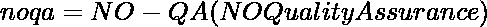
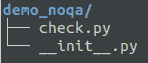
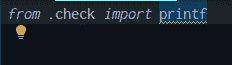
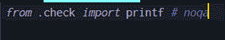

# Python 中没有质量保证

> 原文:[https://www . geesforgeks . org/no-quality-assurance-noqa-in-python/](https://www.geeksforgeeks.org/no-quality-assurance-noqa-in-python/)

如果你是刚开始使用 Python 的人，那么你很可能不知道这个特性。即使你是一个有经验的程序员，你也可能不知道这个漂亮的小功能。这将是一篇简短但非常有用的文章。那么，到底什么是 **noqa** 。NOQA 代表**无质量保证**。



这通常意味着，如果您的集成开发环境中有任何警告，那么如果您在行尾添加一个注释为 **# noqa** ，那么该警告将被集成开发环境忽略。这个东西看起来可能很琐碎，但是在生产环境中非常有用，在生产环境中，在项目级别设置了某些配置，这防止开发人员将代码推送到有警告的 VCS。

显然，有时候集成开发环境无法理解某些编码风格，比如你在**_ _ init _ _ _ 中进行导入。py** 的一个包，你永远不会在同一个文件中使用它。您之所以导入它，唯一的原因是为了让任何其他使用您的包的开发人员都可以访问它。

首先，我们将创建一个名为 **demo_noqa** 的 python 包。目录应该包含两个文件， **__init__。py** ，和 **check.py** 。您的目录结构应该如下所示。



目录结构

现在，转到 **check.py** 并简单地创建一个名为 **printf()** 的函数。您可以使用下面的代码示例。

## 蟒蛇 3

```
def printf():
    print("*\n**\n")
```

现在，转到 **__init__。py** 只需从 **check.py** 导入 **printf** 。您可以查看下面的代码示例

## 蟒蛇 3

```
from .check import printf
```

现在，保存文件。你会看到你会得到一个警告，说 **printf 导入但从未使用过**。下面是一个例子



警告示例

注意**下面的 while 线打印**。这是一个警告。现在，如果你简单地在线尾添加 **# noqa** ，警告将被抑制。这里，下面是同样的例子。



抑制的警告

请注意，灯泡图标消失了，白线也消失了。这就是 **noqa** 的用法。如果你是一个初学者，你可能会发现它非常琐碎，但是相信我，一旦你进入现实世界的工作，你将开始工作的生产水平代码，你将结束使用 **noqa** 相当频繁。