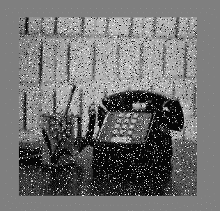
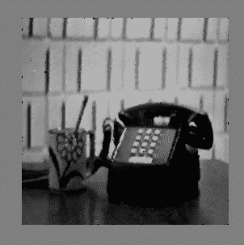

# c++中使用中值滤波去除噪声

> 原文:[https://www . geeksforgeeks . org/降噪-使用中值滤波-in-c/](https://www.geeksforgeeks.org/noise-removal-using-median-filter-in-c/)

中值滤波是一个非线性过程，有助于减少脉冲或椒盐噪声。中值滤波器还用于在降低噪声的同时保持边缘特性。此外，平滑技术，如高斯模糊也被用来减少噪音，但它不能保持边缘属性。中值滤波由于保留了边缘特性而被广泛应用于数字图像处理中。

**进场:**

*   将输入图像的像素值存储在数组中。
*   对于每个像素值，将包括该单元的所有相邻像素值存储在一个新的数组(称为窗口)中。
*   对窗口数组进行排序。
*   窗口阵列的中值用于存储输出图像像素强度。

**边界问题示例:**
使用 3×3 采样窗口的 2D 中值滤波示例:
将边界值扩展到边界值之外。

**边缘保持:**
所有平滑技术都用于去除噪声。中值滤波也是一种类似高斯滤波的平滑技术，但是中值滤波和高斯滤波唯一的区别是中值滤波保留了边缘特性，而高斯滤波没有。边缘保持是一个重要的属性，因为边缘对于视觉外观很重要。由于边缘保持特性，中值滤波广泛应用于数字图像处理中。

**中值滤波算法的 C++实现。**

## C++

```
#include <iostream>
#include <fstream>
#include <sstream>
using namespace std;

/* Function to sort an array using insertion sort*/
void insertionSort(int arr[], int n)
{
    int i, key, j;
    for (i = 1; i < n; i++)
    {
        key = arr[i];
        j = i - 1;

        /* Move elements of arr[0..i-1], that are
        greater than key, to one position ahead
        of their current position */
        while (j >= 0 && arr[j] > key)
        {
            arr[j + 1] = arr[j];
            j = j - 1;
        }
        arr[j + 1] = key;
    }
}

int array[2000][2000];
int arr[2000][2000];
int main()
{
    int window[9],row = 0, col = 0, numrows = 0, numcols = 0,MAX=0;
    ifstream infile("Saltpepper.pgm");
    stringstream ss;
    string inputLine = "";

    // First line : version
    getline(infile,inputLine);
    if(inputLine.compare("P2") != 0) cerr << "Version error" << endl;
    else cout << "Version : " << inputLine << endl;

    // Continue with a stringstream
    ss << infile.rdbuf();

    // Secondline : size of image
    ss >> numcols >> numrows >> MAX;

    //print total number of rows, columns and maximum intensity of image
    cout << numcols << " columns and " << numrows << " rows" <<endl<<"
    Maximium Intesity "<< MAX <<endl;

    //Initialize a new array of same size of image with 0
    for(row = 0; row <= numrows; ++row)
        array[row][0]=0;
    for( col = 0; col<=numcols; ++col )
        array[0][col]=0;

    // Following lines : data
    for(row = 1; row <= numrows; ++row)
    {
        for (col = 1; col <= numcols; ++col)
        {
            //original data store in new array
            ss >> array[row][col];
        }
    }

    // Now print the array to see the result
    for(row = 1; row <= numrows; ++row)
    {
        for(col = 1; col <= numcols; ++col)
        {
            //neighbor pixel values are stored in window including this pixel
            window[0] = array[row-1][col-1];
            window[1] = array[row-1][col];
            window[2] = array[row-1][col+1];
            window[3] = array[row][col-1];
            window[4] = array[row][col];
            window[5] = array[row][col+1];
            window[6] = array[row+1][col-1];
            window[7] = array[row+1][col];
            window[8] = array[row+1][col+1];

            //sort window array
            insertionSort(window,9);
            //put the median to the new array
            arr[row][col]=window[4];   
        }
    }

    ofstream outfile;

    //new file open to store the output image
    outfile.open("Medianfilter.pnm");
    outfile<<"P2"<<endl;
    outfile<<numcols<<" "<<numrows<<endl;
    outfile<<"255"<<endl;

    for(row = 1; row <= numrows; ++row)
    {
        for (col = 1; col <= numcols; ++col)
        {
            //store resultant pixel values to the output file
            outfile << arr[row][col]<<" ";
        }
    }

    outfile.close();
    infile.close();
    return 0 ;
}
```

**输入图像**



**输出图像**

