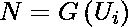
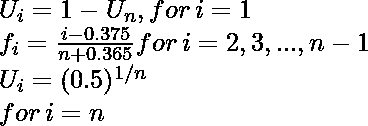
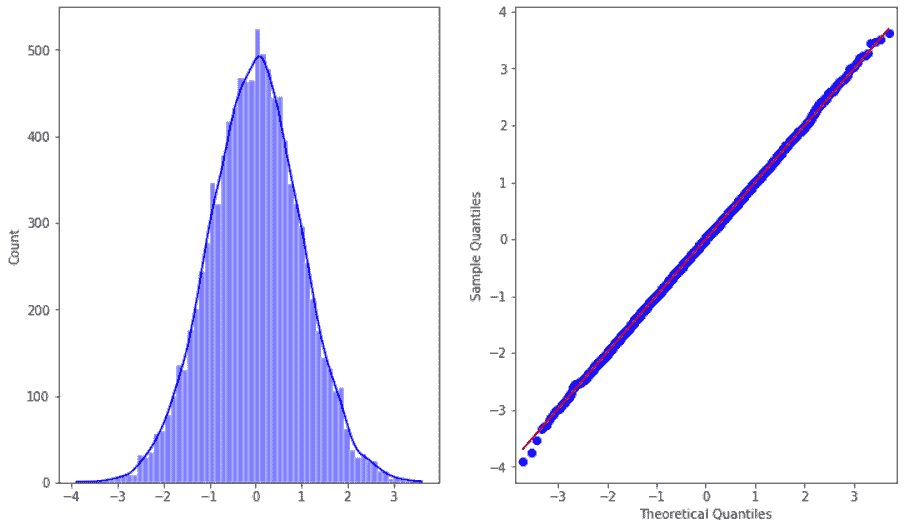
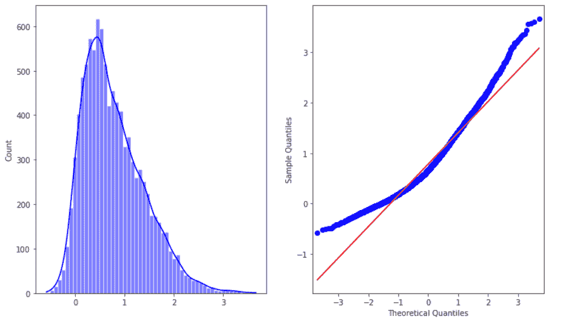
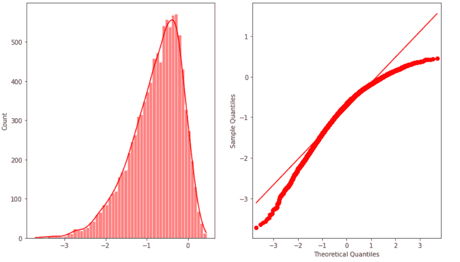
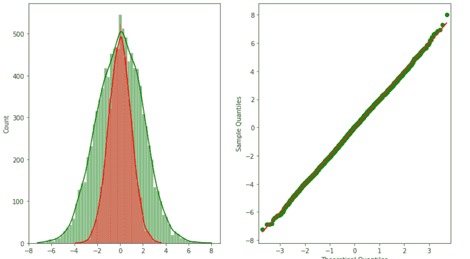

# 正常概率图

> 原文:[https://www.geeksforgeeks.org/normal-probability-plot/](https://www.geeksforgeeks.org/normal-probability-plot/)

概率图是直观比较来自不同分布的数据的一种方式。这些数据可以是经验数据或理论数据。概率图可以有两种类型:

*   **P-P 图:**(概率-概率)P-P 图是可视化两个分布(经验和理论)的累积分布函数 (CDFs)相互比较的方式。
*   **Q-Q 图:**Q-Q(分位数到分位数)图用于比较两个分布的分位数。分位数可以定义为具有相等概率的 连续区间，或将样本在  和之间以类似的方式划分 分布可以是理论分布或来自过程的样本分布、等。正态概率图是q-q 图的一个例子。

**正态概率图:**正态概率图是了解数据集是否正态分布的一种方式。在该图中，数据是相对于理论正态分布图绘制的，如果给定数据集是正态分布的，它应该形成一条近似直线。正态概率图是概率图(更具体地说是 Q-Q 图)的一种情况。该图在行业中常用于寻找偏离正常流程的情况。

正常概率图有以下坐标轴。

*   **横轴**:正序统计中位数。
*   **纵轴**:订单响应值

订单响应变量可计算如下:

<center></center>

其中 Ui 是均匀序中值统计量，G 是正态分布的百分比点函数。它是累积分布函数的倒数。即给定概率分布，我们需要累积分布函数。

统一顺序统计中值可以近似表示为:

<center></center>

数据应遵循的测量过程的基本假设

*   随机数。
*   来自固定分配。
*   位置固定
*   有固定的尺度。

正态概率图用于回答以下问题:

*   数据是正态分布的吗？
*   如果不是，分配的本质是什么

#### 履行

在这个实现中，我们将使用 statsmodels python 库和 seaborn 库来可视化不同的图。这些库都是预装在 colab 中的，但是对于本地环境使用 ***pip 安装。**T3】*

## 蟒蛇 3

```py
# imports 
import numpy as np
import matplotlib.pyplot as plt
import seaborn as sns
import scipy.stats as sc
import statsmodels.graphics.gofplots as sm

# define distributions
sample_size = 10000 
standard_norm = np.random.normal(size=sample_size)
heavy_tailed_norm = np.random.normal(loc=0, scale=2, size=sample_size)
skewed_norm = sc.skewnorm.rvs(a=5, size=sample_size)
skew_left_norm = sc.skewnorm.rvs(a=-5, size=sample_size)

# plots for standard distribution
fig, ax = plt.subplots(1, 2, figsize=(12, 7))
sns.histplot(standard_norm,kde=True, color ='blue',ax=ax[0])
sm.ProbPlot(standard_norm).qqplot(line='s', ax=ax[1])

# plot for right-tailed distribution
fig, ax = plt.subplots(1, 2, figsize=(12, 7))
sm.ProbPlot(skewed_norm).qqplot(line='s', ax=ax[1]);
sns.histplot(skewed_norm,kde=True, color ='blue',ax=ax[0])

# plot for left-tailed distribution
fig, ax = plt.subplots(1, 2, figsize=(12, 7))
sm.ProbPlot(skew_left_norm).qqplot(line='s',color='red', ax=ax[1]);
sns.histplot(skew_left_norm,kde=True, color ='red',ax=ax[0])

# plot for heavy tailed distribution
fig, ax = plt.subplots(1, 2, figsize=(12, 7))
sm.ProbPlot(heavy_tailed_norm).qqplot(line='s',color ='green', ax=ax[1]);
sns.histplot(heavy_tailed_norm,kde=True, color ='green',ax=ax[0])
sns.histplot(standard_norm,kde=True, color ='red',ax=ax[0])
```



标准正态



向右倾斜



向左倾斜



厚尾(参见轴值)

#### 参考文献:

*   [NIST 手册](https://www.itl.nist.gov/div898/handbook/eda/section3/normprpl.htm)