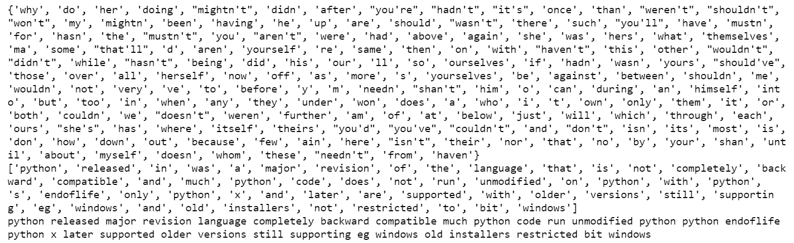
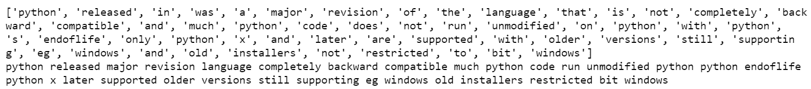

# 用 Python 规范化文本数据

> 原文:[https://www . geesforgeks . org/normalization-text-data-with-python/](https://www.geeksforgeeks.org/normalizing-textual-data-with-python/)

在本文中，我们将学习如何用 Python 对文本数据进行规范化。我们来讨论一些概念:

*   **文本数据**询问系统收集的材料，包括书面、印刷或电子出版的文字，通常是有目的地书写或从语音中转录的。
*   **文本规范化**是将文本转换成以前没有的一种规范形式的方法。在存储或处理文本之前对其进行规范化允许分离关注点，因为在对其执行操作之前，输入肯定是一致的。文本规范化要求意识到什么类型的文本要规范化，以及以后如何处理；没有通用的标准化程序。

**所需步骤**

在这里，我们将讨论文本规范化所需的一些基本步骤。

*   输入文本字符串，
*   将字符串的所有字母转换为一个大小写(小写或大写)，
*   如果数字对于转换成文字是必不可少的，那么去掉所有的数字，
*   去掉标点符号，其他形式的语法，
*   删除空白，
*   删除停止词，
*   以及任何其他计算。

我们正在用上面提到的步骤进行文本规范化，每一步都可以用一些方法来完成。所以我们将讨论整个过程中的每一件事。

**文本字符串**

## 蟒蛇 3

```py
# input string
string = "       Python 3.0, released in 2008, was a major revision of the language that is not completely backward compatible and much Python 2 code does not run unmodified on Python 3\. With Python 2's end-of-life, only Python 3.6.x[30] and later are supported, with older versions still supporting e.g. Windows 7 (and old installers not restricted to 64-bit Windows)."
print(string)
```

**输出:**

> “2008 年发布的 Python 3.0 是对该语言的一次重大修订，它并不是完全向后兼容的，而且 Python 2 的许多代码在 Python 3 上也不会未经修改就运行。随着 Python 2 的寿终正寝，仅支持 Python 3.6.x[30]和更高版本，旧版本仍支持例如 Windows 7(旧安装程序不限于 64 位 Windows)。"

**格转换(**[](https://www.geeksforgeeks.org/isupper-islower-lower-upper-python-applications/#:~:text=In%20Python%2C%20lower()%20is,all%20uppercase%20characters%20to%20lowercase.)****)****

**在 Python 中，lower()是用于字符串处理的内置方法。lower()方法从给定的字符串中返回 lower 化的字符串。它将所有大写字符转换为小写字符。如果不存在大写字符，它将返回原始字符串。**

## **蟒蛇 3**

```py
# input string
string = "       Python 3.0, released in 2008, was a major revision of the language that is not completely backward compatible and much Python 2 code does not run unmodified on Python 3\. With Python 2's end-of-life, only Python 3.6.x[30] and later are supported, with older versions still supporting e.g. Windows 7 (and old installers not restricted to 64-bit Windows)."

# convert to lower case
lower_string = string.lower()
print(lower_string)
```

****输出:****

> **“2008 年发布的 python 3.0 是对该语言的一次重大修订，它并不是完全向后兼容的，而且 python 2 的许多代码在 python 3 上也不会未经修改就运行。随着 python 2 的寿终正寝，仅支持 python 3.6.x[30]和更高版本，旧版本仍支持例如 windows 7(旧安装程序不限于 64 位 windows)。"**

**[**去除数字**](https://www.geeksforgeeks.org/python-remove-all-digits-from-a-list-of-strings/)**

**如果数字与您的分析无关，请将其删除。通常，正则表达式用于移除数字。**

## **蟒蛇 3**

```py
# import regex
import re

# input string
string = "       Python 3.0, released in 2008, was a major revision of the language that is not completely backward compatible and much Python 2 code does not run unmodified on Python 3\. With Python 2's end-of-life, only Python 3.6.x[30] and later are supported, with older versions still supporting e.g. Windows 7 (and old installers not restricted to 64-bit Windows)."

# convert to lower case
lower_string = string.lower()

# remove numbers
no_number_string = re.sub(r'\d+','',lower_string)
print(no_number_string)
```

****输出:****

> **“蟒蛇。，发布于年，是对该语言的重大修订，它不是完全向后兼容的，并且许多 python 代码在 python 上运行时不会未经修改。有了 python 的生命终结，只有 python..支持 x[]和更高版本，旧版本仍支持例如 windows(旧安装程序不限于 32 位 windows)。"**

**[**去除标点符号**](https://www.geeksforgeeks.org/python-remove-punctuation-from-string/)**

**用标点符号替换的部分也可以用正则表达式来执行。在本文中，我们使用特定的正则表达式将所有标点符号替换为空字符串。**

## **蟒蛇 3**

```py
# import regex
import re

# input string
string = "       Python 3.0, released in 2008, was a major revision of the language that is not completely backward compatible and much Python 2 code does not run unmodified on Python 3\. With Python 2's end-of-life, only Python 3.6.x[30] and later are supported, with older versions still supporting e.g. Windows 7 (and old installers not restricted to 64-bit Windows)."

# convert to lower case
lower_string = string.lower()

# remove numbers
no_number_string = re.sub(r'\d+','',lower_string)

# remove all punctuation except words and space
no_punc_string = re.sub(r'[^\w\s]','', no_number_string)
print(no_punc_string)
```

****输出:****

> **年发布的 python 是对该语言的一次重大修订，它不是完全向后兼容的，并且许多 python 代码不会未经修改就在 python 上运行使用 python 的 endoflife 仅支持 python x 和更高版本，旧版本仍支持 eg windows 和不限于 bit windows 的旧安装程序**

**[**清除空白**](https://www.geeksforgeeks.org/python-string-strip/)**

****strip()** 函数是 Python 编程语言中的一个内置函数，它返回一个字符串的副本，去掉了前导和尾随字符(基于传递的字符串参数)。**

## **蟒蛇 3**

```py
# import regex
import re

# input string
string = "       Python 3.0, released in 2008, was a major revision of the language that is not completely backward compatible and much Python 2 code does not run unmodified on Python 3\. With Python 2's end-of-life, only Python 3.6.x[30] and later are supported, with older versions still supporting e.g. Windows 7 (and old installers not restricted to 64-bit Windows)."

# convert to lower case
lower_string = string.lower()

# remove numbers
no_number_string = re.sub(r'\d+','',lower_string)

# remove all punctuation except words and space
no_punc_string = re.sub(r'[^\w\s]','', no_number_string)

# remove white spaces
no_wspace_string = no_punc_string.strip()
print(no_wspace_string)
```

****输出:****

> **年发布的 python 是对该语言的一次重大修订，它不是完全向后兼容的，并且许多 python 代码不会未经修改就在 python 上运行使用 python 的 endoflife 仅支持 python x 和更高版本，旧版本仍支持 eg windows 和不限于 bit windows 的旧安装程序**

****删除停止词****

**在像“the”、“a”、“on”、“is”、“all”这样的语言中，“停止词”是最常见的词。这些词没有重要的意义，通常与课文相去甚远。使用舌头工具包(NLTK)可以摆脱停止词，这是一组用于符号和统计舌头处理的库和程序。**

## **蟒蛇 3**

```py
# download stpwords
import nltk
nltk.download('stopwords')

# import nltk for stopwords
from nltk.corpus import stopwords
stop_words = set(stopwords.words('english'))
print(stop_words)

# assign string
no_wspace_string='python  released in  was a major revision of the language that is not completely backward compatible and much python  code does not run unmodified on python  with python s endoflife only python x and later are supported with older versions still supporting eg windows  and old installers not restricted to bit windows'

# convert string to list of words
lst_string = [no_wspace_string][0].split()
print(lst_string)

# remove stopwords
no_stpwords_string=""
for i in lst_string:
    if not i in stop_words:
        no_stpwords_string += i+' '

# removing last space
no_stpwords_string = no_stpwords_string[:-1]
print(no_stpwords_string)
```

****输出:****

****

**在这种情况下，我们可以使用 Python 对文本数据进行规范化。下面是完整的 python 程序:**

## **蟒蛇 3**

```py
# import regex
import re

# download stpwords
import nltk
nltk.download('stopwords')

# import nltk for stopwords
from nltk.corpus import stopwords
stop_words = set(stopwords.words('english'))

# input string
string = "       Python 3.0, released in 2008, was a major revision of the language that is not completely backward compatible and much Python 2 code does not run unmodified on Python 3\. With Python 2's end-of-life, only Python 3.6.x[30] and later are supported, with older versions still supporting e.g. Windows 7 (and old installers not restricted to 64-bit Windows)."

# convert to lower case
lower_string = string.lower()

# remove numbers
no_number_string = re.sub(r'\d+','',lower_string)

# remove all punctuation except words and space
no_punc_string = re.sub(r'[^\w\s]','', no_number_string)

# remove white spaces
no_wspace_string = no_punc_string.strip()
no_wspace_string

# convert string to list of words
lst_string = [no_wspace_string][0].split()
print(lst_string)

# remove stopwords
no_stpwords_string=""
for i in lst_string:
    if not i in stop_words:
        no_stpwords_string += i+' '

# removing last space
no_stpwords_string = no_stpwords_string[:-1]

# output
print(no_stpwords_string)
```

****输出:****

****