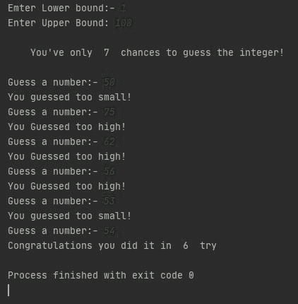

# Python 3 和 C 中的猜数字游戏

> 原文:[https://www . geesforgeks . org/python 猜数字游戏/](https://www.geeksforgeeks.org/number-guessing-game-in-python/)

大多数来自计算机科学背景的极客会想到他们在做了一门编程语言后的第一个项目“T2”。在本文中，您将获得您的第一个项目和基本项目。

**<u>任务:</u>** *下面是步骤:*

*   建立一个数字猜谜游戏，其中**用户选择一个范围。**
*   假设用户选择了一个范围，即从 **A** 到 **B** ，其中 **A** 和 **B** 属于整数。
*   一些**随机整数将由系统**选择，用户必须在**最小猜测次数**中猜测该整数

**<u>分析:</u>**

**说明 1** :如果用户输入范围，比如 1 到 100。编译器随机选择 42 作为整数。现在猜谜游戏开始了，所以用户输入 50 作为他/她的**第一个猜测**。编译器显示“再试一次！你猜得太高了”。这意味着随机数(即 42)不在 50 到 100 的范围内。这就是猜测一半范围的重要性。同样，用户猜测 50 的一半(你能告诉我为什么吗？).所以 50 的一半是 25。用户输入 25 作为他/她的**第二猜测**。这次编译器会显示，“再试一次！你猜得太小了”。这意味着小于 25 的整数(从 1 到 25)是没有用的。现在，用户猜测的范围更短，即从 25 到 50。聪明！用户猜测了该范围的一半，因此，用户猜测 37 作为他/她的**第三猜测**。这次编译器再次显示输出，“再试一次！你猜得太小了”。对于用户来说，每次猜测的猜测范围越来越小。现在，用户的猜测范围是从 37 到 50，其中用户猜测 43 作为他/她的**第四个猜测**。这一次，编译器将显示一个输出“再试一次！你猜得太高了”。因此，用户的新猜测范围将从 37 到 43，同样，用户猜测该范围的一半，即 40 作为他/她的**第五猜测**。这次编译器显示输出，“再试一次！你猜得太小了”。剩下的猜测更小，比如从 41 到 43。现在用户猜测 41 作为他/她的**第六猜测**。哪个是错的，显示输出“再试一次！你猜得太小了”。最后，用户猜对了数字 42 作为他/她的**第七个猜测**。

**总猜测次数= 7**

**说明 2** :如果用户输入范围，比如 1 到 50。编译器随机选择 42 作为整数。现在猜谜游戏开始了。所以 50 的一半是 25。用户输入 25 作为他/她的**第一猜测**。这次编译器会显示，“再试一次！你猜得太小了”。这意味着小于 25 的整数(从 1 到 25)是没有用的。现在，用户猜测的范围更短，即从 25 到 50。聪明！用户猜测了这个范围的一半，因此，用户猜测 37 作为他/她的**第二猜测**。这次编译器再次显示输出，“再试一次！你猜得太小了”。对于用户来说，每次猜测的猜测范围越来越小。现在，用户的猜测范围是从 37 到 50，其中用户猜测 43 作为他/她的**第三猜测**。这一次，编译器将显示一个输出“再试一次！你猜得太高了”。因此，用户的新猜测范围将从 37 到 43，同样，用户猜测该范围的一半，即 40 作为他/她的**第四猜测**。这次编译器显示输出，“再试一次！你猜得太小了”。剩下的猜测更小，比如从 41 到 43。现在用户猜测 41 是他/她的第五个猜测。哪个是错的，显示输出“再试一次！你猜得太小了”。最后，用户猜对了数字 42 作为他/她的第六个猜测。

**总猜测次数=** 6

因此，最小猜测次数取决于范围。而且编译器必须根据自己的范围计算出最小猜测次数。为此，我们有一个公式:-

> 最小猜测次数=对数 <sub>2</sub> (上限-下限+ 1)

### **<u>算法</u>** :步骤如下:

*   用户输入范围的**下限**和**上限**。
*   编译器在该范围之间生成一个随机整数，并将其存储在一个变量中以供将来参考。
*   对于重复猜测，将初始化 while 循环。
*   如果用户猜到的数字大于随机选择的数字，用户会得到一个输出“*再试一次！你猜的太高了*
*   否则如果用户猜到一个比随机选择的数字小的数字，用户会得到一个输出“*再试一次！你猜的太小了”*
*   并且如果用户在最少的猜测次数中猜到，则用户得到“*恭喜！*“输出。
*   否则，如果用户在最小猜测次数内没有猜中整数，他/她将获得“*下次好运！*“输出。

**下面是算法的实现:**

## 蟒蛇 3

```
import random
import math
# Taking Inputs
lower = int(input("Enter Lower bound:- "))

# Taking Inputs
upper = int(input("Enter Upper bound:- "))

# generating random number between
# the lower and upper
x = random.randint(lower, upper)
print("\n\tYou've only ",
       round(math.log(upper - lower + 1, 2)),
      " chances to guess the integer!\n")

# Initializing the number of guesses.
count = 0

# for calculation of minimum number of
# guesses depends upon range
while count < math.log(upper - lower + 1, 2):
    count += 1

    # taking guessing number as input
    guess = int(input("Guess a number:- "))

    # Condition testing
    if x == guess:
        print("Congratulations you did it in ",
              count, " try")
        # Once guessed, loop will break
        break
    elif x > guess:
        print("You guessed too small!")
    elif x < guess:
        print("You Guessed too high!")

# If Guessing is more than required guesses,
# shows this output.
if count >= math.log(upper - lower + 1, 2):
    print("\nThe number is %d" % x)
    print("\tBetter Luck Next time!")

# Better to use This source Code on pycharm!
```

## C

```
#include<stdio.h>
#include<stdlib.h>
#include<time.h>

int main()
{
    int number, guess, nguesses=1;
    srand(time(0));

    // Generates a random number between 1 and 100
    number = rand()%100 + 1;

    // printf("The number is %d\n", number);
    // Keep running the loop
    // until the number is guessed
    do
    {
        printf("Guess the number between 1 to 100\n");
        scanf("%d", &guess);
        if(guess>number)
        {
            printf("you guessed to high\n");
        }
        else if(guess<number)
        {
            printf("you guessed too low\n");
        }
        else
        {
            printf("You guessed the correct number");
            printf("attempts : %d\n", nguesses);
        }
        nguesses++;
    } while(guess!=number);

    return 0;
}
// this code is provided by harsh sinha username- harshsinha03
```

**输出:** *以下是上述程序*的输出



猜谜游戏的输出