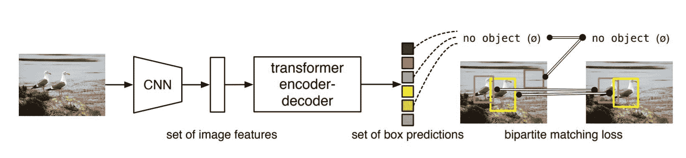
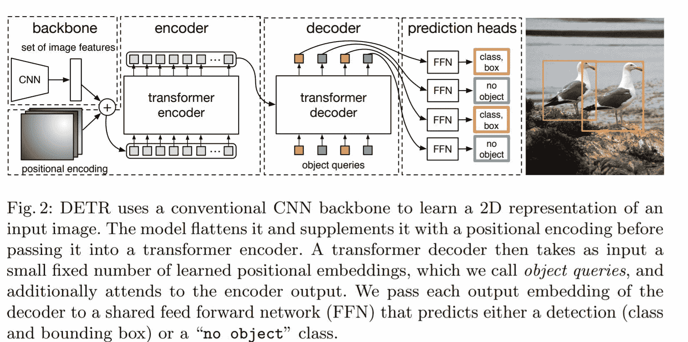
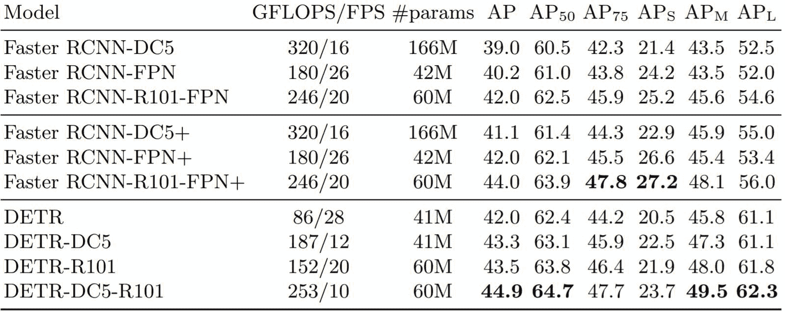

# 脸书用检测变压器(DETR)检测物体

> 原文:[https://www . geesforgeks . org/object-detection-with-detection-transformer-dert-by-Facebook/](https://www.geeksforgeeks.org/object-detection-with-detection-transformer-dert-by-facebook/)

脸书刚刚于 2020 年 5 月 27 日发布了其最先进的物体检测模型。他们称之为 [DERT](https://arxiv.org/pdf/2005.12872.pdf) 代表[探测变压器](https://arxiv.org/pdf/2005.12872.pdf)，因为它使用变压器探测物体。这是第一次将变压器与卷积神经网络一起用于此类目标检测任务。还有其他物体检测模型，如 [RCNN 系列](https://www.geeksforgeeks.org/faster-r-cnn-ml/)、 [YOLO](https://www.geeksforgeeks.org/yolo-v2-object-detection/) (你只看一次)和 SSD(单镜头检测)，但它们都没有使用变压器来完成这项任务。这个模型最棒的地方在于，由于它使用了一个转换器，它使得架构非常简单，不像前面提到的所有其他具有各种超参数和层的技术。所以没有进一步的告别，让我们开始吧。
**什么是物体检测？**
给定一张照片如果你需要确定照片是否有一个特定的物体，你可以通过分类来完成。但是如果你想得到那个物体在图像中的位置…嗯，即使这不是一个物体探测任务…这叫做分类和本地化。但是如果图像中有多个对象，并且您想要每个对象的每个位置，那么这就是对象检测。
前面的一些技术试图让一个 RPN(区域提议网络)想出可能包含对象的潜在区域，然后我们可以使用锚框、NMS(非最大抑制)和 IOU 的概念来生成相关的框并识别对象。虽然这些概念起作用，但推理需要一些时间，因此由于其复杂性，无法实现高精度的实时使用。
在高层次上，这使用 CNN，然后使用一个变压器来检测一个对象，它通过一个二分匹配训练对象来检测。这就是它如此简单的主要原因。



来源-https://arxiv.org/pdf/2005.12872.pdf

**步骤 1:**
我们将图像通过卷积神经网络编码器，因为 CNN 处理图像效果最好。所以通过 CNN 后，图像特征是守恒的。这是具有更多特征通道的图像的高阶表示。
**步骤 2:**
图像的这种丰富的特征图被提供给变压器编码器-解码器，其输出盒子预测的集合。这些框中的每一个都由一个元组组成。元组将是一个类和一个边界框。注意:这也包括空类或无类及其位置。
现在，这是一个真正的问题，因为在注释中没有对象类被注释为空。比较和处理相邻的相似对象是另一个主要问题，在本文中，使用二分匹配损失来解决这个问题。通过比较每个类和边界框与相应的类和框(包括 none 类，比如说 N 个)来比较损失，注释包括添加的不包含任何内容的部分，以使总框数为 N。预测值与实际值的分配是一对一的分配，从而使总损失最小化。有一种非常著名的算法叫做匈牙利法来计算这些最小匹配。
**主要部件:**



来源-https://arxiv.org/pdf/2005.12872.pdf

**从卷积神经网络提取的主干–**特征和位置编码被传递
**变压器编码器–**变压器自然是一个序列处理单元，出于同样的原因，我们输入张量被展平。它将序列转换成一个同样长的特征序列。
**转换器解码器–**接收对象查询，因此它是一个解码器，作为调节信息的辅助输入。
**预测前馈网络(FFN)–**这方面的输出通过一个分类器，该分类器输出前面讨论过的类标签和包围盒输出
**评估器:**
评估是在 [COCO 数据集](http://cocodataset.org/#explore)上完成的，其主要竞争对手是已经统治该类别一段时间的 RCNN 家族，被认为是最经典的对象检测技术。



来源-https://arxiv.org/pdf/2005.12872.pdf

**优势:**T2】

*   这个新模型非常简单，你不需要安装任何库来使用它。
*   DETR 在大型物体上表现出明显更好的性能，而不是在可以进一步改进的小型物体上。
*   好消息是，他们甚至在[论文](https://arxiv.org/pdf/2005.12872.pdf)中提供了[代码](https://github.com/facebookresearch/detr)，所以现在我们也将实现它，以了解它真正能够做什么。

**代码:**

## 蟒蛇 3

```
# Write Python3 code here
mport torch
from torch import nn
from torchvision.models import resnet50

class DETR(nn.Module):

def __init__(self, num_classes, hidden_dim, nheads,
num_encoder_layers, num_decoder_layers):
  super().__init__()
  # We take only convolutional layers from ResNet-50 model
  self.backbone = nn.Sequential(*list(resnet50(pretrained=True).children())[:-2])
  self.conv = nn.Conv2d(2048, hidden_dim, 1)
  self.transformer = nn.Transformer(hidden_dim, heads,
  num_encoder_layers, num_decoder_layers)
  self.linear_class = nn.Linear(hidden_dim, num_classes + 1)
  self.linear_bbox = nn.Linear(hidden_dim, 4)
  self.query_pos = nn.Parameter(torch.rand(100, hidden_dim))
  self.row_embed = nn.Parameter(torch.rand(50, hidden_dim // 2))
  self.col_embed = nn.Parameter(torch.rand(50, hidden_dim // 2))
  def forward(self, inputs):
  x = self.backbone(inputs)
  h = self.conv(x)
  H , W = h.shape[-2:]
  pos = torch.cat([
  self.col_embed[:W].unsqueeze(0).repeat(H, 1, 1),
  self.row_embed[:H].unsqueeze(1).repeat(1, W, 1),
], dim=-1).flatten(0, 1).unsqueeze(1)
  h = self.transformer(pos + h.flatten(2).permute(2, 0, 1),
  self.query_pos.unsqueeze(1))
  return self.linear_class(h), self.linear_bbox(h).sigmoid()
detr = DETR(num_classes=91, hidden_dim=256, nheads=8, num_encoder_layers=6, num_decoder_layers=6)
detr.eval()
inputs = torch.randn(1, 3, 800, 1200)
logits, bboxes = detr(inputs)

<strong>Listing 1: </strong>DETR PyTorch inference code. For clarity, it uses learned positional encodings in the encoder instead of fixed, and positional encodings are added to the input
only instead of at each transformer layer. Making these changes requires going beyond
PyTorch implementation of transformers, which hampers readability. The entire code
to reproduce the experiments will be made available before the conference.
```

我们只从 ResNet-50 模型中提取卷积层
代码取自[论文](https://arxiv.org/pdf/2005.12872.pdf)

**代码:试着在 colab 上运行这个代码，或者直接进入这个链接，复制并运行完整的文件。**

## 蟒蛇 3

```
import torch as th
import torchvision.transforms as T
import requests
from PIL import Image, ImageDraw, ImageFont
```

我们将使用 ResNet 101 作为主干架构，我们将直接从 Pytorch Hub 加载该架构。
**代号:**

## 蟒蛇 3

```
model = th.hub.load('facebookresearch/detr', 'detr_resnet101', pretrained=True)
model.eval()
model = model.cuda()
```

## 蟒蛇 3

```
# standard PyTorch mean-std input image normalization
transform = T.Compose([
    T.ToTensor(),
    T.Normalize([0.485, 0.456, 0.406], [0.229, 0.224, 0.225])
])

CLASSES = [
    'N/A', 'person', 'bicycle', 'car', 'motorcycle', 'airplane', 'bus',
    'train', 'truck', 'boat', 'traffic light', 'fire hydrant', 'N/A',
    'stop sign', 'parking meter', 'bench', 'bird', 'cat', 'dog', 'horse',
    'sheep', 'cow', 'elephant', 'bear', 'zebra', 'giraffe', 'N/A', 'backpack',
    'umbrella', 'N/A', 'N/A', 'handbag', 'tie', 'suitcase', 'frisbee', 'skis',
    'snowboard', 'sports ball', 'kite', 'baseball bat', 'baseball glove',
    'skateboard', 'surfboard', 'tennis racket', 'bottle', 'N/A', 'wine glass',
    'cup', 'fork', 'knife', 'spoon', 'bowl', 'banana', 'apple', 'sandwich',
    'orange', 'broccoli', 'carrot', 'hot dog', 'pizza', 'donut', 'cake',
    'chair', 'couch', 'potted plant', 'bed', 'N/A', 'dining table', 'N/A',
    'N/A', 'toilet', 'N/A', 'tv', 'laptop', 'mouse', 'remote', 'keyboard',
    'cell phone', 'microwave', 'oven', 'toaster', 'sink', 'refrigerator', 'N/A',
    'book', 'clock', 'vase', 'scissors', 'teddy bear', 'hair drier',
    'toothbrush'
]
```

在此输入图像的网址。我用过的是 https://i.ytimg.com/vi/vrlX3cwr3ww/maxresdefault.jpg
T1【代号:T3】

## 蟒蛇 3

```
url = input()
```

显示图像

## 蟒蛇 3

```
img = Image.open(requests.get(url, stream=True).raw).resize((800,600)).convert('RGB')
img
```

**代码:**

## 蟒蛇 3

```
img_tens = transform(img).unsqueeze(0).cuda()
with th.no_grad():
  output = model(img_tens)

draw = ImageDraw.Draw(img)
pred_logits=output['pred_logits'][0][:, :len(CLASSES)]
pred_boxes=output['pred_boxes'][0]

max_output = pred_logits.softmax(-1).max(-1)
topk = max_output.values.topk(15)

pred_logits = pred_logits[topk.indices]
pred_boxes = pred_boxes[topk.indices]
pred_logits.shape
```

**代码:**

## 蟒蛇 3

```
for logits, box in zip(pred_logits, pred_boxes):
  cls = logits.argmax()
  if cls >= len(CLASSES):
    continue
  label = CLASSES[cls]
  print(label)
  box = box.cpu() * th.Tensor([800, 600, 800, 600])
  x, y, w, h = box
  x0, x1 = x-w//2, x+w//2
  y0, y1 = y-h//2, y+h//2
  draw.rectangle([x0, y0, x1, y1], outline='red', width=5)
  draw.text((x, y), label, fill='white')
```

**代码:显示检测到的图像**

## 蟒蛇 3

```
img
```

这是 [colab 笔记本](https://colab.research.google.com/drive/1jZzvVozUwZr8YKCe0rAENpfdlyBYefZN?usp=sharing)和 [github 代码](https://github.com/amancodeblast/DeTr-demo)的链接。另外，请随意查看[官方 GitHub](https://github.com/facebookresearch/detr) 了解相同的
**缺点:**
训练需要很长时间。它在 8 个图形处理器上训练了 6 天。当你把它和这种规模的语言模型进行比较时，这并不重要，因为它们使用了一个转换器，但是仍然。