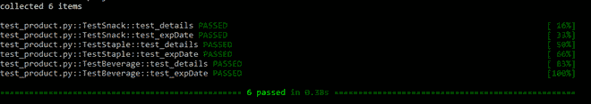
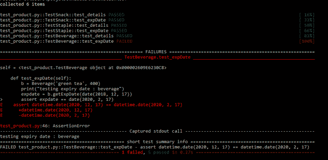

# Python 中的面向对象测试

> 原文:[https://www . geesforgeks . org/面向对象-python 测试/](https://www.geeksforgeeks.org/object-oriented-testing-in-python/)

**先决条件:** [面向对象测试](https://www.geeksforgeeks.org/object-oriented-testing-in-software-testing/)

自动化面向对象测试可以使用 **Pytest** 测试工具在 Python 中执行。在本文中，我们通过为类执行测试用例来执行面向对象的测试。我们编写了一个程序，其中有一个名为“产品”的**父类**和三个名为“T4”的子类——零食、饮料和主食。我们实现所有的类，并将它们保存在一个名为 *product.py* 的文件中。这些类具有以下功能:

*   **小吃–***印刷详情()*和 *getExpDate()*
*   **饮料–***印刷详情()*和 *getExpDate()*
*   **斯台普斯–***印刷细节()*和 *getExpDate()*

需要注意的是 *getExpDate()* 在这种情况下是一个被覆盖的函数。

*产品. py* 文件中的代码:

## 蟒蛇 3

```
# importing the modules
from datetime import date
from dateutil.relativedelta import relativedelta

# base class

class Product:

    name = ""

    # printing the class in the constructor
    def __init__(self):
        print("super class Product")

# getExpDate() returns the expiry date of product
# since every product has different expiry date
# therefore this method is overridden by child classes
    def getExpDate():

        # gives exp date
        print("Expiry date")
        pass

# derived class 1
class Snack(Product):

    # months
    shelfLife = 6
    price = 0

    # constructor - initializing variables
    def __init__(self, name, price):
        self.name = name
        self.price = price

    # prints the Snack product details
    def printDetails(self):
        print("name : " + self.name)
        print("price : " + str(self.price))
        print("shelf life : " + str(self.shelfLife) + " months")

    # calculates the expiry date using relativedelta library and returns
    def getExpDate(self, pkdDate):
        expDate = pkdDate + relativedelta(months=self.shelfLife)
        return expDate

# derived class 2
class Beverage(Product):

    # 2 years
    shelfLife = 2
    price = 0

    # constructor - initializing variables
    def __init__(self, name, price):
        self.name = name
        self.price = price

    # prints the Beverage product details
    def printDetails(self):
        print("name : " + self.name)
        print("price : " + str(self.price))
        print("shelf life : " + str(self.shelfLife) + " years")

    # calculates the expiry date using relativedelta 
    # library and returns
    def getExpDate(self, pkdDate):
        expDate = pkdDate + relativedelta(years=self.shelfLife)
        return expDate

# derived class 3
class Staples(Product):

    # 1 year
    shelfLife = 1
    price = 0

    # constructor - initializing variables
    def __init__(self, name, price):
        self.name = name
        self.price = price

    # prints the Staples product details
    def printDetails(self):
        print("name : " + self.name)
        print("price : " + str(self.price))
        print("shelf life : " + str(self.shelfLife) + " year")

    # calculates the expiry date using relativedelta
    # library and returns
    def getExpDate(self, pkdDate):
        expDate = pkdDate + relativedelta(years=self.shelfLife)
        return expDate

def main():
    s = Snack('cookies', 60)
    s.printDetails()
    print(s.name + " will expire on " +
          str(s.getExpDate(date(2019, 10, 3))) + "months")
    # yyyy-mm-dd

    p = Product()

    st = Staples('rice', 300)
    st.printDetails()
    print(st.name + " will expire on " + str(st.getExpDate(date(2020, 1, 23))))

    b = Beverage('coffee', 250)
    b.printDetails()
    print(b.name + " will expire on " + str(b.getExpDate(date(2018, 12, 17))))

    print("done till here")

if __name__ == '__main__':
    main()
```

**输出:**

```
name : cookies
price : 60
shelf life : 6 months
cookies will expire on 2020-04-03months
super class Product
name : rice
price : 300
shelf life : 1 year
rice will expire on 2021-01-23
name : coffee
price : 250
shelf life : 2 years
coffee will expire on 2020-12-17
done till here

```

为了执行面向对象的测试，我们为每个类编写测试用例。在编写这些测试用例时，应该记住以下几点:

*   创建单独的测试类来测试每个类的功能，例如*测试零食*、*测试主食*、*测试饮料*
*   为类的每个函数编写一个测试用例
*   使用 *assert* 关键字在测试用例中添加断言。如果测试用例通过，断言语句将返回*真*，或者如果测试用例失败，将返回*假*

除了产品类(父类)之外，我们已经为 *product.py* 文件的所有类中存在的每个函数编写了测试用例。这是因为 Product 类只有一个函数，这个函数也被子类覆盖了，所以编写一个测试用例没有什么区别。因此，我们总共编写了 6 个测试用例，其中为每个子类编写了两个测试用例。

*test_product.py* 文件中的代码:

## 蟒蛇 3

```
# importing the modules
import pytest
from product import Snack, Staples, Beverage
from datetime import date

class TestSnack:

      # test case for print details of Snack
    def test_details(self):
        s = Snack('chips' , 50)
        print("testing details : snack")
        assert ('chips' , 50, 6)  == (s.name, s.price, s.shelfLife)

    # test case for calculating exiry date of Snack
    def test_expDate(self):
        s = Snack('wafers', 40)
        print("testing expiry date : snack")
        expdate = s.getExpDate(date(2019, 10, 3))
        assert expdate == date(2020, 4, 3)

class TestStaple:

      # test case for print details of Staples
    def test_details(self):
        st = Staples('rice' , 300)
        print("testing details : staples")
        assert ('rice' , 300, 1)  == (st.name, st.price, st.shelfLife)

    # test case for calculating exiry date of Staples
    def test_expDate(self):
        st = Staples('wheat flour', 400)
        print("testing expiry date : staples")
        expdate = st.getExpDate(date(2020, 1, 23))
        assert expdate == date(2021, 1, 23)

class TestBeverage:

      # test case for print details of Beverage
    def test_details(self):
        b = Beverage('coffee' , 250)
        print("testing details : beverage")
        assert ('coffee' , 250, 2)  == (b.name, b.price, b.shelfLife)

    # test case for calculating exiry date of Beverage
    def test_expDate(self):
        b = Beverage('green tea', 400)
        print("testing expiry date : beverage")
        expdate = b.getExpDate(date(2018, 12, 17))
        assert expdate == date(2020, 12, 17)
```

**注意:**函数名和测试文件名应该始终以单词“ *test* 开头。

要执行上述测试用例，在一个文件夹中创建两个单独的文件， *product.py* 和 *test_product.py* 。要执行写入以下命令:

```
pytest

```

运筹学

```
pytest -v

```

*pytest -v* 显示详细输出。

输出如下所示:



如果我们改变测试用例的一个断言语句中的值，它将导致测试用例失败。参考如下所示的输出:



在上面显示的输出中，*测试饮料*类中的 *test_expDate()* 测试用例失败，因为断言语句导致了一个 *False* 表达式。