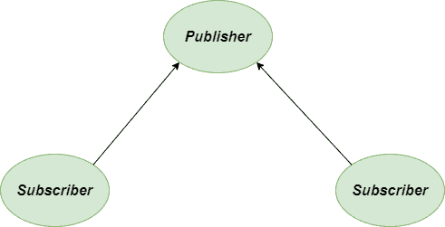
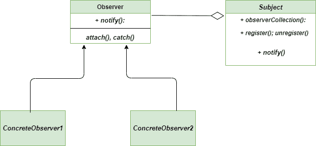

# 观察者法——Python 设计模式

> 原文:[https://www . geesforgeks . org/observer-method-python-design-patterns/](https://www.geeksforgeeks.org/observer-method-python-design-patterns/)

观察者方法是一种 [**行为设计模式**](https://www.geeksforgeeks.org/design-patterns-set-1-introduction/) ，它允许您定义或创建一个订阅机制，向多个对象发送关于他们正在观察的对象发生的任何新事件的通知。主体基本上是由多个物体来观察的。需要监控受试者，并且每当受试者发生变化时，都会通知观察者该变化。这种模式定义了对象之间的一对多依赖关系，这样一个对象改变状态，它的所有依赖关系都会被自动通知和更新。

### 不使用观测器方法的问题

假设您想要创建一个计算器应用程序，它具有不同的功能，例如加法、减法、将数字的基数改为十六进制、十进制以及许多其他功能。但是你的一个朋友有兴趣把他最喜欢的数字的基数改成八进制基数，而你还在开发应用程序。那么，有什么解决办法呢？你的朋友是否应该每天查看申请，以了解申请的状态？但是你不认为这会导致很多不必要的访问，而这些访问是绝对不需要的。或者，您可以在每次添加新功能并向每个用户发送通知时考虑这一点。可以吗？有时是的，但不是每次都是。可能有些用户会被许多他们真的不想要的不必要的通知所冒犯。

### 用观测器法求解

让我们讨论一下上述问题的解决方案。客体**主体**成为焦点。但它也会通知其他对象，这也是为什么我们通常称它为**出版商**。所有希望跟踪发布者状态变化的对象都称为订阅者。



观察者-方法-解决方案-图表

## 蟒蛇 3

```
class Subject:

    """Represents what is being observed"""

    def __init__(self):

        """create an empty observer list"""

        self._observers = []

    def notify(self, modifier = None):

        """Alert the observers"""

        for observer in self._observers:
            if modifier != observer:
                observer.update(self)

    def attach(self, observer):

        """If the observer is not in the list,
        append it into the list"""

        if observer not in self._observers:
            self._observers.append(observer)

    def detach(self, observer):

        """Remove the observer from the observer list"""

        try:
            self._observers.remove(observer)
        except ValueError:
            pass

class Data(Subject):

    """monitor the object"""

    def __init__(self, name =''):
        Subject.__init__(self)
        self.name = name
        self._data = 0

    @property
    def data(self):
        return self._data

    @data.setter
    def data(self, value):
        self._data = value
        self.notify()

class HexViewer:

    """updates the Hewviewer"""

    def update(self, subject):
        print('HexViewer: Subject {} has data 0x{:x}'.format(subject.name, subject.data))

class OctalViewer:

    """updates the Octal viewer"""

    def update(self, subject):
        print('OctalViewer: Subject' + str(subject.name) + 'has data '+str(oct(subject.data)))

class DecimalViewer:

    """updates the Decimal viewer"""

    def update(self, subject):
        print('DecimalViewer: Subject % s has data % d' % (subject.name, subject.data))

"""main function"""

if __name__ == "__main__":

    """provide the data"""

    obj1 = Data('Data 1')
    obj2 = Data('Data 2')

    view1 = DecimalViewer()
    view2 = HexViewer()
    view3 = OctalViewer()

    obj1.attach(view1)
    obj1.attach(view2)
    obj1.attach(view3)

    obj2.attach(view1)
    obj2.attach(view2)
    obj2.attach(view3)

    obj1.data = 10
    obj2.data = 15
```

### 类图

以下是观察者方法
的类图



类图-观察者-方法

### 输出

```
DecimalViewer: Subject Data 1 has data 10
HexViewer: Subject Data 1 has data 0xa
OctalViewer: SubjectData 1has data 0o12
DecimalViewer: Subject Data 2 has data 15
HexViewer: Subject Data 2 has data 0xf
OctalViewer: SubjectData 2has data 0o17
```

### 优势

*   **开放/封闭原则:**在 Observer 方法中引入订户类比其他方法容易得多，而无需更改客户端的代码。
*   **建立关系:**在运行时建立对象之间的关系真的很容易。
*   **描述:**它仔细描述了物体和观察者之间存在的耦合。因此，没有必要修改主题来添加或删除观察者。

### 不足之处

*   **内存泄漏:**内存泄漏由 [**失效监听器问题**](https://en.wikipedia.org/wiki/Lapsed_listener_problem) 引起，原因是观察器显式注册和注销。
*   **随机通知:**所有出席的订阅者都以随机顺序获得通知。
*   **有风险的实现:**如果不小心实现模式，很有可能最终会得到复杂程度很高的代码。

### 适应性

*   **多重依赖:**当多个对象依赖于一个对象的状态时，我们应该使用这种模式，因为它为同一个对象提供了整洁且经过良好测试的设计。
*   **获取通知:**它用于社交媒体、RSS 源、电子邮件订阅，在这些应用中，您可以选择关注或订阅，并收到最新的通知。
*   **物体的反射:**当我们没有将物体紧密耦合时，那么一个物体的状态变化必然会反映在另一个物体上。

**进一步阅读–**[**爪哇**观察者法](https://www.geeksforgeeks.org/observer-pattern-set-1-introduction/)