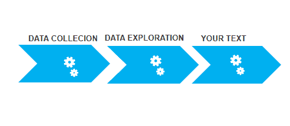
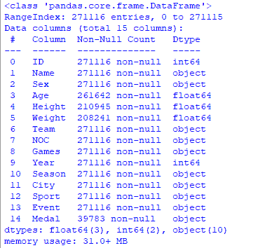
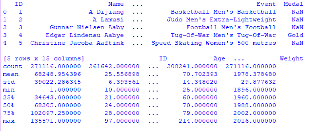
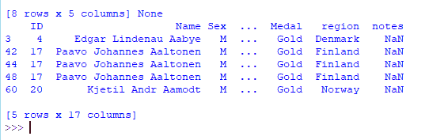
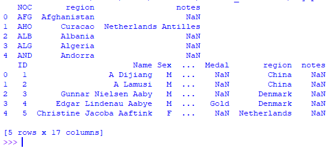
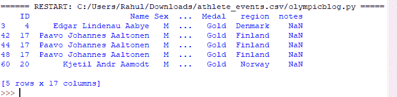

# 使用 Python 进行奥运数据分析

> 原文:[https://www . geesforgeks . org/Olympics-数据-分析-使用-python/](https://www.geeksforgeeks.org/olympics-data-analysis-using-python/)

在本文中，我们将看到使用 Python 进行的奥运会分析。现代奥运会是以夏季和冬季体育比赛为特色的领先国际体育赛事，来自世界各地的数千名运动员参加各种比赛。奥运会被认为是世界上最重要的体育比赛，有 200 多个国家参加。

奥运会的项目总数是 33 个项目中的 339 个。每一个项目都有赢家。因此产生了各种数据。因此，通过使用 Python，我们将分析这些数据。

## 使用的模块

*   [熊猫](https://www.geeksforgeeks.org/python-pandas-dataframe/):用于分析数据，
*   [NumPy](https://www.geeksforgeeks.org/python-numpy/) : NumPy 是一个通用的数组处理包。
*   [Matplotlib](https://www.geeksforgeeks.org/python-introduction-matplotlib/) :是数值数学扩展 NumPy
*   [海鸟](https://www.geeksforgeeks.org/introduction-to-seaborn-python/):用于 Python 中可视化统计图形绘制

## **模型架构:**



## **分步实施**

### **步骤 1:导入库**

## 蟒蛇 3

```py
# importing all necessary libraries
import pandas as pd
import numpy as np
import matplotlib.pyplot as plt
import seaborn as sns
```

### **第二步:了解数据库**

在处理奥运数据时，我们有两个 CSV 文件。一份包含了历年奥运会体育相关费用的报告。另一个是包含所有年份运动员参赛信息的。

CSV 数据文件可以从这里下载:[数据集](https://drive.google.com/drive/folders/19dCkREUadXgET8rbdKyhJ4nYgLcK-j_a?usp=sharing)

### **第三步:数据清理和格式化**

我们使用。[使用熊猫将 _csv()](https://www.geeksforgeeks.org/python-read-csv-using-pandas-read_csv/) 方法读入数据框，并显示每个数据集的前 5 行。

## 蟒蛇 3

```py
data = pd.read_csv('athlete_events.csv')  # read file

# data.head() display first 5 entry
# data.describe describe about model
# data.info give info about data
print(data.head(), data.describe(), data.info())
```

**输出:**

  

### **第四步:合并两个数据帧**

这里我们将使用 python 中的 [pandas.merge()](https://www.geeksforgeeks.org/joining-two-pandas-dataframes-using-merge/) 合并两个数据帧。

## 蟒蛇 3

```py
# regions and country noc data csv file
regions = pd.read_csv('datasets_31029_40943_noc_regions.csv')
print(regions.head())

# merging to data and regions frame
merged = pd.merge(data, regions, on='NOC', how='left')
print(merged.head())
```

**输出:**



## **奥运数据分析**

现在可以使用熊猫和 matplotlib 获得数据，让我们看看一些例子

### 金牌选手的数据分析

创建一个只包含金牌选手的新数据框架。

## 蟒蛇 3

```py
# creating goldmedal dataframes
goldMedals = merged[(merged.Medal == 'Gold')]
print(goldMedals.head())
```

**输出:**



### 年龄方面的金牌得主:

在这里，我们将创建一个关于年龄的金牌数的图表。为此，我们将创建 [countplot](https://www.geeksforgeeks.org/countplot-using-seaborn-in-python/) 用于图形表示，其中 X 轴表示运动员的年龄，Y 轴表示奖牌数量。

## 蟒蛇 3

```py
plt.figure(figsize=(20, 10))
plt.title('Distribution of Gold Medals')
sns.countplot(goldMedals['Age'])
plt.show()
```