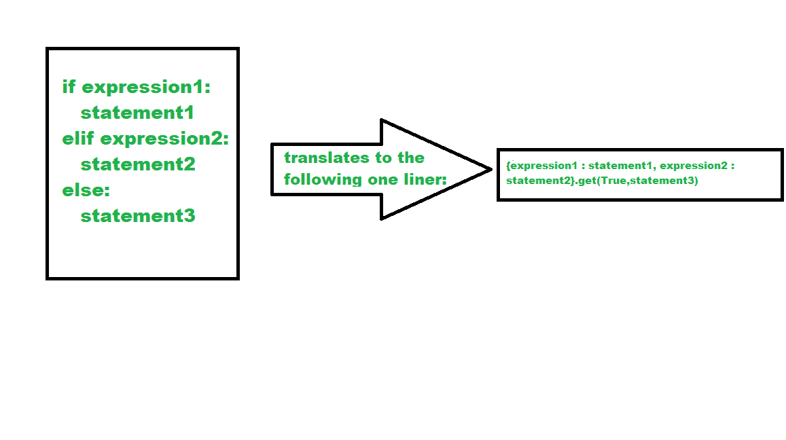

# Python if-elif-else 语句的一个衬垫

> 原文:[https://www . geesforgeks . org/one-liner-for-python-if-elif-else-statements/](https://www.geeksforgeeks.org/one-liner-for-python-if-elif-else-statements/)

在 Python 中，If-elif-else 语句用于决策，即程序将评估测试表达式，并且只有当给定的测试表达式为真时，才会执行剩余的语句。这允许对多个表达式进行验证。

**语法:**

```
if test expression:
    Body of if

elif test expression:
    Body of elif

else: 
    Body of else
```

这个概念可以用三进制运算的短线法来实现。

**Python if-elif-else 语句的一个衬垫**



**语法:**

> {(条件 1 : <code1>)，(条件 2 : <code2>) }。得到(真，<code3>)</code3></code2></code1>

如果条件 1 为真，运行代码 1；如果条件 2 为真，运行代码 2；如果两者都为假，运行第三个代码。

**示例:**

## 蟒蛇 3

```
x = 87

result = {x > 190: "First condition satisfied!", 
          x == 87: "Second condition satisfied!"}.get(
  True, "Third condition satisfied")

print(result)
```

**输出:**

```
Second condition satisfied!
```

**免责声明**:对于 Python 中的 if-elif-else 这种语法，下面的代码不会给你带来想要的结果:

## 蟒蛇 3

```
x = 87

{x > 190: print("First condition satisfied!"),
 x == 87: print("Second condition satisfied!")}.get(
  True, print("Third condition satisfied!"))
```

**输出:**

```
First condition satisfied!
Second condition satisfied!
Third condition satisfied!
```