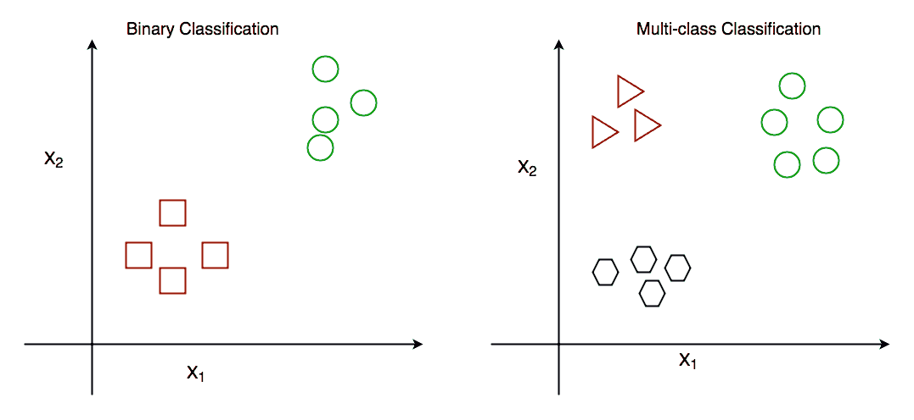

# 多类分类的一对多策略

> 原文:[https://www . geesforgeks . org/one-vs-rest-strategy-for-multi-class-classing/](https://www.geeksforgeeks.org/one-vs-rest-strategy-for-multi-class-classification/)

先决条件:[开始分类/](https://www.geeksforgeeks.org/getting-started-with-classification/)

分类可能是最常见的机器学习任务。在我们进入什么是 **One-vs-Rest (OVR)** 分类器以及它们是如何工作的之前，您可以按照下面的链接，获得什么是分类以及它是如何有用的简要概述。

一般来说，有两种类型的分类算法:

1.  二元分类算法。
2.  多类分类算法。

二元分类是指我们必须将物体分成两组。通常，这两组由“真”和“假”组成。例如，给定某组健康属性，二元分类任务可以是确定一个人是否患有糖尿病。

另一方面，在多类分类中，有两个以上的类。例如，给定水果的一组属性，比如它的形状和颜色，多类分类任务将是确定水果的类型。



现在，您已经了解了二进制和多类分类是如何工作的，让我们继续讨论如何使用一对多启发式方法。

**One-vs-Rest (OVR)方法** :
许多流行的分类算法都是针对二元分类问题而设计的。这些算法包括:

*   逻辑回归
*   支持向量机(SVM)
*   感知器模型

还有更多。

因此，这些流行的分类算法不能直接用于多类分类问题。一些启发式方法可以将多类分类问题分解成许多不同的二元分类问题。为了理解这是如何工作的，让我们考虑一个**例子**:比方说，一个分类问题是将各种水果分为三种水果:香蕉、橘子或苹果。现在，这显然是一个多类分类问题。如果你想使用二进制分类算法，比如 SVM。“一对多”方法处理这一问题的方式如下所示:

由于分类问题中有三类，One-vs-Rest 方法将把这个问题分解成三个二元分类问题:

*   问题 1:香蕉 vs[橘子，苹果]
*   问题 2:橙色 vs[香蕉，苹果]
*   问题 3:苹果 vs[香蕉，橘子]

因此，它不是像(香蕉 vs 橘子 vs 苹果)那样解决，而是使用如上所示的三个二元分类问题来解决。

这种方法的一个主要缺点是必须创建许多模型。对于具有“n”个类的多类问题，必须创建“n”个模型，这可能会减慢整个过程。然而，它对于具有少量类的数据集非常有用，在这些数据集中，我们希望使用像 SVM 或逻辑回归这样的模型。

**使用 Python3**
实现 One-vs-Rest 方法 Python 的 scikit-learn 库提供了一种实现该方法的方法 OneVsRestClassifier(估计器，* n _ jobs = None)。对于这个实现，我们将使用流行的“葡萄酒数据集”，使用化学属性来确定葡萄酒的原产地。我们可以使用 scikit-learn 来指导这个数据集。要了解更多关于该数据集的信息，您可以使用以下链接:[葡萄酒数据集](https://archive.ics.uci.edu/ml/datasets/wine)

我们将使用支持向量机，这是一种二进制分类算法，并将其与 One-vs-Rest 启发式算法一起使用来执行多类分类。

为了评估我们的模型，我们将看到测试集的准确性分数和模型的分类报告。

```py
from sklearn.datasets import load_wine
from sklearn.multiclass import OneVsRestClassifier
from sklearn.svm import SVC
from sklearn.metrics import accuracy_score, classification_report
from sklearn.model_selection import train_test_split
import warnings

''' 
We are ignoring warnings because of a peculiar fact about this
dataset. The 3rd label, 'Label2' is never predicted and so the python 
interpreter throws a warning. However, this can safely be ignored because 
we are not concerned if a certain label is predicted or not 
'''
warnings.filterwarnings('ignore')

# Loading the dataset
dataset = load_wine()
X = dataset.data
y = dataset.target

# Splitting the dataset into training and testing sets
X_train, X_test, y_train, y_test = train_test_split(
    X, y, test_size = 0.1, random_state = 13)

# Creating the SVM model
model = OneVsRestClassifier(SVC())

# Fitting the model with training data
model.fit(X_train, y_train)

# Making a prediction on the test set
prediction = model.predict(X_test)

# Evaluating the model
print(f"Test Set Accuracy : {accuracy_score(
    y_test, prediction) * 100} %\n\n")
print(f"Classification Report : \n\n{classification_report(
    y_test, prediction)}")
```

**输出:**

```py
Test Set Accuracy : 66.66666666666666 %

Classification Report : 

              precision    recall  f1-score   support

           0       0.62      1.00      0.77         5
           1       0.70      0.88      0.78         8

   micro avg       0.67      0.92      0.77        13
   macro avg       0.66      0.94      0.77        13
weighted avg       0.67      0.92      0.77        13

```

我们得到的测试集准确率约为 66.667%。这对这个数据集来说还不错。该数据集因难以分类而臭名昭著，基准精度为 62.4±0.4%。所以，我们的结果其实挺好的。

**结论:**
现在你已经知道了如何使用 One-vs-Rest 启发式方法来用二进制分类器进行多类分类，下次需要执行一些多类分类任务时可以尝试使用。