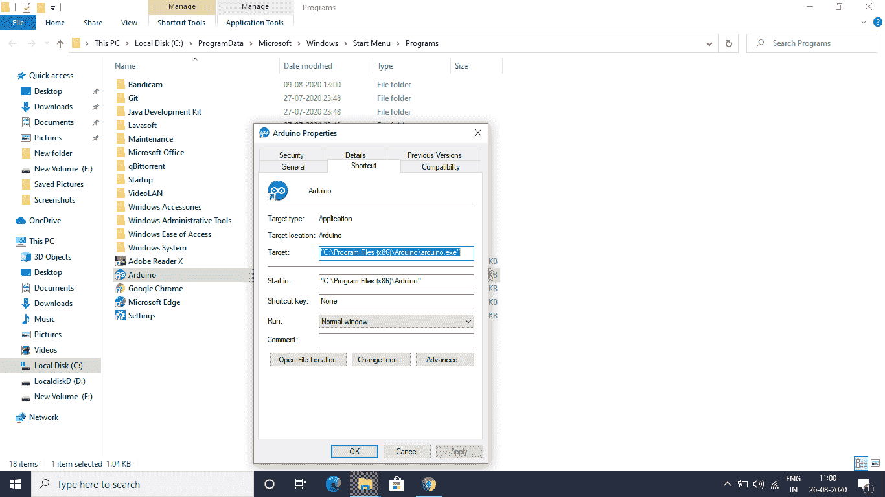

# 用 Python 打开 IDE

> 原文:[https://www.geeksforgeeks.org/opening-an-ide-with-python/](https://www.geeksforgeeks.org/opening-an-ide-with-python/)

**IDE** (集成开发环境)是一个软件应用程序，它为轻松开发软件提供了许多便利。让我们看看如何用 Python 脚本打开一个 IDE。首先，我们要得到 IDE 的路径。为此，请打开文件位置，然后在路径中复制目标。



我们必须从文件位置复制目标

我们将使用 **os.startfile()** 方法来运行 IDE。我们将把集成开发环境的路径作为参数传递。

## 蟒蛇 3

```
# importing the module
import os

# setting the path of the IDE
# use of \\ is important because 
# \ will be treated as a escape sequence
# here we are using the Arduino Ide 
# path to open the arduino ide
path="C:\\Program Files (x86)\\Arduino\\arduino.exe"

# using the os.startfile() method
os.startfile(path)
```

**输出:**

<video class="wp-video-shortcode" id="video-475148-1" width="640" height="360" preload="metadata" controls=""><source type="video/mp4" src="https://media.geeksforgeeks.org/wp-content/uploads/20200826105605/NewVedioGeeksforGeeks_Trim.mp4?_=1">[https://media.geeksforgeeks.org/wp-content/uploads/20200826105605/NewVedioGeeksforGeeks_Trim.mp4](https://media.geeksforgeeks.org/wp-content/uploads/20200826105605/NewVedioGeeksforGeeks_Trim.mp4)</video>