# 使用 Networkx 模块对图形和特殊图形的操作| Python

> 原文:[https://www . geesforgeks . org/operations-on-graph-and-special-graph-use-networkx-module-python/](https://www.geeksforgeeks.org/operations-on-graph-and-special-graphs-using-networkx-module-python/)

先决条件:[创建一个无向图](https://www.geeksforgeeks.org/networkx-python-software-package-study-complex-networks/)。

基本图形操作如下:

**从图中获取子图:**

给定一个图及其节点集的子集，我们可以通过选择这些节点以及它们之间的所有边来创建一个子图，就像在原始图中一样。下面的代码将清楚地说明这个操作。

```
import networkx as nx 
import matplotlib.pyplot as plt

G = nx.Graph()

plt.figure(figsize =(9, 12))
G.add_edges_from([(1, 2), (1, 3), (2, 3), (2, 4), (2, 5), (3, 4), 
                         (4, 5), (4, 6), (5, 7), (5, 8), (7, 8)])

# original Graph created
plt.subplot(211)
print("The original Graph:")

nx.draw_networkx(G)
```

原图:
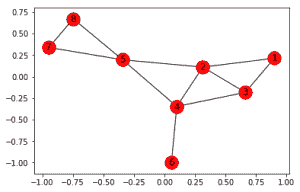

```
H = G.subgraph([1, 2, 3, 4])
# [1, 2, 3, 4] is the subset of 
# the original set of nodes

plt.subplot(212)
print("The Subgraph:")
nx.draw_networkx(H)
```

子图:
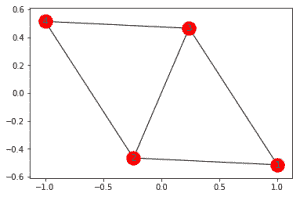
原图 G 有 1 到 8 个节点。我们选择了节点 1、2、3 和 4，并创建了一个子图 H，它有 5 条边，这些边存在于原始图 g 中

**两个图形的并集:**

给定两个图 G 和 H，这两个图的并集创建了一个可能有多个连通分量的图。但是我们必须记住，G 和 H 的节点集应该是不相交的，换句话说，这两个图不应该有任何共同的节点。

```
import networkx as nx 
import matplotlib.pyplot as plt

G = nx.Graph()

plt.figure(figsize =(9, 12))
G.add_edges_from([(1, 2), (1, 3), (2, 3), (2, 4), (2, 5), (3, 4), 
                         (4, 5), (4, 6), (5, 7), (5, 8), (7, 8)])

# First Graph created
plt.subplot(311)
nx.draw_networkx(G)

H = nx.Graph()
H.add_edges_from([(13, 14), (13, 15), (13, 9),
                  (14, 15), (15, 10), (9, 10)])

# Second Graph created
plt.subplot(312)
nx.draw_networkx(H)

I = nx.union(G, H)
plt.subplot(313)
nx.draw_networkx(I)
```

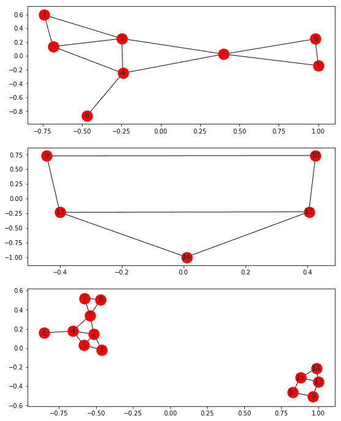

新形成的图 I 是图 g 和 h 的并集，如果我们在两个图之间确实有公共节点，并且仍然想得到它们的并集，那么我们将使用另一个叫做`disjoint_set()`的函数

```
I = nx.disjoint_set(G, H)
```

这将重命名公共节点，并形成一个类似的图形。

**两幅图的笛卡尔乘积:**

给定两个图，G 和 H，笛卡儿积创建了一个新的图，I = G * H。I 的节点集是 G 和 H 的节点集的笛卡儿积，即 V(I) = V(G)*V(H)。

边((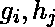)，(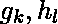))存在的条件和唯一条件是:

*   i=k 并且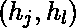作为 H 中的边存在
*   j=l 并且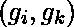在 G 中作为边存在

```
import networkx as nx 
import matplotlib.pyplot as plt

G = nx.Graph()

plt.figure(figsize =(9, 18))
G.add_edges_from([(1, 2), (2, 3)])

# First Graph created
plt.subplot(311)
nx.draw_networkx(G)

H = nx.Graph()
H.add_edges_from([(6, 7)])
# Second Graph created
plt.subplot(312)
nx.draw_networkx(H)

I = nx.cartesian_product(G, H)
plt.subplot(313)
nx.draw_networkx(I)
```

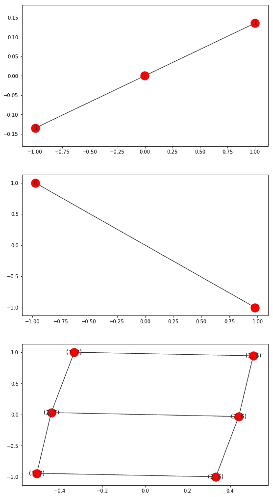
这个表示清楚地显示了前两个图的乘积如何产生第三个图。

**两幅图的合成:**

给定两个图 G 和 H，如果它们没有公共节点，那么这两个图的组合将产生一个具有 2 个连通分量的图(假设 G 和 H 是连通图)。这和我们用`nx.union(G, H)`或者`nx.disjoint_union(G, H)`得到的结果是一样的。
但是如果 G 和 H 有公共节点，这两个图的合成将产生一个连通图，使得 G 和 H 是新图的子图。

```
import networkx as nx 
import matplotlib.pyplot as plt

G = nx.Graph()

plt.figure(figsize =(9, 15))
G.add_edges_from([(1, 2), (1, 3), (2, 3), (2, 4)])

# First Graph created
plt.subplot(311)
nx.draw_networkx(G)

H = nx.Graph()
H.add_edges_from([(3, 7), (7, 4), (3, 4)])
# Second Graph created
plt.subplot(312)
nx.draw_networkx(H)

I = nx.compose(G, H)
plt.subplot(313)
nx.draw_networkx(I)
```

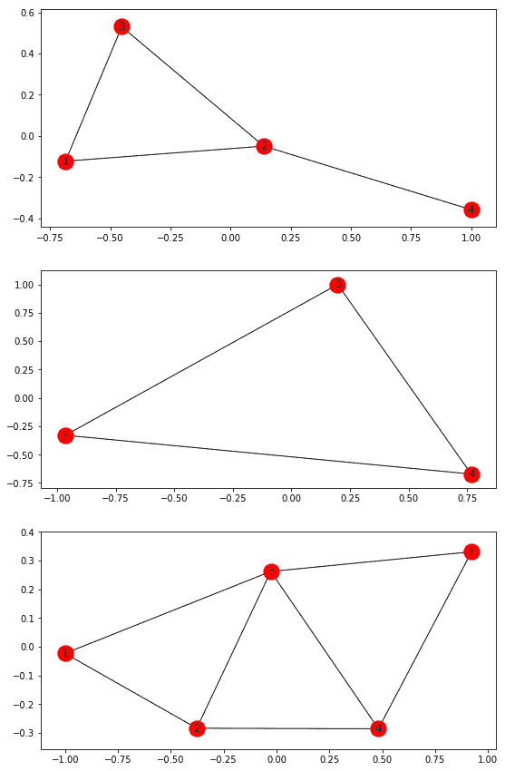

图表清楚地显示了前两个图形是如何组合在一起形成第三个图形的。

**图形的补码:**

给定一个图 G，G 的补(比如 H)有 G 的所有节点，它有 G 没有的所有可能的边。设 V 和 E 为 G 的节点和边的集合，那么 H 有`{(|V|*(|V|-1))/2 - |E|}` 个数的边。因此，完全图的补图没有边。

```
import networkx as nx 
import matplotlib.pyplot as plt

G = nx.Graph()

plt.figure(figsize =(9, 16))
G.add_edges_from([(1, 2), (1, 3), (2, 3), (2, 4)])

# Original Graph created
plt.subplot(211)
nx.draw_networkx(G)

H = nx.complement(G)
plt.subplot(212)
nx.draw_networkx(H)
```

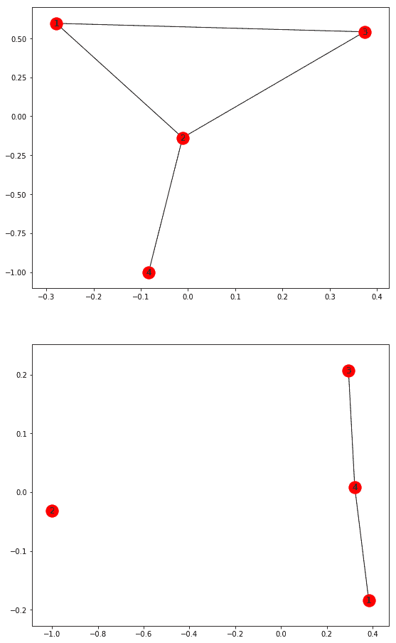

**转换为定向:**

给定一个无向图 G，这个 Networkx 函数将通过用双向有向边替换它的边，把它转换成有向图。

```
import networkx as nx 
import matplotlib.pyplot as plt

G = nx.Graph()

plt.figure(figsize =(9, 16))
G.add_edges_from([(1, 2), (1, 3), (2, 3), (2, 4)])
# Original Undirected Graph created

plt.subplot(211)
nx.draw_networkx(G)

H = nx.to_directed(G)
plt.subplot(212)
nx.draw_networkx(H)
```

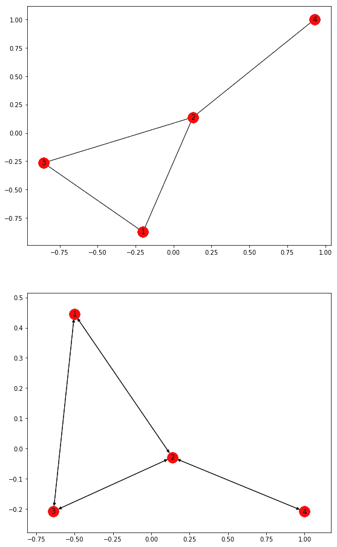

**转换为无向:**

给定一个有向图 G，这个 Networkx 函数将把它的所有有向边转换成无向边，从而把它转换成无向图。如果具有不同属性(权重、颜色等)的一对节点之间存在两条边。)，则只创建一条边，可以任意选择使用哪条边数据。

```
import networkx as nx 
import matplotlib.pyplot as plt

G = nx.DiGraph()

plt.figure(figsize =(9, 16))
G.add_edges_from([(1, 2), (1, 3), (2, 4)])

# Original Directed Graph created
plt.subplot(211)
nx.draw_networkx(G)

H = nx.to_undirected(G)
plt.subplot(212)
nx.draw_networkx(H)
```

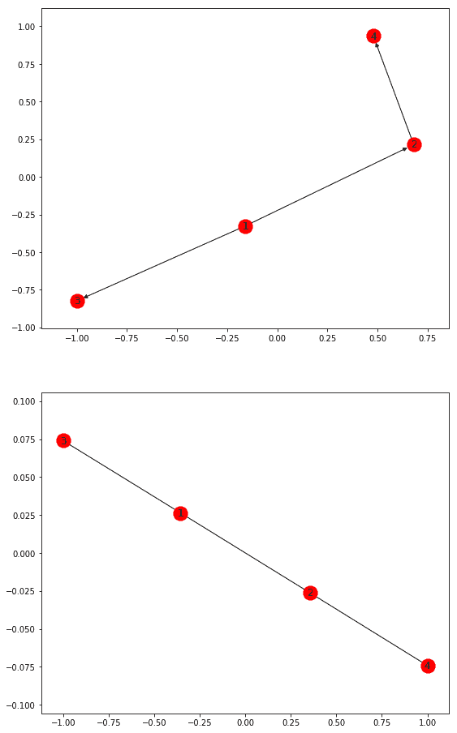

现在，我们将讨论网络模块提供的各种特殊图形。

**彼得森图:**彼得森图是一个有 10 个顶点和 15 条边的无向图。这是一个小图，作为图论中许多问题的一个有用的例子和反例。

```
import networkx as nx 
import matplotlib.pyplot as plt

plt.figure(figsize =(9, 100))

# Peterson Graph
plt.subplot(12, 1, 1)
G = nx.petersen_graph()
nx.draw_networkx(G)
```

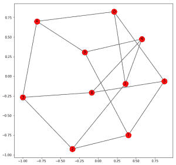

**图特图:**图特图是一个 3- [正则图](https://en.wikipedia.org/wiki/Regular_graph)，有 46 个顶点和 69 条边。Tutte 图是一个[立方](https://en.wikipedia.org/wiki/Cubic_graph) [多面体](https://en.wikipedia.org/wiki/Polyhedral_graph)图，但是是非[哈密顿](https://en.wikipedia.org/wiki/Hamiltonian_path)。所以是 [Tait 猜想的反例。](https://en.wikipedia.org/wiki/Tait%27s_conjecture)每个 3-正多面体都有一个哈密顿圈。

```
# Tutte Graph
plt.subplot(12, 1, 2)
G = nx.tutte_graph()
nx.draw_networkx(G)
```

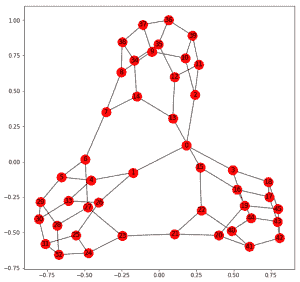

**Sedgewick 迷宫图:** Sedgewick 的迷宫算法用于生成大型迷宫。与此方法相关的 Networkx 函数返回一个有循环的小迷宫。

```
# Sedgewick Maze Graph
plt.subplot(12, 1, 3)
G = nx.sedgewick_maze_graph()
nx.draw_networkx(G)
```


**四面体图:**返回一个完整的图，图中有四个四面体形状的节点。

```
# Tetrahedral Graph
plt.subplot(12, 1, 4)
G = nx.tetrahedral_graph()
nx.draw_networkx(G)
```

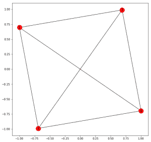

**完全图:**返回给定边数的完全图。

```
# Complete Graph with 5 nodes
plt.subplot(12, 1, 5)
G = nx.complete_graph(6)
nx.draw_networkx(G)
```

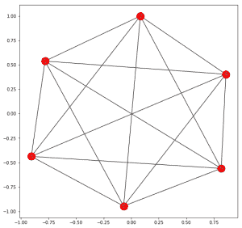

**完全二部图:**给定两个数字 n 和 m，它返回一个有两组 n 和 m 节点的图，其中一组的一个节点连接到另一组的所有节点，但没有自己组的节点。这种类型的图被称为[二分图](http://mathworld.wolfram.com/BipartiteGraph.html)。

```
# Complete Bipartite Graph with 5 and 3 nodes
plt.subplot(12, 1, 6)
G = nx.complete_bipartite_graph(5, 3)
nx.draw_networkx(G)
```

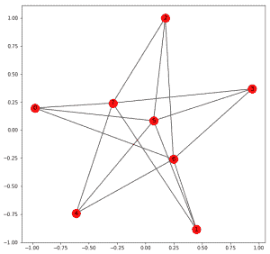

**杠铃图:**给定两个参数 n 和 m，它返回一个有两个[集团](https://en.wikipedia.org/wiki/Clique_(graph_theory))的图，这两个集团由 n 个节点组成，节点之间通过 m 个节点连接。

```
# Barbell Graph with clique of 4 and bridging of 2 nodes
plt.subplot(12, 1, 7)

G = nx.barbell_graph(4, 2)
nx.draw_networkx(G)
```

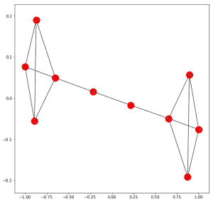

**棒棒糖图:**给定两个参数 n 和 m，它返回一个由 n 个顶点组成的团连接到 m 个节点的路径的图。

```
# Lollipop Graph with clique of 5 and path of 2 nodes
plt.subplot(12, 1, 8)
G = nx.lollipop_graph(5, 2)
nx.draw_networkx(G)
```

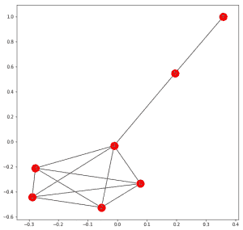

**鄂尔多斯仁义图:**给定两个参数 n 和 p，返回 n 个节点的图，选择每条边的概率为 p。详情见[这篇](https://www.geeksforgeeks.org/erdos-renyl-model-generating-random-graphs/)文章。

```
# Erdos Renyi Graph with 20 nodes and probability of 0.25
plt.subplot(12, 1, 9)

G = nx.erdos_renyi_graph(20, 0.25)
nx.draw_networkx(G)
```

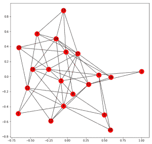

**Watts Strogatz Graph:** 给定三个参数 n、k 和 p，返回一个由 n 个节点组成的小世界网络，每个节点连接到 k 个最近的邻居，每个边重新布线的概率为 p。

```
# Watts Strogatz Graph with 20 nodes, 
# 4 neighbours and probability of 0.2
plt.subplot(12, 1, 10)
G = nx.watts_strogatz_graph(20, 4, 0.2)
nx.draw_networkx(G)
```

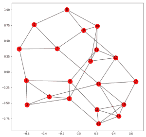

**巴拉巴斯艾伯特图:**给定两个参数 n 和 m，返回一个巴拉巴斯艾伯特优先附着图，该图有 n 个节点和 m 条边要从新节点附着到现有节点。

```
# Barabasi Albert Graph with 20 nodes and 3 attaching nodes
plt.subplot(12, 1, 11)
G = nx.barabasi_albert_graph(20, 3)
nx.draw_networkx(G)
```

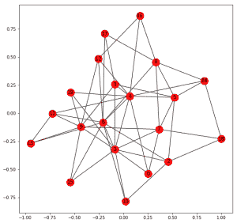

**随机龙虾图:**给定三个参数 n、p1 和 p2，返回一个龙虾图。龙虾是一种在修剪所有叶子节点时会变成毛毛虫的树。毛毛虫是在修剪所有叶节点时简化为路径图的树。图的主干中有 n 个节点，p1 向主干增加一条边的概率，p2 向主干之外增加一条边的概率。

```
# Random Lobster Graph with 30 base
# nodes and probabilites of 0.8
plt.subplot(12, 1, 12)

G = nx.random_lobster(30, 0.8, 0.8)
nx.draw_networkx(G)
```

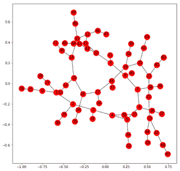