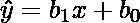
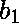
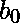
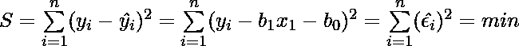
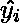
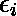
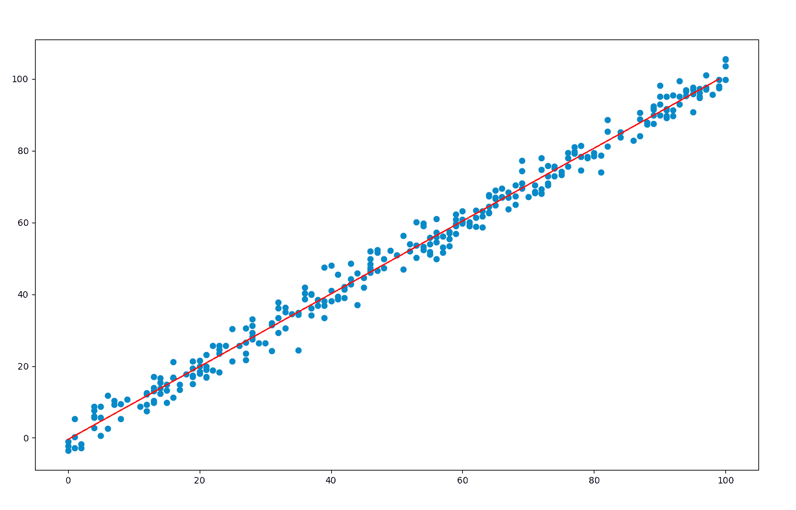

# 使用统计模型的普通最小二乘法(OLS)

> 原文:[https://www . geesforgeks . org/普通-最小二乘法-ols-using-statsmodels/](https://www.geeksforgeeks.org/ordinary-least-squares-ols-using-statsmodels/)

在本文中，我们将使用 Python 的 **statsmodels** 模块来实现线性回归的**普通最小二乘** ( **OLS** )方法。

**简介:**
线性回归模型将因变量( **y** )和至少一个自变量( **x** )之间的关系建立为:

<center></center>

In *OLS* method, we have to choose the values of  and  such that, the total sum of squares of the difference between the calculated and observed values of y, is minimised.
**Formula for OLS:**

<center></center>

其中，
 =第 ith 次观测的预测值
 =第 ith 次观测的实际值
 =第 ith 次观测的误差/残差
n =观测总数

为了得到使 S 最小化的和的值，我们可以对每个系数取一个偏导数，使其等于零。

**使用的模块:**

*   **statsmodels :** 为许多不同的统计模型的估计提供类和函数。

    ```
    pip install statsmodels
    ```

*   **熊猫:**用于数据处理和分析的库。

    ```
    pip install pandas
    ```

*   **NumPy :** 阵列计算核心库。

    ```
    pip install numpy
    ```

*   **Matplotlib :** 一个用于创建静态和交互式图形和可视化的综合库。

    ```
    pip install matplotlib
    ```

**进场:**

*   首先我们定义变量 **x** 和 **y** 。在下面的例子中，变量是使用*熊猫*从 *csv* 文件中读取的。示例中使用的文件可以在[这里](https://drive.google.com/file/d/13AK0eheyKUvHEHts-CPnb67KphEz8YKv/view)下载。
*   接下来，我们需要使用 **add_constant()** 方法将常数添加到等式中。
*   **statsmodels.api** 模块的 **OLS()** 功能用于执行 OLS 回归。它返回一个 OLS 对象。然后在这个对象上调用**拟合()**方法来拟合数据的回归线。
*   **summary()** 方法用于获得一个表格，该表格给出了关于回归结果的广泛描述

> **语法:** statsmodels.api.OLS(y，x)
> **参数:**
> 
> *   **y :** 依赖于 x 的变量
> *   **x :** 自变量

**代码:**

```
import statsmodels.api as sm
import pandas as pd

# reading data from the csv
data = pd.read_csv('train.csv')

# defining the variables
x = data['x'].tolist()
y = data['y'].tolist()

# adding the constant term
x = sm.add_constant(x)

# performing the regression
# and fitting the model
result = sm.OLS(y, x).fit()

# printing the summary table
print(result.summary())
```

**输出:**

```
                            OLS Regression Results                            
==============================================================================
Dep. Variable:                      y   R-squared:                       0.989
Model:                            OLS   Adj. R-squared:                  0.989
Method:                 Least Squares   F-statistic:                 2.709e+04
Date:                Fri, 26 Jun 2020   Prob (F-statistic):          1.33e-294
Time:                        15:55:38   Log-Likelihood:                -757.98
No. Observations:                 300   AIC:                             1520.
Df Residuals:                     298   BIC:                             1527.
Df Model:                           1                                         
Covariance Type:            nonrobust                                         
==============================================================================
                 coef    std err          t      P>|t|      [0.025      0.975]
------------------------------------------------------------------------------
const         -0.4618      0.360     -1.284      0.200      -1.169       0.246
x1             1.0143      0.006    164.598      0.000       1.002       1.026
==============================================================================
Omnibus:                        1.034   Durbin-Watson:                   2.006
Prob(Omnibus):                  0.596   Jarque-Bera (JB):                0.825
Skew:                           0.117   Prob(JB):                        0.662
Kurtosis:                       3.104   Cond. No.                         120.
==============================================================================

Warnings:
[1] Standard Errors assume that the covariance matrix of the errors is correctly specified.

```

表中一些术语的描述:

*   **[R 平方](https://www.geeksforgeeks.org/ml-r-squared-in-regression-analysis/) :** 系数的确定。可预测/可解释的是因变量中的方差比例
*   **[调整 R 平方](https://www.geeksforgeeks.org/ml-adjusted-r-square-in-regression-analysis/) :** 调整后的 R 平方是针对模型中自变量数量调整后的 R 平方的修正形式。当我们包括实际上改进模型的额外变量时，调整 R 平方的值增加。
*   **F-统计量:**模型均方误差与残差均方误差的比值。它决定了模型的整体意义。
*   **coef :** 方程中自变量和常数项的系数。
*   **t:**t-统计量的值。它是参数的估计值和假设值之差与标准误差之比

**预测值:**
从结果表中，我们注意到了 x 的系数和常数项。这些值在原始方程中被替换，回归线使用 *matplotlib* 绘制。
**代码:**

```
import pandas as pd
import matplotlib.pyplot as plt
import numpy as np

# reading data from the csv
data = pd.read_csv('train.csv')

# plotting the original values
x = data['x'].tolist()
y = data['y'].tolist()
plt.scatter(x, y)

# finding the maximum and minimum
# values of x, to get the
# range of data
max_x = data['x'].max()
min_x = data['x'].min()

# range of values for plotting
# the regression line
x = np.arange(min_x, max_x, 1)

# the substituted equation
y = 1.0143 * x - 0.4618

# plotting the regression line
plt.plot(y, 'r')
plt.show()
```

**输出:**
[](https://media.geeksforgeeks.org/wp-content/uploads/20200626160821/Screenshot-2020-06-26-at-3.56.22-PM.png)